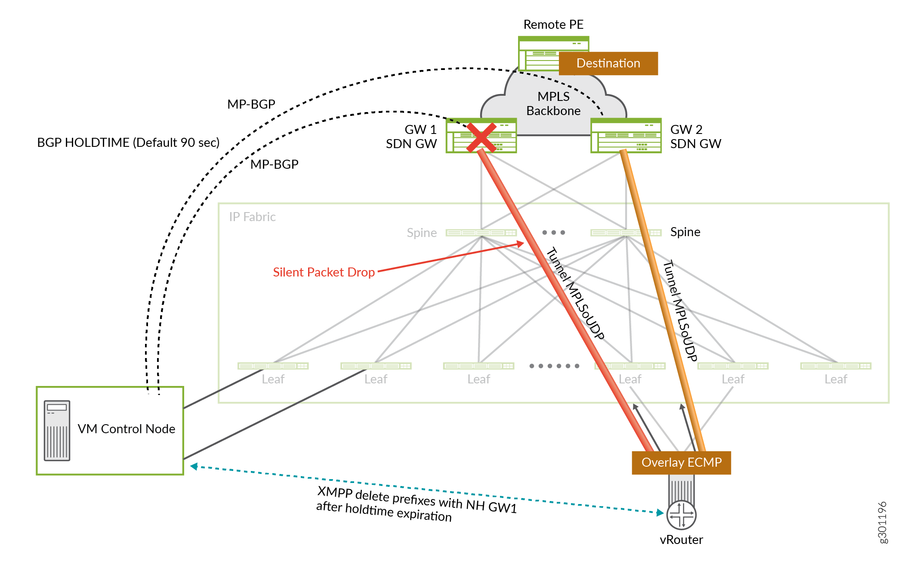
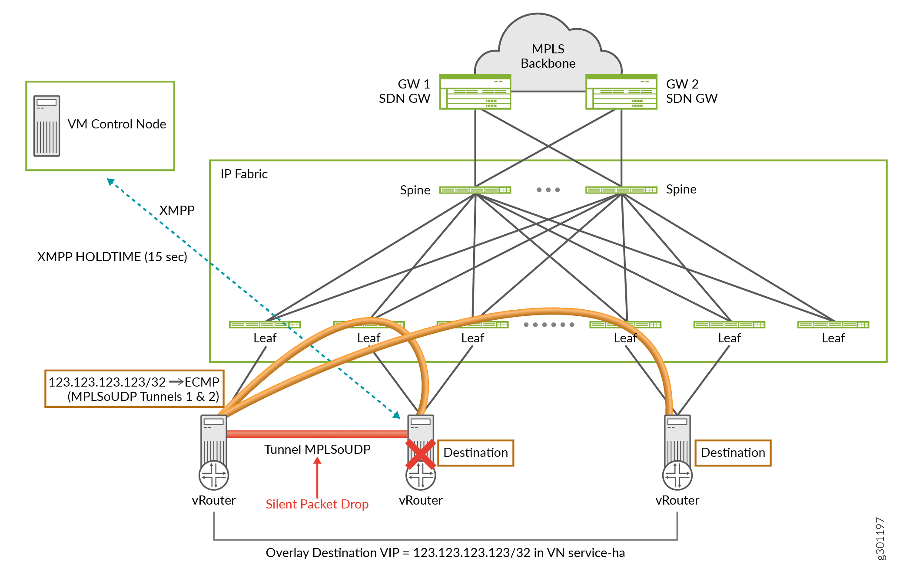
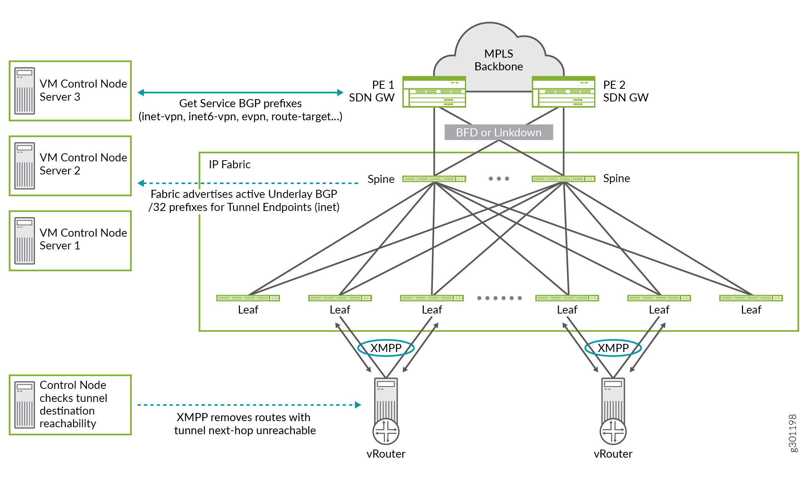

# Fast Routing Convergence with Contrail Networking

 

## What is Convergence

Convergence or routing convergence is a state in which a set of routers
in a network share the same topological information. The routers in the
network collect the topology information from one another through the
routing protocol. The state of convergence is achieved when all routers
send routing information to all routers in the network. In other words,
in a converged network, all routers are aware of the network topology
and the optimal route to send a packet. Any change — for example, the
failure of a device — in the network affects convergence until
information about the change is propagated to all routers and
convergence is achieved again. The time taken by the routers in the
network to reach convergence after a change in topology is termed
convergence time.

Network convergence and fast failover in case of failures in the network
are critical for high performance service provider networks that run
sensitive applications. The speed of achieving convergence in a network
depends on the following actions:

-   Detection—A device detects a failure in the route. Corrective
    action, that is, identifying a new forwarding path, can be taken
    only after identifying the device that failed. Unlike a physical
    network where device availability or failure is identified through
    events, in virtual network, device reachability is established
    through keepalive messages. To achieve fast network convergence, the
    detection time — the time taken to detect failure — is of high
    importance and must be kept within acceptable limits.

-   Local Repair—As soon as a device failure is detected in the primary
    route, traffic is diverted to backup route. At this point, the
    failure or the change in topology is not propagated to all the
    devices in the network.

-   Global Repair—Global repair or network convergence is said to have
    achieved when the change in topology is propagated to all devices in
    the network though routing protocols.

The availability of services depends on the time taken for failure
detection and correction.

## Fast Network Convergence in a Network Managed by Contrail Networking

Contrail Networking provides software defined networking solution that
offers network virtualization at the compute node-level through overlay
networking. In a software-defined network, failures might occur in the
overlay or in the underlay. A failure in the overlay can be the failure
of a virtual machine or a pod. The vRouter can detect, rectify, and
propagate any such failure in the overlay to the gateways by using the
health check mechanism. Of the several possible types of failure in the
underlay, the most critical ones are the SDN gateway failure and compute
node failure.

Fast convergence feature improves the convergence time in case of
failures in a cluster managed by Contrail networking. In a typical
Contrail Networking-managed network, the customer end points connect to
the vRouter through MPLSoUDP, GRE, or VXLAN overlay tunnels from the
gateway device. The vRouters connect to the MPLS gateway through the
fabric endpoints.

The fabric underlay routing has evolved to the extent that most fabric
underlay failures such as those in the leaf or spine, in the links
connecting the leaf and spine or the gateway and spine, vRouter and
leaf, and so on can be efficiently addressed within a very short time
without impacting the flow of traffic. However, there are two types of
failures that can lead to silent packet drop. They are failures in the
vRouter and failures in the gateway device, both of which are referred
to as tunnel end point failures.

The overlay tunnels are maintained by the control node, which exchanges
routes between the tunnel end points. The control node uses BGP to
exchange routes with the gateway devices and XMPP to exchange routes
with the vRouter. As there are no keepalive messages running on the
overlay tunnels, the control node depends on the BGP hold time
expiration to diagnose failures in the northbound connectivity to the
gateway, and on the XMPP timeout for failures for southbound
connectivity to the vRouter. Any failure in gateway can lead to a silent
packet drop for up to 90 seconds, which is the default value for BGP
hold time and expiration. This is because the control node can detect
the gateway failure only after the BGP hold time expires. Similarly, a
failure in the vRouter can lead to a silent packet drop for up to 15
seconds, which is the default value for XMPP timeout.

[Figure 1](fast-routing-convergence.html#gateway-failure) shows what
happens when the gateway router fails. BGP hold time expires after 90
seconds as the destination is unreachable and the same is propagated to
the control node, which recognizes that the gateway router has failed.
This leads to a silent packet drop for 90 seconds until the routing
table in the control node is updated and convergence achieved.

[Figure 2](fast-routing-convergence.html#vrouter-failure) shows a
scenario where the vRouter fails. The control node comes to know about
the vRouter failure only after 15 seconds when the XMPP hold time
expires. Traffic is dropped during these 15 seconds until convergence is
achieved.

Figure 2: Tunnel Endpoint Failure: vRouter

Starting with Release 2008, Contrail Networking
supports fast convergence. The fast convergence feature reduces
the convergence time in case of an overlay end point failure. The
Contrail control plane responds to the changes in the underlay network
and then takes action to achieve convergence quickly, reducing
convergence time that would have taken in a typical scenario where
control plane depends on BGP hold time expiration. Typically, the spines
come to know of any tunnel end point failures through the BFD or the
link down protocols. With the fast convergence feature, the spine
propagates this information to the Contrail Controller and removes the
tunnel end point from the control node through a routing table update.
The control node recognizes this as a tunnel end point failure and
initiates routing convergence. To respond to northbound failures
(gateway failure), the control node performs a next-hop reachability
check, and as soon as a failure is detected, the control plane initiates
convergence. To achieve fast convergence in case of a
southbound failure (vRouter failure), you can set the XMPP hold time to
a value as low as one (1) second. Whenever the XMPP hold time expires,
the control node recognizes it as a failure in the vRouter and initiates
convergence. Though you can set a low value of one, the
recommended timeout value is nine (9) seconds. A lower value is
recommended only for smaller clusters.

[Figure 3](fast-routing-convergence.html#fast-convergence) shows how
Contrail Networking achieves fast convergence by using the destination
reachability information that the spine gathers through BFD or link down
protocols, and by using the XMPP timeout information sent to the control
node to detect a failure in the vRouter.

Figure 3: Fast Convergence in a Contrail-managed Network

Release History Table

Release

Description

[2008](#jd0e60)

Starting with Release 2008, Contrail Networking supports fast
convergence.

[2008](#jd0e63)

To achieve fast convergence in case of a southbound failure (vRouter
failure), you can set the XMPP hold time to a value as low as one (1)
second. Whenever the XMPP hold time expires, the control node recognizes
it as a failure in the vRouter and initiates convergence.

 
