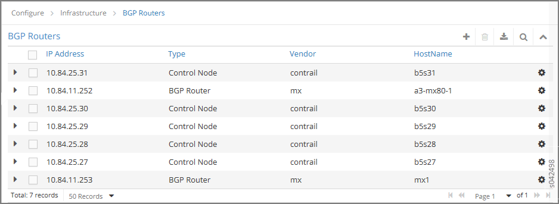
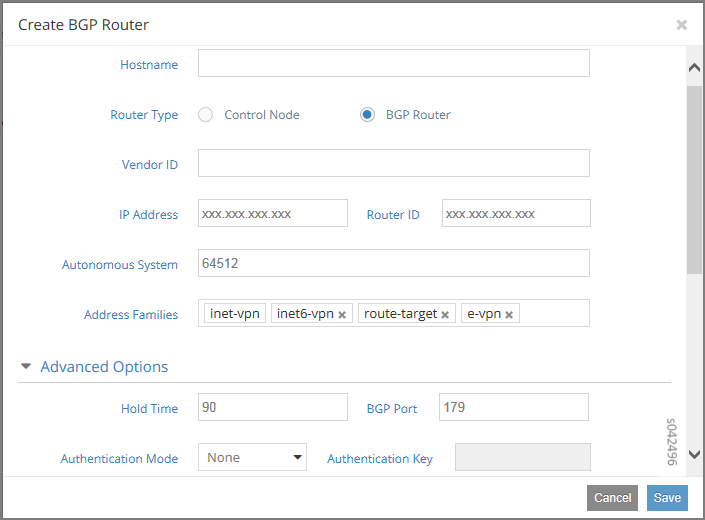
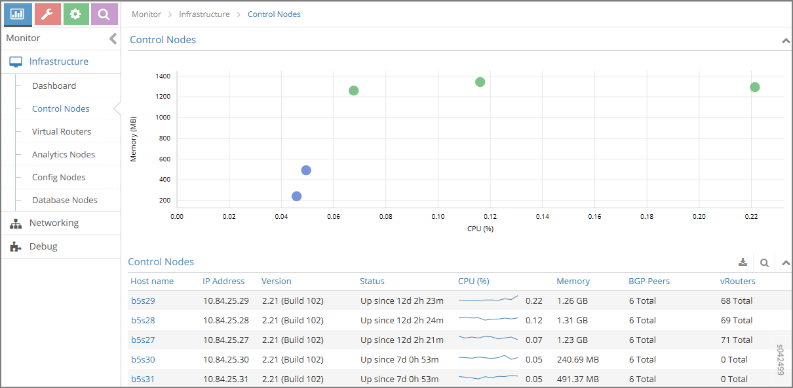
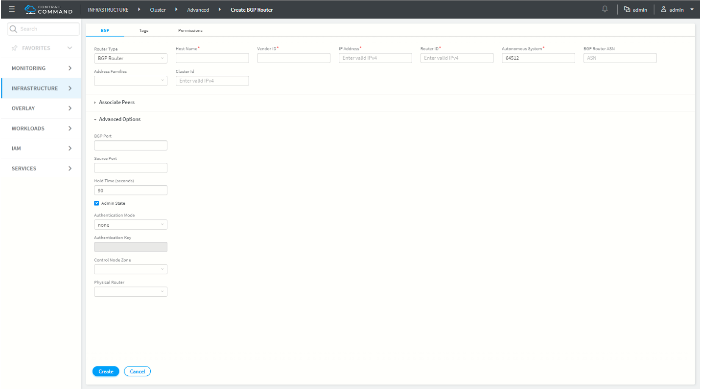

# Configuring the Control Node with BGP

 

An important task after a successful installation is to configure the
control node with BGP. This procedure shows how to configure basic BGP
peering between one or more virtual network controller control nodes and
any external BGP speakers. External BGP speakers, such as Juniper
Networks MX80 routers, are needed for connectivity to instances on the
virtual network from an external infrastructure or a public network.

Before you begin, ensure that the following tasks are completed:

-   The Contrail Controller base system image has been installed on all
    servers.

-   The role-based services have been assigned and provisioned.

-   IP connectivity has been verified between all nodes of the Contrail
    Controller.

-   You have access to Contrail Web User Interface (UI) or Contrail
    Command User Interface (UI). You can access the user interface at
    **http://`nn.nn.nn.nn`:8143**, where **`nn.nn.nn.nn`** is the IP
    address of the configuration node server that is running the
    contrail service.

These topics provide instructions to configure the Control Node with
BGP.

## Configuring the Control Node from Contrail Web UI

To configure BGP peering in the control node:

1.  From the Contrail Controller module control node
    (**http://`nn.nn.nn.nn`:8143**), select **Configure &gt;
    Infrastructure &gt; BGP Routers**; see
    [Figure 1](config-control-node-with-bgp.html#config-bgp-peers).

    

    A summary screen of the control nodes and BGP routers is displayed;
    see
    [Figure 2](config-control-node-with-bgp.html#control-nodes-summary).

    

2.  (Optional) The global AS number is 64512 by
    default. To change the AS number, on the **BGP Router** summary
    screen click the gear wheel and select **Edit**. In the Edit BGP
    Router window enter the new number.

3.  To create control nodes and BGP routers, on the
    **BGP Routers** summary screen, click the  icon.
    The **Create BGP Router** window is displayed; see
    [Figure 3](config-control-node-with-bgp.html#add-bgp-peer).

    

4.  In the **Create BGP Router** window, click **BGP
    Router** to add a new BGP router or click **Control Node** to add
    control nodes.

    For each node you want to add, populate the fields with values for
    your system. See
    [Table 1](config-control-node-with-bgp.html#bgp-peers).

    Table 1: Create BGP Router Fields

    | Field                   | Description                                                                                        |
    |:------------------------|:---------------------------------------------------------------------------------------------------|
    | **Hostname**            | Enter a name for the node being added.                                                             |
    | **Vendor ID**           | Required for external peers. Populate with a text identifier, for example, “MX-0”. (BGP peer only) |
    | **IP Address**          | The IP address of the node.                                                                        |
    | **Router ID**           | Enter the router ID.                                                                               |
    | **Autonomous System**   | Enter the AS number in the range 1-65535 for the node. (BGP peer only)                             |
    | **Address Families**    | Enter the address family, for example, **inet-vpn**                                                |
    | **Hold Time**           | BGP session hold time. The default is 90 seconds; change if needed.                                |
    | **BGP Port**            | The default is 179; change if needed.                                                              |
    | **Authentication Mode** | Enable MD5 authentication if desired.                                                              |
    | **Authentication key**  | Enter the Authentication Key value.                                                                |
    | **Physical Router**     | The type of the physical router.                                                                   |
    | **Available Peers**     | Displays peers currently available.                                                                |
    | **Configured Peers**    | Displays peers currently configured.                                                               |

5.  Click **Save** to add each node that you
    create.

6.  To configure an existing node as a peer, select
    it from the list in the **Available Peers** box, then click
    **&gt;&gt;** to move it into the **Configured Peers** box.

    Click **&lt;&lt;** to remove a node from the **Configured Peers**
    box.

7.  You can check for peers by selecting
    **Monitor &gt; Infrastructure &gt; Control Nodes**; see
    [Figure 4](config-control-node-with-bgp.html#control-node-summ).

    

    In the **Control Nodes** window, click any hostname in the memory
    map to view its details; see
    [Figure 5](config-control-node-with-bgp.html#control-node-details).

    

8.  Click the **Peers** tab to view the peers of a
    control node; see
    [Figure 6](config-control-node-with-bgp.html#peer-details).

    

## Configuring the Control Node with BGP from Contrail Command

To configure BGP peering in the control node:

1.  From Contrail Command UI select
    **Infrastructure &gt; Cluster &gt; Advanced** page.

    Click the **BGP Routers** tab. A list of control nodes and BGP
    routers is displayed. See
    [Figure 7](config-control-node-with-bgp.html#config-bgp).

    

2.  (Optional) The global AS number is 64512 by
    default. You can change the AS number according to your requirement
    on the **BGP Router** tab, by clicking the **Edit** icon. In the
    **Edit BGP Router** tab enter AS number in the range of 1-65,535.
    You can also enter the AS number in the range of 1-4,294,967,295,
    when **4 Byte ASN** is enabled in **Global Config**.

3.  Click the **Create** button on the **BGP
    Routers** tab. The **Create BGP Router** window is displayed. See
    [Figure 8](config-control-node-with-bgp.html#bgp-create).

    

4.  In the **Create BGP Router** page, populate the
    fields with values to create your system. See
    [Table 2](config-control-node-with-bgp.html#controlnodebgp).

    Table 2: Create BGP Router

    <table data-cellspacing="0" style="border-top:thin solid black;" width="99%">
    <colgroup>
    <col style="width: 50%" />
    <col style="width: 50%" />
    </colgroup>
    <thead>
    <tr class="header">
    <th style="text-align: left;">
Fields
</th>
    <th style="text-align: left;">
Description
</th>
    </tr>
    </thead>
    <tbody>
    <tr class="odd">
    <td style="text-align: left;">
<strong>Router Type</strong>
</td>
    <td style="text-align: left;">
Select the type of router you want create
</td>
    </tr>
    <tr class="even">
    <td style="text-align: left;">
<strong>Hostname</strong>
</td>
    <td style="text-align: left;">
Enter a name for the node being added.
</td>
    </tr>
    <tr class="odd">
    <td style="text-align: left;">
<strong>Vendor ID</strong>
</td>
    <td style="text-align: left;">
Required for external peers. Populate with a text identifier, for example, “MX-0”. (BGP peer only)
</td>
    </tr>
    <tr class="even">
    <td style="text-align: left;">
<strong>IP Address</strong>
</td>
    <td style="text-align: left;">
The IP address of the node.
</td>
    </tr>
    <tr class="odd">
    <td style="text-align: left;">
<strong>Router ID</strong>
</td>
    <td style="text-align: left;">
Enter the router ID.
</td>
    </tr>
    <tr class="even">
    <td style="text-align: left;">
<strong>Autonomous System (AS)</strong>
</td>
    <td style="text-align: left;">
Enter autonomous system (AS) number in the range of 1-65,535.

    
If you enable <strong>4 Byte ASN</strong> in <strong>Global Config</strong>, you can enter 4-byte AS number in the range of 1-4,294,967,295.
</td>
    </tr>
    <tr class="odd">
    <td style="text-align: left;">
<strong>BGP Router ASN</strong>
</td>
    <td style="text-align: left;">
Enter the Local-AS number, specific to the associated peers.
</td>
    </tr>
    <tr class="even">
    <td style="text-align: left;">
<strong>Address Families</strong>
</td>
    <td style="text-align: left;">
Select the Internet Address Family from the list, for example, <strong>inet-vpn</strong>, <strong>inet6-vpn</strong>, and so on.
</td>
    </tr>
    <tr class="odd">
    <td style="text-align: left;">
<strong>Cluster ID</strong>
</td>
    <td style="text-align: left;">
Enter the cluster ID, for example, 0.0.0.100.
</td>
    </tr>
    <tr class="even">
    <td style="text-align: left;">
<kbd class="user-typing" data-v-pre="">Associate Peers</kbd>
</td>
    <td style="text-align: left;"> </td>
    </tr>
    <tr class="odd">
    <td style="text-align: left;">
<strong>Peer</strong>
</td>
    <td style="text-align: left;">
Select the configured peers from the list.
</td>
    </tr>
    <tr class="even">
    <td style="text-align: left;">
<strong>Hold Time</strong>
</td>
    <td style="text-align: left;">
Enter the maximum time a BGP session remains active if no Keepalives are received.
</td>
    </tr>
    <tr class="odd">
    <td style="text-align: left;">
<strong>Loop Count</strong>
</td>
    <td style="text-align: left;">
Enter the number of times the same ASN can be seen in a route-update. The route is discarded when the loop count is exceeded.
</td>
    </tr>
    <tr class="even">
    <td style="text-align: left;">
<strong>MD5 Auth Key</strong>
</td>
    <td style="text-align: left;">
Enter the MD5 authentication key value.
</td>
    </tr>
    <tr class="odd">
    <td style="text-align: left;">
<strong>State</strong>
</td>
    <td style="text-align: left;">
Select the <strong>state</strong> box when you are associating BGP peers.
</td>
    </tr>
    <tr class="even">
    <td style="text-align: left;">
<strong>Passive</strong>
</td>
    <td style="text-align: left;">
Select the <strong>passive</strong> box to disable the BGP router from advertising any routes. The BGP router can only receive updates from other peers in this state.
</td>
    </tr>
    <tr class="odd">
    <td style="text-align: left;">
<kbd class="user-typing" data-v-pre="">Advanced Options</kbd>
</td>
    <td style="text-align: left;"> </td>
    </tr>
    <tr class="even">
    <td style="text-align: left;">
<strong>BGP Port</strong>
</td>
    <td style="text-align: left;">
Enter BGP Port number. The default is 179; change if needed.
</td>
    </tr>
    <tr class="odd">
    <td style="text-align: left;">
<strong>Source Port</strong>
</td>
    <td style="text-align: left;">
Enter source port number for client side connection.
</td>
    </tr>
    <tr class="even">
    <td style="text-align: left;">
<strong>Hold Time (seconds)</strong>
</td>
    <td style="text-align: left;">
BGP session hold time. The default is 90 seconds; change if needed.
</td>
    </tr>
    <tr class="odd">
    <td style="text-align: left;">
<strong>Admin State</strong>
</td>
    <td style="text-align: left;">
Select the <strong>Admin state</strong> box to enable the state as UP and deselect the box to disable the state to DOWN.
</td>
    </tr>
    <tr class="even">
    <td style="text-align: left;">
<strong>Authentication Mode</strong>
</td>
    <td style="text-align: left;">
Select MD5 from list if required.
</td>
    </tr>
    <tr class="odd">
    <td style="text-align: left;">
<strong>Authentication key</strong>
</td>
    <td style="text-align: left;">
Enter the Authentication Key value.
</td>
    </tr>
    <tr class="even">
    <td style="text-align: left;">
<strong>Control Node Zone</strong>
</td>
    <td style="text-align: left;">
Select the required control node zone from the list.
</td>
    </tr>
    <tr class="odd">
    <td style="text-align: left;">
<strong>Physical Router</strong>
</td>
    <td style="text-align: left;">
Select the the physical router from the list.
</td>
    </tr>
    </tbody>
    </table>

5.  Click **Create** to complete add each
    node.

6.  You can check for peers and details about the
    control nodes by selecting **Infrastructure &gt; Cluster &gt;
    Control Nodes**. Click the desired node to check the details on
    **Summary** and **Detailed Stats** page.

 
