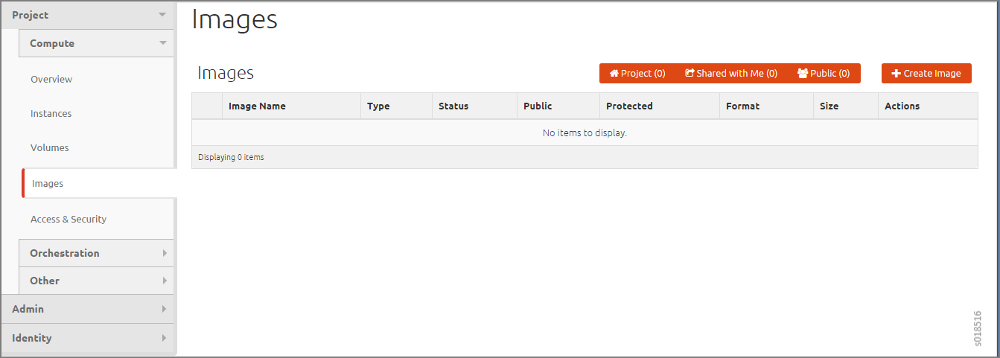
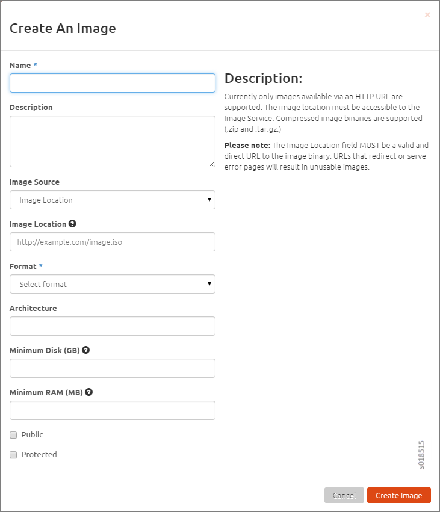

# Creating an Image for a Project in OpenStack Contrail

 

To specify an image to upload to the Image Service for a project in your
system by using the OpenStack dashboard:

1.  In OpenStack, select **Project &gt; Compute &gt;
    Images**. The Images window is displayed. See
    [Figure 1](creating-image-vnc.html#images).

    

2.  Make sure you have selected the correct project to
    which you are associating an image.

3.  Click **Create Image**.

    The **Create An Image** window is displayed. See
    [Figure 2](creating-image-vnc.html#create-image).

    

4.  Complete the fields to specify your image.
    [Table 1](creating-image-vnc.html#images-fields) describes each of
    the fields on the window.**Note**

    Only images available through an HTTP URL are supported, and the
    image location must be accessible to the Image Service. Compressed
    image binaries are supported (`*.zip` and `*.tar.gz`).

    Table 1: Create an Image Fields

    <table data-cellspacing="0" style="border-top:thin solid black;" width="99%">
    <colgroup>
    <col style="width: 50%" />
    <col style="width: 50%" />
    </colgroup>
    <thead>
    <tr class="header">
    <th style="text-align: left;">
Field
</th>
    <th style="text-align: left;">
Description
</th>
    </tr>
    </thead>
    <tbody>
    <tr class="odd">
    <td style="text-align: left;">
<strong>Name</strong>
</td>
    <td style="text-align: left;">
Enter a name for this image.
</td>
    </tr>
    <tr class="even">
    <td style="text-align: left;">
<strong>Description</strong>
</td>
    <td style="text-align: left;">
Enter a description for the image.
</td>
    </tr>
    <tr class="odd">
    <td style="text-align: left;">
<strong>Image Source</strong>
</td>
    <td style="text-align: left;">
Select <strong>Image File</strong> or <strong>Image Location</strong>.

    
If you select <strong>Image File</strong>, you are prompted to browse to the local location of the file.
</td>
    </tr>
    <tr class="even">
    <td style="text-align: left;">
<strong>Image Location</strong>
</td>
    <td style="text-align: left;">
Enter an external HTTP URL from which to load the image. The URL must be a valid and direct URL to the image binary. URLs that redirect or serve error pages result in unusable images.
</td>
    </tr>
    <tr class="odd">
    <td style="text-align: left;">
<strong>Format</strong>
</td>
    <td style="text-align: left;">
Required field. Select the format of the image from a list: 
    AKI– Amazon Kernel Image 
    AMI– Amazon Machine Image 
    ARI– Amazon Ramdisk Image 
    ISO– Optical Disk Image 
    QCOW2– QEMU Emulator 
    Raw– An unstructured image format 
    VDI– Virtual Disk Imade 
    VHD– Virtual Hard Disk 
    VMDK– Virtual Machine Disk 
    
</td>
    </tr>
    <tr class="even">
    <td style="text-align: left;">
<strong>Architecture</strong>
</td>
    <td style="text-align: left;">
Enter the architecture.
</td>
    </tr>
    <tr class="odd">
    <td style="text-align: left;">
<strong>Minimum Disk (GB)</strong>
</td>
    <td style="text-align: left;">
Enter the minimum disk size required to boot the image. If you do not specify a size, the default is 0 (no minimum).
</td>
    </tr>
    <tr class="even">
    <td style="text-align: left;">
<strong>Minimum Ram (MB)</strong>
</td>
    <td style="text-align: left;">
Enter the minimum RAM required to boot the image. If you do not specify a size, the default is 0 (no minimum).
</td>
    </tr>
    <tr class="odd">
    <td style="text-align: left;">
<strong>Public</strong>
</td>
    <td style="text-align: left;">
Select this check box if this is a public image. Leave unselected for a private image.
</td>
    </tr>
    <tr class="even">
    <td style="text-align: left;">
<strong>Protected</strong>
</td>
    <td style="text-align: left;">
Select this check box for a protected image.
</td>
    </tr>
    </tbody>
    </table>

5.  When you are finished, click **Create
    Image**.

 
