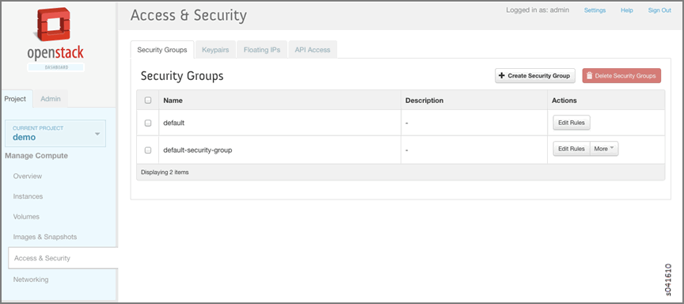
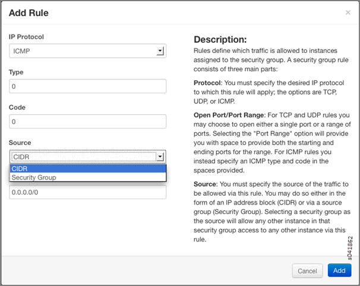
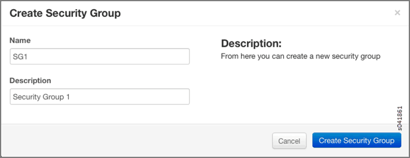

# Using Security Groups with Virtual Machines (Instances)

 

## Security Groups Overview

A **security group** is a container for security group rules. Security
groups and security group rules allow administrators to specify the type
of traffic that is allowed to pass through a port. When a virtual
machine (VM) is created in a virtual network (VN), a security group can
be associated with the VM when it is launched. If a security group is
not specified, a port is associated with a default security group. The
default security group allows both ingress and egress traffic. Security
rules can be added to the default security group to change the traffic
behavior.

## Creating Security Groups and Adding Rules

A default security group is created for each project. You can add
security rules to the default security group and you can create
additional security groups and add rules to them. The security groups
are then associated with a VM, when the VM is launched or at a later
date.

To add rules to a security group:

1.  From the OpenStack interface, click the
    **Project** tab, select **Access & Security**, and click the
    **Security Groups** tab.

    Any existing security groups are listed under the **Security
    Groups** tab, including the default security group; see
    [Figure 1](creating-security-groups.html#secur-grps).

    

2.  Select the **default-security-group** and click
    **Edit Rules** in the **Actions** column.

    The **Edit Security Group Rules** window is displayed; see
    [Figure 2](creating-security-groups.html#edit-sec-rules). Any rules
    already associated with the security group are listed.

    

3.  Click **Add Rule** to add a new rule; see
    [Figure 3](creating-security-groups.html#add-rule-sg).

    

    Table 1: Add Rule Fields

    | Column          | Description                                                                                                                                                                                                                                                                                                                                                   |
    |:----------------|:--------------------------------------------------------------------------------------------------------------------------------------------------------------------------------------------------------------------------------------------------------------------------------------------------------------------------------------------------------------|
    | **IP Protocol** | Select the IP protocol to apply for this rule: TCP, UDP, ICMP.                                                                                                                                                                                                                                                                                                |
    | **From Port**   | Select the port from which traffic originates to apply this rule. For TCP and UDP, enter a single port or a range of ports. For ICMP rules, enter an ICMP type code.                                                                                                                                                                                          |
    | **To Port**     | The port to which traffic is destined that applies to this rule, using the same options as in the **From Port** field.                                                                                                                                                                                                                                        |
    | **Source**      | Select the source of traffic to be allowed by this rule. Specify subnet—the CIDR IP address or address block of the inter-domain source of the traffic that applies to this rule, or you can choose security group as source. Selecting security group as source allows any other instance in that security group access to any other instance via this rule. |

4.  Click **Create Security Group** to create
    additional security groups.

    The **Create Security Group** window is displayed; see
    [Figure 4](creating-security-groups.html#creat-sec-grp).

    Each new security group has a unique 32-bit security group ID and an
    ACL is associated with the configured rules.

    

5.  When an instance is launched, there is an
    opportunity to associate a security group; see
    [Figure 5](creating-security-groups.html#launch-sg).

    In the **Security Groups** list, select the security group name to
    associate with the instance.

    

6.  You can verify that security groups are attached
    by viewing the `SgListReq` and `IntfReq` associated with the
    `agent.xml`.

 
