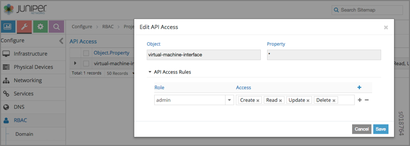
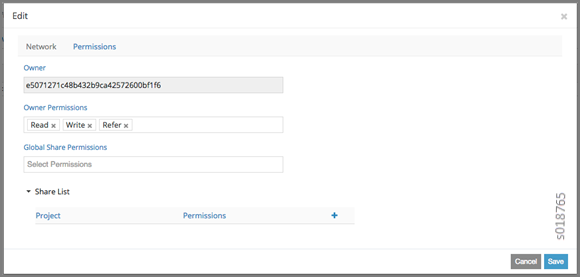

# Configuring Role and Resource-Based Access Control

 

## Contrail Role and Resource-Based Access (RBAC) Overview

Contrail Networking supports role and resource-based access control
(RBAC) with API operation-level access control.

The RBAC implementation relies on user credentials obtained from
Keystone from a token present in an API request. Credentials include
user, role, tenant, and domain information.

API-level access is controlled by a list of rules. The attachment points
for the rules include `global-system-config`, domain, and project.
Resource-level access is controlled by permissions embedded in the
object.

## API-Level Access Control

If the RBAC feature is enabled, the API server requires a valid token to
be present in the `X-Auth-Token` of any incoming request. The API server
trades the token for user credentials (role, domain, project, and so on)
from Keystone.

If a token is missing or is invalid, an HTTP error 401 is returned.

The `api-access-list` object holds access rules of the following form:

`<object, field> => list of <role:CRUD> `

Where:

`object`—An API resource
such as network or subnet.

`field`—Any property or
reference within the resource. The `field` option can be multilevel, for
example, `network.ipam.host-routes` can be used to identify multiple
levels. The `field` is optional, so in its absence, the create, read,
update, and delete (CRUD) operation refers to the entire resource.

`role`—The Keystone role
name. 

Each rule also specifies the list of roles and their corresponding
permissions as a subset of the CRUD operations.

### Example: ACL RBAC Object

The following is an example access control list (ACL) object for a
project in which the admin and any users with the `Development` role can
perform CRUD operations on the network in a project. However, only the
`admin ` role can perform CRUD operations for policy and IP address
management (IPAM) inside a network.

    <virtual-network, network-policy> => admin:CRUD

     <virtual-network, network-ipam> => admin:CRUD

     <virtual-network, *>    => admin:CRUD, Development:CRUD

### Rule Sets and ACL Objects

The following are the features of rule sets for access control objects
in Contrail.

-   The rule set for validation is the union of rules from the ACL
    attached to:

    -   User project

    -   User domain

    -   Default domain

        It is possible for the project or domain access object to be
        empty.

-   Access is only granted if a rule in the combined rule set allows
    access.

-   There is no explicit deny rule.

-   An ACL object can be shared within a domain. Therefore, multiple
    projects can point to the same ACL object. You can make an ACL
    object the default.

## Object Level Access Control

The `perms2` permission property of an object allows fine-grained access
control per resource.

The `perms2` property has the following fields:

`owner` —This field is
populated at the time of creation with the tenant UUID value extracted
from the token. 

`share list `—The share list
gets built when the object is selected for sharing with other users. It
is a list of tuples with which the object is shared.

The `permission` field has the following options:

-   `R`—Read object

-   `W`—Create or update object

-   `X`—Link (refer to) object

Access is allowed as follows:

-   If the user is the owner and permissions allow (rwx)

-   Or if the user tenant is in a shared list and permissions allow

-   Or if world access is allowed

## Configuration

This section describes the parameters used in Contrail RBAC.

-   [Parameter: aaa-mode](role-resource-access-control-vmc.html#jd0e197)

-   [Parameter:
    cloud\_admin\_role](role-resource-access-control-vmc.html#jd0e271)

-   [Global Read-Only
    Role](role-resource-access-control-vmc.html#jd0e358)

-   [Parameter Changes in
    /etc/neutron/api-paste.ini](role-resource-access-control-vmc.html#jd0e415)

### Parameter: aaa-mode

RBAC is controlled by a parameter named `aaa-mode`. This parameter is
used in place of the multi-tenancy parameter of previous releases.

The `aaa-mode` can be set to the following values:

-   `no-auth`—No authentication is performed and full access is granted
    to all.

-   `cloud-admin`—Authentication is performed and only the admin role
    has access.

-   `rbac`—Authentication is performed and access is granted based on
    role.

    If you are using Contrail Ansible Deployer to provision Contrail
    Networking, set the value for AAA\_MODE to rbac
    to enable RBAC by default.

    

    

        contrail_configuration:
          .
          .
          .
          AAA_MODE: rbac

    

    

    If you are installing Contrail Networking from Contrail Command,
    specify the key and value as AAA\_MODE and rbac, respectively, under the section Contrail
    Configuration on the **Step 2 Provisioning Options** page.

After enabling RBAC, you must restart the neutron server by running the
service neutron-server restart command
for the changes to take effect.

**Note**

The `multi_tenancy` parameter is deprecated, starting with Contrail 3.0.
The parameter should be removed from the configuration. Instead, use the
`aaa_mode` parameter for RBAC to take effect.

If the `multi_tenancy` parameter is not removed, the `aaa-mode` setting
is ignored.

### Parameter: cloud\_admin\_role

A user who is assigned the `cloud_admin_role` has full access to
everything.

This role name is configured with the `cloud_admin_role` parameter in
the API server. The default setting for the parameter is `admin`. This
role must be configured in Keystone to change the default value.

If a user has the `cloud_admin_role` in one tenant, and the user has a
role in other tenants, then the `cloud_admin_role` role must be included
in the other tenants. A user with the `cloud_admin_role` doesn't need to
have a role in all tenants, however, if that user has any role in
another tenant, that tenant must include the `cloud_admin_role`.

#### Configuration Files with Cloud Admin Credentials

The following configuration files contain `cloud_admin_role`
credentials:

-   `/etc/contrail/contrail-keystone-auth.conf `

-   `/etc/neutron/plugins/opencontrail/ContrailPlugin.ini`

-   `/etc/contrail/contrail-webui-userauth.js`

#### Changing Cloud Admin Configuration Files

Modify the cloud admin credential files if the `cloud_admin_role` role
is changed.

1.  Change the configuration files with the new
    information.
2.  Restart the following:
    -   API server

        `service supervisor-config restart`

    -   Neutron server

        `service neutron-server restart`

    -   WebUI

        `service supervisor-webui restart`

### Global Read-Only Role

You can configure a global read-only role (`global_read_only_role`).

A `global_read_only_role` allows read-only access to all Contrail
resources. The `global_read_only_role` must be configured in Keystone.
The default `global_read_only_role` is not set to any value.

A `global_read_only_role` user can use the Contrail Web Ui to view the
global configuration of Contrail default settings.

#### Setting the Global Read-Only Role

To set the global read-only role:

1.  The `cloud_admin` user sets the
    `global_read_only_role` in the Contrail API:

    `/etc/contrail/contrail-api.conf`

    `global_read_only_role = <new-admin-read-role>`

2.  Restart the `contrail-api `service:

    `service contrail-api restart`

### Parameter Changes in /etc/neutron/api-paste.ini

Contrail RBAC operation is based upon a user token received in the
`X-Auth-Token` header in API requests. The following change must be made
in `/etc/neutron/api-paste.ini` to force Neutron to pass the user token
in requests to the Contrail API server:

    keystone = user_token request_id catch_errors ....
    ...
    ...
    [filter:user_token]
    paste.filter_factory = neutron_plugin_contrail.plugins.opencontrail.neutron_middleware:token_factory

## Upgrading from Previous Releases

The `multi_tenancy` parameter is deprecated.. The parameter should be
removed from the configuration. Instead, use the `aaa_mode` parameter
for RBAC to take effect.

If the `multi_tenancy` parameter is not removed, the `aaa-mode` setting
is ignored.

## Configuring RBAC Using the Contrail User Interface

To use the Contrail UI with RBAC:

1.  Set the aaa\_mode to no\_auth.

    `/etc/contrail/contrail-analytics-api.conf`

    `aaa_mode = no-auth `

2.  Restart the `analytics-api` service.

    `service contrail-analytics-api restart`

3.  Restart services by restarting the
    container.

You can use the Contrail UI to configure RBAC at both the API level and
the object level. API level access control can be configured at the
global, domain, and project levels. Object level access is available
from most of the create or edit screens in the Contrail UI.

### Configuring RBAC at the Global Level

To configure RBAC at the global level, navigate to **Configure &gt;
Infrastructure &gt; Global Config &gt; RBAC**, see
[Figure 1](role-resource-access-control-vmc.html#rbacui1).

### Configuring RBAC at the Domain Level

To configure RBAC at the domain level, navigate to **Configure &gt; RBAC
&gt; Domain**, see
[Figure 2](role-resource-access-control-vmc.html#rbacui2).

### Configuring RBAC at the Project Level

To configure RBAC at the project level, navigate to **Configure &gt;
RBAC &gt; Project**, see
[Figure 3](role-resource-access-control-vmc.html#rbacui3).

### Configuring RBAC Details

Configuring RBAC is similar at all of the levels. To add or edit an API
access list, navigate to the global, domain, or project page, then click
the plus (+) icon to add a list, or click the gear icon to select from
Edit, Insert After, or Delete, see
[Figure 4](role-resource-access-control-vmc.html#rbacui4).

#### Creating or Editing API Level Access

Clicking create, edit, or insert after activates the Edit API Access
popup window, where you enter the details for the API Access Rules.
Enter the user type in the Role field, and use the **+** icon in the
Access filed to enter the types of access allowed for the role,
including, Create, Read, Update, Delete, and so on, see
[Figure 5](role-resource-access-control-vmc.html#rbacui5).

#### Creating or Editing Object Level Access

You can configure fine-grained access control by resource. A
**Permissions** tab is available on all create or edit popups for
resources. Use the **Permissions** popup to configure owner permissions
and global share permissions. You can also share the resource to other
tenants by configuring it in the **Share List**, see
[Figure 6](role-resource-access-control-vmc.html#rbacui6).

## RBAC Resources

Refer to the OpenStack Administrator Guide for additional information
about RBAC:

-   [Identity API protection with role-based access control
    (RBAC)](http://docs.openstack.org/admin-guide-cloud/content/identity-service-api-protection-with-role-based-access-control.html)

 
