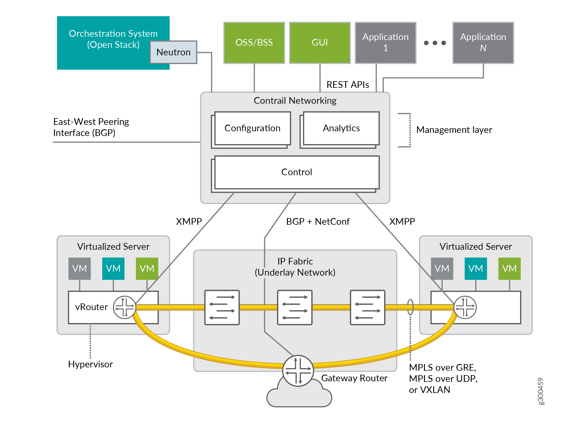

# Understanding Contrail Networking Components

 

Contrail Networking is comprised of the following key components:

-   *Contrail Networking management Web GUI and plug-ins* integrate with
    orchestration platforms such as Kubernetes, OpenShift, Mesos,
    OpenStack, VMware vSphere, and with service provider operations
    support systems/business support systems (OSS/BSS). Many of these
    integrations are built, certified, and tested with technology
    alliances like Red Hat, Mirantis, Canonical, NEC, and more. Contrail
    Networking sits under such orchestration systems and integrates
    northbound via published REST APIs. It can be automatically driven
    through the APIs and integrations, or managed directly using the Web
    GUI, called Contrail Command GUI.

-   *Contrail Networking control and management systems*, commonly
    called the controller, have several functions. Few of the major
    functions are:

    -   *Configuration Nodes*—This function accepts requests from the
        API to provision workflows like adding new virtual networks, new
        endpoints, and much more. It converts these abstract high-level
        requests, with optional detail, into low-level directions that
        map to the internal data model.

    -   *Control Nodes*—This function maintains a scalable, highly
        available network model and state by federating with other peer
        instances of itself. It directs network provisioning for the
        Contrail Networking vRouters using Extensible Messaging and
        Presence Protocol (XMPP). It can also exchange network
        connectivity and state with peer physical routers using open
        industry-standard MP-BGP which is useful for routing the overlay
        networks and north-south traffic through a high-performance
        cloud gateway router.

    -   *Analytics Nodes*—This function collects, stores, correlates,
        and analyzes data across network elements. This information,
        which includes statistics, logs, events, and errors, can be
        consumed by end-user or network applications through the
        northbound REST API or Apache Kafka. Through the Web GUI, the
        data can be analyzed with SQL style queries.

-   *Contrail Networking vRouter* runs on the compute nodes of the cloud
    or NFV infrastructure. It gets network tenancy, VPN, and
    reachability information from the control function nodes and ensures
    native Layer 3 services for the Linux host on which it runs or for
    the containers or virtual machines of that host. Each vRouter is
    connected to at least two control nodes to optimize system
    resiliency. The vRouters run in one of two high performance
    implementations: as a Linux kernel module or as an Intel Data Plane
    Development Kit (DPDK)-based process.

 
