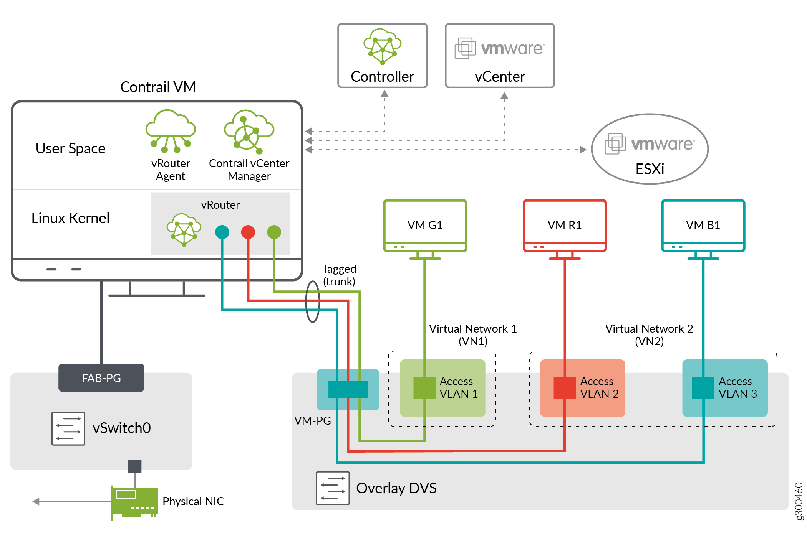
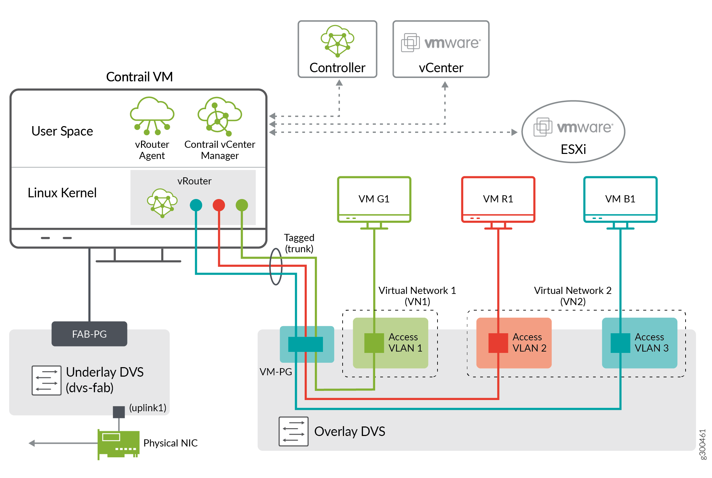
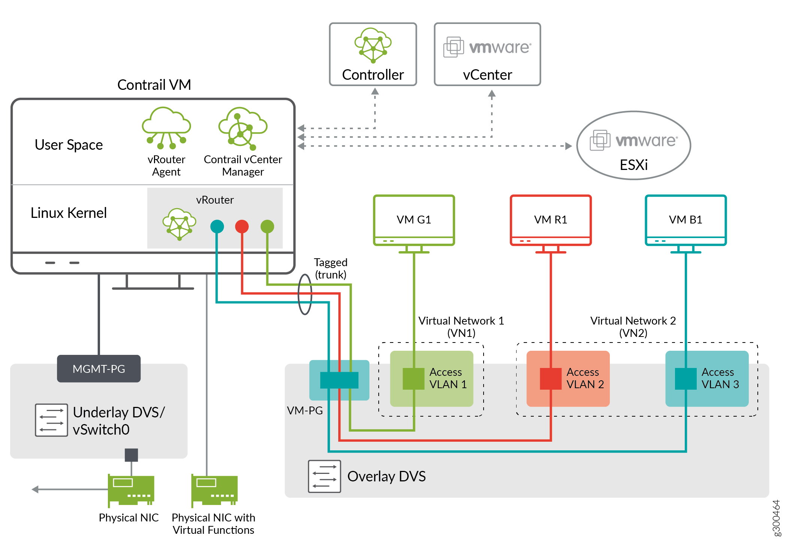

# Configuring Underlay Network for ContrailVM

 

The ContrailVM can be configured in several different ways for the
underlay (`ip-fabric`) connectivity:

## Standard Switch Setup

In the standard switch setup, the ContrailVM is provided an interface
through the standard switch port group that is used for management and
control data, see
[Figure 1](vcenter-as-orchestrator-deployment-scenarios-501.html#stdswitch).

To set up the ContrailVM in this mode, the standard switch and port
group must be configured in `vcenter_vars.yml`.

If switch name is not configured, the default values of `vSwitch0` are
used for the standard switch.

The ContrailVM supports multiple NICs for management and `control_data`
interfaces. The management interface must have the DHCP flag as `true`
and the `control_data` interface can have DHCP set as `false`. When DHCP
is set to false, the IP address of the `control_data` interface must be
configured by the user and ensure connectivity. Additional configuration
such as static routes and bond interface must be configured by the user.

The following is an example of configuration with standard switch.

    -   name: <esxi_host>
        username: <username>
        password: <password>
        datastore: <datastore>
        vcenter_server: <server>
        datacenter: <datacenter>
        cluster: <cluster>
        std_switch_list:
          - pg_name: mgmt-pg
            switch_name: vSwitch0
        contrail_vm:
           networks:
             - mac: 00:77:56:aa:bb:03
               sw_type: standard
               switch_name: vSwitch0
               pg: mgmt-pg

## Distributed Switch Setup

A distributed switch functions as a single virtual switch across
associated hosts.

In the distributed switch setup, the ContrailVM is provided an interface
through the distributed switch port group that is used for management
and control data, see
[Figure 2](vcenter-as-orchestrator-deployment-scenarios-501.html#distswitch).

The ContrailVM can be configured to use the management and control\_data
NICs from DVS. When the DVS configuration is specified, the standard
switch configuration is ignored.

To set up the ContrailVM in this mode, configure the distributed switch,
port group, number of ports in the port group, and the uplink in the
`vcenter_servers ` section in `vcenter_servers.yml`.

**Note**

The uplink can be a link aggregation group (LAG). If you use LAG, then
DVS and LAG should be preconfigured.

The following is an example distributed switch configuration in
`vcenter_vars.yml`.

     vcenter_servers:
      - SRV1:
          hostname: <server>
          username: <username>
          password: <password>
          datacentername: <datacenter>
          clusternames:
            - <cluster>
          
          
          dv_switch:
            dv_switch_name: <dvs_name>
          dv_port_group:
            dv_portgroup_name: <pg_name>
            number_of_ports: <num_of_ports>
          dv_switch_control_data:
            dv_switch_name: <ctrl_dvs_name>
          dv_port_group_control_data:
            dv_portgroup_name: <ctrl_pg_name>
            number_of_ports: <num_of_ports>
            uplink:
             - 'vmnic3'

## PCI Pass-Through Setup

PCI pass-through is a virtualization technique in which a physical
Peripheral Component Interconnect (PCI) device is directly connected to
a virtual machine, bypassing the hypervisor. Drivers in the VM can
directly access the PCI device, resulting in a high rate of data
transfer.

In the pass-through setup, the ContrailVM is provided management and
control data interfaces. Pass-through interfaces are used for control
data.
[Figure 3](vcenter-as-orchestrator-deployment-scenarios-501.html#pcisinglecd)
shows a PCI pass-through setup with a single `control_data` interface.

When setting up the ContrailVM with pass-through interfaces, upon
provisioning ESXi hosts in the installation process, the PCI
pass-through interfaces are exposed as Ethernet interfaces in the
ContrailVM, and are identified in the `control_data` device field.

The following is an example PCI pass-through configuration with a single
`control_data` interface:

    esxihosts:
      - name: <esxi_host>
        username: <username>
        password: <password>
        datastore: <datastore>
        vcenter_server: <server>
        datacenter: <datacenter>
        cluster: <cluster>
        contrail_vm:
          networks:
            - mac: <mac_addr>
          pci_devices:
           - '0000:04:00.0'

[Figure 4](vcenter-as-orchestrator-deployment-scenarios-501.html#pcibond)
shows a PCI pass-through setup with a bond\_control data interface,
which has multiple pass-through NICs.

Update the ContrailVM section in `vcenter_vars.yml` with `pci_devices`
as shown in the following example:

    esxihosts:
      - name: <esxi_host>
        username: <username>
        password: <password>
        datastore: <datastore>
        vcenter_server: <server>
        datacenter: <datacenter>
        cluster: <cluster>
        contrail_vm:
         
          networks:
            - mac: <mac_addr>
          pci_devices:
           - '0000:04:00.0'
           - '0000:04:00.1'

## SR-IOV Setup

A single root I/O virtualization (SR-IOV) interface allows a network
adapter device to separate access to its resources among various
hardware functions.

In the SR-IOV setup, the ContrailVM is provided management and control
data interfaces. SR-IOV interfaces are used for control data. See
[Figure 5](vcenter-as-orchestrator-deployment-scenarios-501.html#sriov).

In VMware, the `port-group` is mandatory for SR-IOV interfaces because
the ability to configure the networks is based on the active policies
for the port holding the virtual machines.

To set up the ContrailVM with SR-IOV interfaces, all configurations used
for the standard switch setup are also used for the pass-through setup,
providing management connectivity to the ContrailVM.

To provide the `control_data` interfaces, configure the SR-IOV-enabled
physical interfaces in the `contrail_vm` section, and configure the
`control_data` in the global section of `vcenter_vars.yml`.

Upon provisioning ESXi hosts in the installation process, the SR-IOV
interfaces are exposed as Ethernet interfaces in the ContrailVM.

[Figure 6](vcenter-as-orchestrator-deployment-scenarios-501.html#sriovsingle)
shows a SR-IOV setup with a single `control_data` interface.

The following is an example SR-IOV configuration for the cluster and
server configuration.

The cluster configuration:

    vcenter_servers:
      - SRV1:
          hostname: <server>
          username: <username>
          password: <password>
          datacentername: <datacenter>
          clusternames:
            - <cluster>
          
          
          dv_switch:
            dv_switch_name: <dvs_name>
          dv_port_group:
            dv_portgroup_name: <pg_name>
            number_of_ports: <num_of_ports>
          dv_switch_sr_iov:
            dv_switch_name: <sriov_dvs_name>
          dv_port_group_sriov:
            dv_portgroup_name: <sriov_pg_name>
            number_of_ports: 

The server configuration:

    esxihosts:
      - name: <esxi_host>
        username: <username>
        password: <password>
        datastore: <datastore>
        vcenter_server: <server>
        datacenter: <datacenter>
        cluster: <cluster>
        contrail_vm:
          
          networks:
            - mac: <mac_addr>
          sr_iov_nics:
           - 'vmnic0'

[Figure 7](vcenter-as-orchestrator-deployment-scenarios-501.html#sriovbond)
shows an SR-IOV configuration with a bond `control_data` interface,
which has multiple SR-IOV NICs.

For Bond interface-configuration specify multiple NICs in sr\_iov\_nics, and add required
configuration for multi-interface and bond configuration in
`vcenter_vars.yml`.

The cluster configuration:

    vcenter_servers:
      - SRV1:
          hostname: <server>
          username: <username>
          password: <password>
          datacentername: <datacenter>
          clusternames:
            - <cluster>
          
          
          dv_switch:
            dv_switch_name: <dvs_name>
          dv_port_group:
            dv_portgroup_name: <pg_name>
            number_of_ports: <num_of_ports>
          dv_switch_sr_iov:
            dv_switch_name: <sriov_dvs_name>
          dv_port_group_sriov:
            dv_portgroup_name: <sriov_pg_name>
            number_of_ports: 

The server configuration:

    esxihosts:
      - name: <esxi_host>
        username: <username>
        password: <password>
        datastore: <datastore>
        vcenter_server: <server>
        datacenter: <datacenter>
        cluster: <cluster>
        contrail_vm:
         
          networks:
            - mac: <mac_addr>
          sr_iov_nics:
           - 'vmnic0'
           - 'vmnic1'

 
