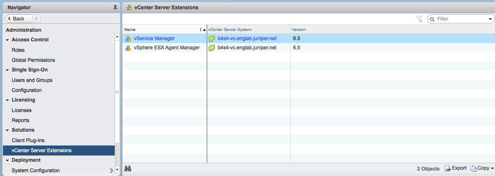
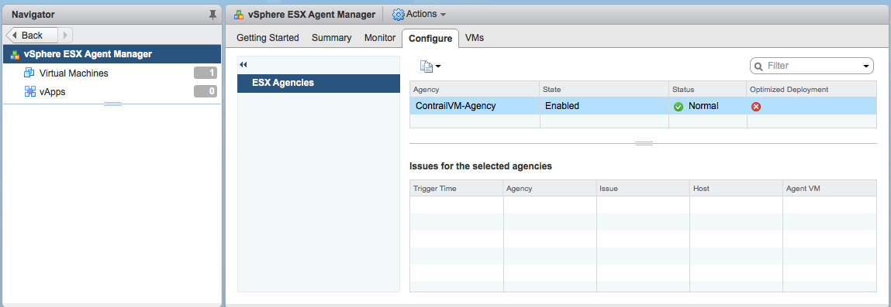

# Integrating vCenter for Contrail

 

These topics provide instructions for integrating Contrail Release 5.1.x
and microservices with VMware vCenter.

## Prerequisites

Before you start the integration, ensure that the contrail controller
meets the prerequisites given in [Server Requirements and Supported
Platforms](../installation/hardware-reqs-vnc.html).

Follow these steps to prepare Contrail controller(s):

    yum update -y

    yum install -y yum-plugin-priorities https://dl.fedoraproject.org/pub/epel/epel-release-latest-7.noarch.rpm

    yum install -y python-pip git gcc python-devel sshpass

    yum install -y git

    pip install “ansible==2.5.0” pyvmomi

## ESX Agent Manager

VMware provides a standard vCenter solution called vSphere ESX Agent
Manager (EAM), that allows you to deploy, monitor, and manage
ContrailVMs on ESXi hosts.

The ContrailVM is deployed as an Agent VM that is monitored by EAM. With
this integration, ContrailVMs are marked as more critical and privileged
than other tenant VMs on the host.

The following are the benefits of running ContrailVM as an AgentVM from
EAM:

-   Auto-deploy ContrailVMs on ESXi hosts in scope (clusters).

-   Manage and Monitor ContrailVMs through EAM in the vSphere web
    client.

-   Integrate with other vCenter features like AddHos, Maintenance Mode,
    vSphere DRS, vSphere DPM, and VMWare HA.

These topics provide instructions for integrating Contrail Release 5.1.x
and microservices with VMware vCenter.

## Set Up vCenter Server

Follow these steps to set up the vCenter server.

1.  Download the Contrail Ansible Deployer
    (`contrail-ansible-deployer-< >.tgz`) onto your provisioning host.
    You can download the deployer from
    <https://www.juniper.net/support/downloads/?p=contrail#sw>.

2.  Untar the `tgz`.
    

    

    `- tar xvf contrail-ansible-deployer-< >.tgz `

    

    

3.  Prepare a `vcenter_vars.yml` file populated with
    vCenter server and ESXI hosts parameters. You can download the
    CentOS 7.5 and ESXi VM Host from
    <https://www.juniper.net/support/downloads/?p=contrail#sw>.**Note**

    You can see a sample of the vcenter\_vars.yml file in the
    `contrail-ansible-deployer/playbooks/roles/vcenter/vars/vcenter_vars.yml`
    after you extract the image files.

    **Note**

    The ContrailVM’s Open Virtualization Format (OVF) image must be
    hosted on an http or https server which runs on and is reachable
    from the vCenter server. The location of the OVF is provided as a
    URL path for `vmdk:` as shown in the example given below.

    

    **Example: Enabling HA and DRS in the cluster**

    

        vcenter_servers:
          - SRV1:
              hostname: 
              username:
              password:
              # Optional: defaults to False
              #validate_certs: False
              datacentername: 
              clusternames:
              #path to the ovf, is needed for ESX Agent Manager to deploy ContrailVMs
              vmdk: http://<ip-address>/centos-7.5/LATEST/ContrailVM.ovf
              # Optional: If not specified HA and DRS are turned off on the clusters.
              enable_ha: yes
              enable_drs: yes

    

    For definition examples, refer
    `contrail-ansible-deployer/playbooks/roles/vcenter/vars/vcenter_vars.yml.sample`.

    To enable HA and DRS in the cluster, set `enable_ha` and
    `enable_drs` to `yes` in the `vcenter_vars.yml` file. If these flags
    are not enabled, HA and DRS is turned off by default for newly
    created and existing clusters.

    

    

    **Example instances.yaml File**

    

        provider_config:
          bms:
            ssh_pwd: password
            ssh_user: root
            ntpserver: 8.8.8.8
            domainsuffix: blah.net

        instances:
          bms1:
            provider: bms
            ip: <ip-address>
            roles:
              config_database:
              config:
              control:
              analytics_database:
              analytics:
              webui:
              vcenter_plugin:
          bms2:
            provider: bms
            esxi_host: <ip-address>
            ip: <ip-address>
            roles:
              vrouter:
              vcenter_manager:
                ESXI_USERNAME: root
                ESXI_PASSWORD: password
          bms3:
            provider: bms
            esxi_host: <ip-address>
            ip: <ip-address>
            roles:
              vrouter:
              vcenter_manager:
                ESXI_USERNAME: root
                ESXI_PASSWORD: password
          bms4:
            provider: bms
            esxi_host: <ip-address>
            ip: <ip-address>
            roles:
              vrouter:
              vcenter_manager:
                ESXI_USERNAME: root
                ESXI_PASSWORD: password

        global_configuration:
          CONTAINER_REGISTRY: hub.juniper.net
          CONTAINER_REGISTRY_USERNAME: username
          CONTAINER_REGISTRY_PASSWORD: password
          REGISTRY_PRIVATE_INSECURE: False

        contrail_configuration:
          CLOUD_ORCHESTRATOR: vcenter
          CONTROLLER_NODES: <ip-address>
          CONTRAIL_VERSION: 5.1.0-0.360
          RABBITMQ_NODE_PORT: 5673
          VCENTER_SERVER: <ip-address>
          VCENTER_USERNAME: administrator@vsphere.net
          VCENTER_PASSWORD: password
          VCENTER_DATACENTER: <DC name here>
          VCENTER_DVSWITCH: overlay
          VCENTER_WSDL_PATH: /usr/src/contrail/contrail-web-core/webroot/js/vim.wsdl
          VCENTER_AUTH_PROTOCOL: https

    

    

    **Note**

    The default login credentials for Contrail OVF:

    -   Username: `root `

    -   Password: `c0ntrail123`

    We suggest using unique usernames and passwords in accordance with
    your organization’s security guidelines.

    

    **Example vcenter\_vars.yml File**

    

        ---
        vcenter_servers:
          - SRV1:
              hostname: <host-ip-address>
              username: administrator@vsphere.net
              password: password
              # Optional: defaults to False
              #validate_certs: False
              datacentername: "<your DC name here>"
              clusternames:
                - "<your cluster name here>"
              vmdk: http://<ip-address>/contrail/images/ContrailVM.ovf
              dv_switch:
                dv_switch_name: overlay
              dv_port_group:
                dv_portgroup_name: VM_pg
                number_of_ports: 1800

        esxihosts:
          - name: <ip-address>
            username: root
            password: password
            datastore: <your local datastore here>
            datacenter: "<your DC name here>"
            cluster: "<your cluster name here>"
            contrail_vm:
              networks:
                - mac: 00:77:56:aa:bb:01
            vcenter_server: SRV1 #leave this
          - name: <ip-address>
            username: root
            password: password
            datastore: <your local datastore here>
            datacenter: "<your DC name here>"
            cluster: "<your cluster name here>"
            contrail_vm:
              networks:
                - mac: 00:77:56:aa:bb:02
            vcenter_server: SRV1 #leave this
          - name: <ip-address>
            username: root
            password: password
            datastore: <your local datastore here>
            datacenter: "<your DC name here>"
            cluster: "<your cluster name here>"
            contrail_vm:
              networks:
                - mac: 00:77:56:aa:bb:77
            vcenter_server: SRV1 #leave this

    

    

4.  Run the Contrail vCenter
    playbook.

    

    

    `ansible-playbook playbooks/vcenter.yml`

    

    

    **Note**

    Verify that the hostnames for the contrail controller(s) and the
    ContrailVMs (vRouters) are unique in `/etc/hostname` file.

    You can verify hostname from either the DHCP options (if the
    management network uses DHCP) or manually (if the management network
    uses static IP allocation).

## Configure Contrail Parameters

Populate the file `config/instances.yaml` with Contrail roles.

For an example file, see
`contrail-ansible-deployer/confing/instances.yaml.vcenter_example`.

## Install Contrail

Install Contrail by running the following Contrail playbooks:

`ansible-playbook -i inventory/ -e orchestrator=vcenter playbooks/configure_instances.yml`

`ansible-playbook -i inventory/ -e orchestrator=vcenter playbooks/install_contrail.yml`

## Monitor and Manage ContrailVM from ESX Agent Manager

ContrailVMs can be monitored from EAM by using ContrailVM-Agency.

Follow these steps to monitor and manage Contrail VM from EAM:

1.  Resolve issues from the ContrailVM-Agency.

    The ContrailVM-Agency is in an alert state when the ContrailVM in
    any host is powered off or is deleted.

    Click **Resolve All Issues** from the ContrailVM-Agency to correct
    the issue. The ContrailVM-Agency will attempt to correct the issue
    by bringing the ContrailVM back online or by spawning a ContrailVM
    from the OVF on the ESXi host.

    

    

2.  Add host.
    1.  Add ESXi host to the cluster.

    2.  Configure **Agent VM Settings** for the ESXI
        host.

        

        For more information on configuring Agent VM, network, and
        datastore settings, see [Configure Agent VM
        Settings](https://docs.vmware.com/en/VMware-vSphere/6.5/com.vmware.vsphere.vcenterhost.doc/GUID-6BEC5198-5273-4592-ABD2-2E6E85873C16.html).

        EAM deploys a ContrailVM (from the base OVF) on the ESXi host.

    3.  Add ESXi host details to `vcenter_vars.yml`
        and repeat step [4](vcenter-contrail.html#run-vcenter-playbook)
        to add appropriate interfaces to the ContrailVM and to configure
        necessary settings in the vCenter server.

    4.  Add ContrailVM details to `instances.yaml`
        and provision Contrail on the newly added ContrailVm (router).
        For more information on provisioning Contrail, see [Install
        Contrail](vcenter-contrail.html#id-install-contrail).

3.  Clean up the ContrailVM-Agency.

    Delete **ContrailVM-Agency** from the EAM user interface to delete
    ContrailVM and the agency.

 
