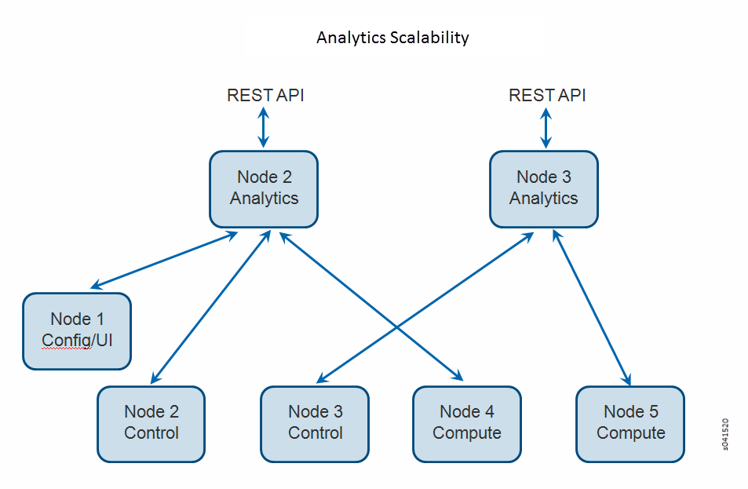

# Analytics Scalability

 

The Contrail monitoring and analytics services (*collector* role)
collect and store data generated by various system components and
provide the data to the Contrail interface by means of representational
state transfer (REST) application program interface (API) queries.

The Contrail components are horizontally scalable to ensure consistent
performance as the system grows. Scalability is provided for the
generator components (*control* and *compute* roles) and for the REST
API users (*webui* role).

This section provides a brief description of the recommended
configuration of analytics in Contrail to achieve horizontal
scalability.

The following is the recommended locations for the various component
roles of the Contrail system for a 5-node configuration.

-   Node 1 —config role, web-ui role

-   Node 2 —control role, analytics role, database role

-   Node 3 —control role, analytics role, database role

-   Node 4 —compute role

-   Node 5 —compute role

[Figure 1](analytics-scalability-vnc.html#analytics-scalable)
illustrates scalable connections for analytics in a 5-node system, with
the nodes configured for roles as recommended above. The analytics load
is distributed between the two analytics nodes. This configuration can
be extended to any number of analytics nodes.

The analytics nodes collect and store data and provide this data through
various REST API queries. Scalability is provided for the control nodes,
the compute nodes, and the REST API users, with the API output displayed
in the Contrail user interface. As the number of control and compute
nodes increase in the system, the analytics nodes can also be increased.

 
