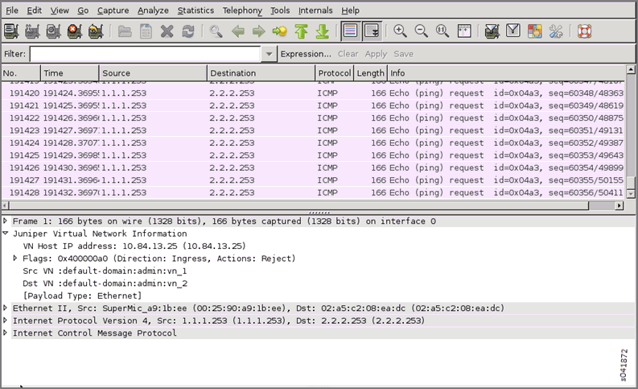

# Analyzer Service Virtual Machine

 

The analyzer service virtual machine (`analyzer-vm-console.qcow2`)
launches a Contrail-enhanced version of the network protocol analyzer
Wireshark as the analyzer starts capturing mirror packets destined to
the analyzer service.

## Packet Format for Analyzer

The analyzer uses the PCAP format, which has these parts:

-   Global header

-   PCAP packet header

-   Packet data (original packet data)

The global header is added by the analyzer service by means of the
Wireshark instance. The vRouter DP uses the configured UDP session to
send mirrored packets to the analyzer, adding the PCAP packet header to
the packet data as it sends it over the UDP socket to the analyzer.

The following additional information is also added to the packet data as
metadata:

-   Captured host (IP address)

-   Ingress or egress

-   Action (Pass/Deny/...)

-   Source VN (fully qualified name)

-   Destination VN (fully qualified name)

In the existing PCAP, a network ID is added in the global header. The
metadata (additional flow information) is added in front of the existing
packet as follows.

+-+-+-+-+-+-+-+-+-+-+-+-+-+-+-+-+-+-+-++-+-+-+-+-+-+-+-+-+-+-+-+-+-+-+-+-+-+-++-+-+-+-+-+-+

\| Global header \| Packet header\| Meta data \|Packet data\| Packet
header\| Meta data \|Packet data\|

+-+-+-+-+-+-+-+-+-+-+-+-+-+-+-+-+-+-+-++-+-+-+-+-+-+-+-+-+-+-+-+-+-+-+-+-+-+-++-+-+-+-+-+-+

## Metadata Format

The metadata is in type-length-value (TLV) format as follows.

-   Type: 1 Byte

-   Length: 1 Byte

-   Value: up to length

Type

-   1 – Captured host IPv4 address

-   2 - Action field

-   3 – Source VN

-   4 – Destination VN

-   255 – TLV end

*Captured host address*

Length is 4 or 16 bytes based on IP address type

*Action field*

Length is 2 bytes. Multiple bits might be turned on, if there are more
actions. Ingress or egress bit will be present in the Action field.

*Source VN or Destination VN*

Length is variable and up to 256 characters

*TLV end*

A special type `255 (0xFF)` is used to identify the end of TLV entries.
The TLV end must be last, at the end of the metadata.

## Wireshark Changes

A plugin is added to the Wireshark code. The plugin parses the metadata
and displays the packet fields; see example in
[Figure 1](analyzer-vm.html#wireshark1).

## Troubleshooting Packet Display

Follow these steps if the packets are not displaying:

1.  Use `tcpdump` on the tap interfaces to see if
    packets are going towards the analyzer VM.
2.  Check introspect to see whether the flow action
    has mirror activity in it or not.

 
