# Debugging BGP Peering and Route Exchange in Contrail

 

Use the troubleshooting steps and guidelines in this topic when you have
errors with Contrail BGP peering and route exchange.

## Example Cluster

Examples in this document refer to a virtual cluster that is set up as
follows:

    Config Nodes  : [‘nodea22’, ‘nodea20’]

    Control Nodes : [‘nodea22’, ‘nodea20’]

    Compute Nodes : [‘nodea22’, ‘nodea20’]

    Collector  : [‘nodea22’]

    WebU  : nodea22

    Openstack  : nodea22

## Verifying the BGP Routers

Use this procedure to launch various introspects to verify the setup of
the BGP routers in your system.

Use this procedure to launch various introspects to verify the setup of
the BGP routers in your system.

1.  List BGP routers with the following Contrail API
    request.

    `bgp-router` is created in Contrail for each control node, BGPaaS,
    and external BGP routers. These are visible from the following
    location, shown using the sample node setup.

    `http: //<host ip address>:8082/bgp-routers`

    **Note**

    Throughout this procedure, replace `<host ip address>` with the
    correct location for your system to see the setup in your system.​

    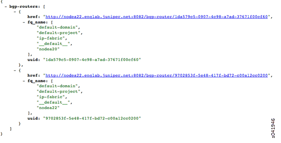

2.  Verify the BGP peering.

    The following statement is entered to check the `bgp_router_refs`
    object on the API server to validate the peering on the sample
    setup.

    ` http: //<host ip address>:8082/bgp-router/1da579c5-0907-4c98-a7ad-37671f00cf60`

    

3.  Verify the command line arguments that are passed
    to the control-node.

    On the control-node, use `ps aux | grep control-node` to see the
    arguments that are passed to the control-node.

    

    ### Example

        /usr/bin/control-node --map-user <ip address> --map-password <ip address>--hostname nodea22 --host-ip <ip address> --bgp-port 179 --discovery-server <ip address>  

    

    The hostname is the `bgp-router` name. Ensure that the bgp-router
    config can be found for the hostname, using the procedure in Step 1.

4.  Validate the BGP neighbor config and the BGP
    peering config object available on the control node. The control
    node receives the configuration from Cassandra (starting with
    Contrail Networking Release 4.0) or from IF-MAP (earlier than
    Contrail Networking Release 4.0).

    `http: //<host ip address>:8083/Snh_ShowBgpNeighborConfigReq? `

    

    `http: //<host ip address>:8083/Snh_ShowBgpPeeringConfigReq? `

    

5.  Check the BGP neighbor states on the control
    node.

    `http: //<host ip address>:8083/Snh_ShowBgpNeighborSummaryReq`

## Verifying the Route Exchange

The following two virtual networks are used in the sample debugging
session for route exchange.

      vn1 -> 1.1.1.0/24

         vn2 -> 2.2.2.0/24

*Example Procedure for Verifying Route Exchange*

1.  Validate the presence of the routing instance for
    each virtual network in the sample system.

    `http ://<host ip address>:8083/Snh_ShowRoutingInstanceReq?name=  `

    **Note**

    Throughout this example, replace `<host ip address>` with the
    correct location for the control node on your system.

    

    In the sample output, you can see the **import\_target** and the
    **export\_target** configured on the routing instance. Also shown
    are the **xmpp peers** (**vroutes**) registered to the table.

    The user can click on the **inet** table of the required routing
    instance to display the routes that belong to the instance.

    Use the information in Step 2 to validate a route.

2.  Validate a route in a given routing instance in
    the sample setup:

    `http ://<host ip address>:8083/Snh_ShowRouteReq?x=default-domain:demo:vn1:vn1.inet.0 `

    In the following sample output (truncated), the user can validate
    the BGP paths for the protocol and for the source of the route to
    verify which XMPP agent or vRouter has pushed the route. If the path
    source is BGP, the route is imported to the VRF table from a BGP
    peer, either another control-node or an external bgp router such as
    an MX Series router. BGP paths are displayed in the order of path
    selection.

    

3.  Validate the **l3vpn** table.

    `http: //<host ip address>:8083/Snh_ShowRouteReq?x=bgp.l3vpn.0`

    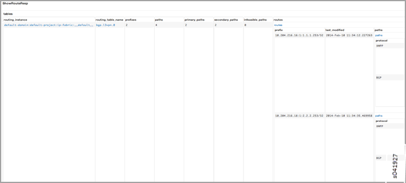

    The following sample output has been scrolled horizontally to
    display the BGP path attributes of each route’s. policies.

    The extended community (communities column), determines the VRF
    table to which this VPN route is imported. The **origin\_vn** shows
    the virtual network where this route was created, information useful
    for applying ACL.

    The label (MPLS) and tunnel encap columns can be used for debugging
    data path issues.

    

## Debugging Route Exchange with Policies

This section uses the sample output and the sample vn1 and vn2 to
demonstrate methods of debugging route exchange with policies.

1.  Create a network policy to allow vn1 and vn2
    traffic and associate the policy to the virtual networks.

    

2.  Validate that the routing instances have the
    correct import\_target configuration.

    `http: //<host ip address>:8083/Snh_ShowRoutingInstanceReq?name=  `

    

3.  Validate that the routes are imported from
    VRF.

    Use the BGP path attribute to check the replication status of the
    path. The route from the destination VRF should be replicated and
    validate the origin-vn.

    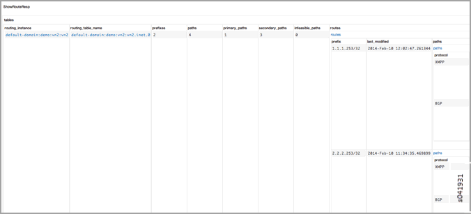

## Debugging Peering with an MX Series Router

This section sets up an example BGP MX Series peer and provides some
troubleshooting scenarios.

1.  Set the Global AS number of the control-node for
    an MX Series BGP peer, using the Contrail WebUI (eBGP).

    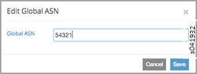

2.  Configure the eBGP peer for the MX Series router.
    Use the Contrail Web UI or Python provisioning.

    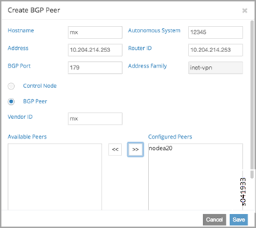

    

    Configuring the MX Series BGP peer with the Python provision
    utility:

        python ./provision_mx.py --router_name mx --router_ip <ip address> --router_asn 12345 --api_server_ip <ip address> --api_server_port 8082 --oper add --admin_user admin --admin_password  <password> --admin_tenant_name  admin

    

3.  Configure a control-node peer on the MX Series
    router, using Junos CLI:
    

        set protocols bgp group contrail-control-nodes type external

        set protocols bgp group contrail-control-nodes local-address <ip address>

        set protocols bgp group contrail-control-nodes keep all

        set protocols bgp group contrail-control-nodes peer-as 54321

        set protocols bgp group contrail-control-nodes local-as 12345

        set protocols bgp group contrail-control-nodes neighbor <ip address>

         

    

## Debugging a BGP Peer Down Error with Incorrect Family

Use this procedure to identify and resolve errors that arise from
families mismatched configurations.

**Note**

This example uses locations at `http: //<host ip address>:`. Be sure to
replace `<host ip address> `with the correct address for your
environment.

1.  Check the BGP peer UVE.

    `http: //<host ip address>:8081/analytics/uves/bgp-peers`

2.  Search for the MX Series BGP peer by name in the
    list.

    In the sample output, `families` is the family advertised by the
    peer and `configured_families` is what is provisioned.​ In the
    sample output, the families configured on the peer has a mismatch,
    thus the peer doesn’t move to an established state. You can verify
    it in the peer UVE.

    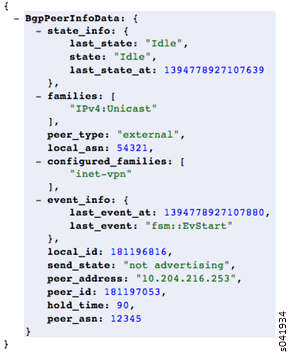

3.  Fix the `families` mismatch in the sample by
    updating the configuration on the MX Series router, using Junos
    CLI:

    `set protocols bgp group contrail-control-nodes family inet-vpn unicast`

4.  After committing the CLI configuration, the peer
    comes up. Verify this with UVE.

    `http: //<host ip address>:8081/analytics/uves/bgp-peers`

    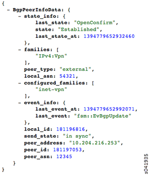

5.  Verify the peer status on the MX Series router,
    using Junos CLI:
    

    

    `run show bgp neighbor <ip address>`

    

    

        Peer: <ip address> AS 54321 Local: <ip address> AS 12345

          Type: External    State: Established    Flags: <ImportEval Sync>

          Last State: OpenConfirm   Last Event: RecvKeepAlive

          Last Error: None

          Options: <Preference LocalAddress KeepAll AddressFamily PeerAS LocalAS Rib-group Refresh>

          Address families configured: inet-vpn-unicast

          Local Address: <ip address> Holdtime: 90 Preference: 170 Local AS: 12345 Local System AS: 64512

          Number of flaps: 0

          Error: 'Cease' Sent: 0 Recv: 2

          Peer ID: <ip address>   Local ID: <ip address>    Active Holdtime: 90

          Keepalive Interval: 30         Group index: 1    Peer index: 0

          BFD: disabled, down

          Local Interface: ge-1/0/2.0

          NLRI for restart configured on peer: inet-vpn-unicast

          NLRI advertised by peer: inet-vpn-unicast

          NLRI for this session: inet-vpn-unicast

          Peer does not support Refresh capability

          Stale routes from peer are kept for: 300

          Peer does not support Restarter functionality

          Peer does not support Receiver functionality

          Peer does not support 4 byte AS extension

          Peer does not support Addpath

    

    

## Configuring MX Peering (iBGP)

1.  Edit the Global ASN.

    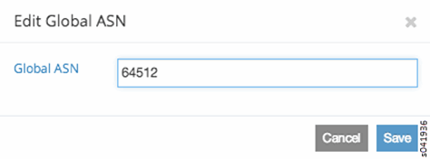

2.  Configure the MX Series IBGP peer, using Contrail
    WebUI or Python provisioning.

    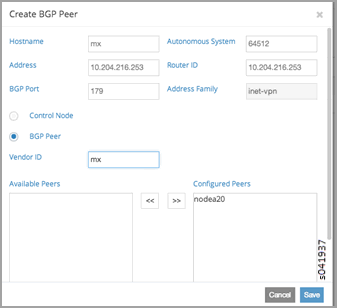

    Configuring the MX Series BGP peer with the Python provision
    utility:

    `python ./provision_mx.py --router_name mx--router_ip <ip address> --router_asn 64512 --api_server_ip <ip address> --api_server_port 8082 --oper add --admin_user admin --admin_password  <password> --admin_tenant_name  admin   `

3.  Verify the peer from UVE.

    `http ://<host ip address>:8081/analytics/uves/bgp-peers`

    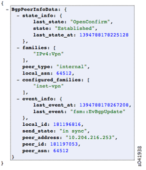

4.  You can verify the same information at the HTTP
    introspect page of the control node (8443 in this example).

    `http: //<host ip address>:8083/Snh_BgpNeighborReq?ip_address=&domain=`

    

## Checking Route Exchange with an MX Series Peer

1.  Check the route table in the bgp.l3vpn.0
    table.

    

2.  Configure a public virtual network.

    

3.  Verify the routes in the public.inet.0
    table.

    `http: //<host ip address>:8083/Snh_ShowRouteReq?x=default-domain:admin:public:public.inet.0`

    

4.  Launch a virtual machine in the public network
    and verify the route in the public.inet.0 table.

    `http: //<host ip address>:8083/ Snh_ShowRouteReq?x=default-domain:admin:public:public.inet.0`

    

5.  Verify the route in the bgp.l3vpn.0 table.

    `http: //<host ip address>:8083/Snh_ShowRouteReq?x=bgp.l3vpn.0`

    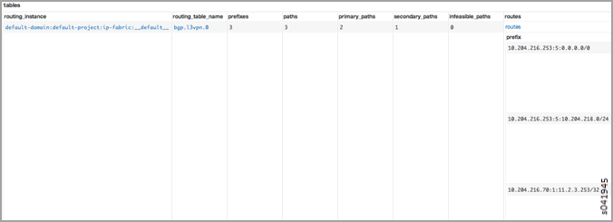

## Checking the Route in the MX Series Router

Use Junos CLI show commands from the router to check the route. These
commands assume that the routing instance with the imported route table
from Contrail is configured on the MX Series router, either manually or
by using Device Manager.

    run show route table public.inet.0

    public.inet.0: 5 destinations, 6 routes (5 active, 0 holddown, 0 hidden)

    + = Active Route, - = Last Active, * = Both

     

    0.0.0.0/0          *[Static/5] 15w6d 08:50:34

                        > to <ip address> via ge-1/0/1.0

    <ip address>    *[Direct/0] 15w6d 08:50:35

                        > via ge-1/0/1.0

    <ip address>   *[Local/0] 15w6d 08:50:51

                          Local via ge-1/0/1.0

    <ip address>  *[BGP/170] 01:13:34, localpref 100, from <ip address>

                          AS path: ?, validation-state: unverified

                        > via gr-1/0/0.32771, Push 16

                        [BGP/170] 01:13:34, localpref 100, from <ip address>

                          AS path: ?, validation-state: unverified

                        > via gr-1/0/0.32771, Push 16

    <ip address>      *[BGP/170] 00:03:20, localpref 100, from <ip address>

                          AS path: ?, validation-state: unverified

                        > via gr-1/0/0.32769, Push 16

     

    run show route table bgp.l3vpn.0 receive-protocol bgp <ip address> detail

    bgp.l3vpn.0: 92 destinations, 130 routes (92 active, 0 holddown, 0 hidden)

    * <ip address> (1 entry, 0 announced)

         Import Accepted

         Route Distinguisher: <ip address>

         VPN Label: 16

         Nexthop: <ip address>

         Localpref: 100

         AS path: ?

         Communities: target:64512:1 target:64512:10003 unknown iana 30c unknown iana 30c unknown type 8004 value fc00:1 unknown type 8071 value fc00:4

 
