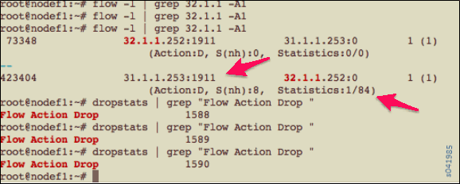
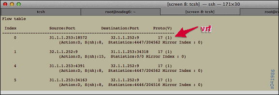
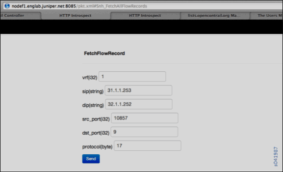
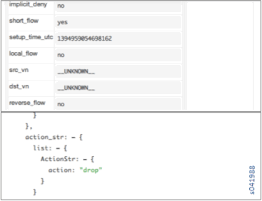
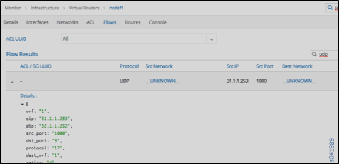
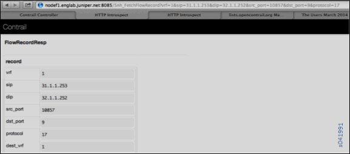

# Debugging Ping Failures for Policy-Connected Networks

 

This topic presents troubleshooting scenarios and steps for resolving
reachability issues (ping failures) when working with policy-connected
virtual networks.

These are the methods used to configure reachability for a virtual
network or virtual machine:

-   Use network policy to exchange virtual network routes.

-   Use a floating IP address pool to associate an IP address from a
    destination virtual network to virtual machine(s) in the source
    virtual network.

-   Use an ASN/RT configuration to exchange virtual network routes with
    an MX Series router gateway.

-   Use a service instance static route configuration to route between
    service instances in two virtual networks.

This topic focuses on troubleshooting reachability for the first method
--- using network policy to exchange routes between virtual networks.

*Troubleshooting Procedure for Policy-Connected Network*

1.  Check the state of the virtual machine and
    interface.

    Before doing anything else, check the status of the source and
    destination virtual machines.

    -   Is the **Status** of each virtual machine **Up**?

    -   Are the corresponding tap interfaces **Active**?

    Check the virtual machine status in the Contrail UI:

    

    Check the tap interface status in the http agent introspect, for
    example:

    `https://<host ip address>:8085/Snh_ItfReq?name=`

    

    When the virtual machine status is verified **Up**, and the tap
    interface is **Active**, you can focus on other factors that affect
    traffic, including routing, network policy, security policy, and
    service instances with static routes.

2.  Check reachability and routing.

    Use the following troubleshooting guidelines whenever you are
    experiencing ping failures on virtual network routes that are
    connected by means of network policy.

    Check the network policy configuration:

    -   Verify that the policy is attached to each of the virtual
        networks.

    -   Each attached policy should have either an explicit rule
        allowing traffic from one virtual network to the other, or an
        allow all traffic rule.

    -   Verify that the order of the actions in the policy rules is
        correct, because the actions are applied in the order in which
        they are listed.

    -   If there are multiple policies attached to a virtual network,
        verify that the policies are attached in a logical order. The
        first policy listed is applied first, and its rules are applied
        first, then the next policy is applied.

    -   Finally, if either of the virtual networks does not have an
        explicit rule to allow traffic from the other virtual network,
        the traffic flow will be treated as an **UNRESOLVED** or
        **SHORT** flow and all packets will be dropped.

    Use the following sequence in the Contrail UI to check policies,
    attachments, and traffic rules:

    Check VN1-VN2 ACL information from the compute node:

    

    Check the virtual network policy configuration with route
    information:

    

    Check the VN1 route information for VN2 routes:

    

    If a route is missing, ping fails. Flow inspection in the compute
    node displays **Action: D(rop)**.

    Repeated dropstats commands confirms the drop by incrementing the
    **Flow Action Drop** counter with each iteration of dropstats.

    Flow and dropstats commands issued at the compute node:

    

    To help in debugging flows, you can use the detailed flow query from
    the agent introspect page for the compute node.

    Fields of interest include:

    -   Inputs \[from **flow –l** output\]: **src/dest ip, src/dest
        ports, protoco**l, and **vrf**

    -   Output from detailed flow query: **short\_flow, src\_vn,
        action\_str-&gt;action**

    Flow command output:

    

    Fetching details of a single flow:

    

    Output from **FetchFlowRecord** shows unresolved IP addresses:

    

    You can also retrieve information about unresolved flows from the
    Contrail UI, as shown in the following:

    

3.  Check for protocol-specific network policy
    action.

    If you are still experiencing reachability issues, troubleshoot any
    protocol-specific action, where routes are exchanged, but only
    specific protocols are allowed.

    The following shows a sample query on a protocol-specific flow in
    the agent introspect:

    

    The following shows that the policy action clearly displays **deny**
    as the action.

    

*Summary*

This topic explores one area —debugging for policy-based routing.
However, in a complex system, a virtual network might have one or more
configuration methods combined that influence reachability and routing.

For example, an environment might have a virtual network VN-X configured
with policy-based routing to another virtual network VN-Y. At the same
time, there are a few virtual machines in VN-X that have a floating IP
to another virtual network VN-Z, which is connected to VN-XX via a NAT
service instance. This is a complex scenario, and you need to debug
step-by-step, taking into account all of the features working together.

Additionally, there are other considerations beyond routing and
reachability that can affect traffic flow. For example, the rules of
network policies and security groups can affect traffic to the
destination. Also, if multi-path is involved, then ECMP and RPF need to
be taken into account while debugging.

 
