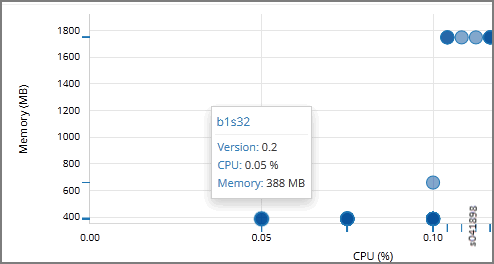

# Monitor &gt; Infrastructure &gt; Dashboard

 

Use **Monitor &gt; Infrastructure &gt; Dashboard** to get an
“at-a-glance” view of the system infrastructure components, including
the numbers of virtual routers, control nodes, analytics nodes, and
config nodes currently operational, a bubble chart of virtualrouters
showing the CPU and memory utilization, log messages, system
information, and alerts.

## Monitor Dashboard

Click **Monitor &gt; Infrastructure &gt; Dashboard** on the left to view
the **Dashboard**. See
[Figure 1](monitor-dashboard-vnc.html#dashboard1).

## Monitor Individual Details from the Dashboard

Across the top of the **Dashboard** screen are summary boxes
representing the components of the system that are shown in the
statistics. See
[Figure 2](monitor-dashboard-vnc.html#control-details-dash). Any of the
control nodes, virtual routers, analytics nodes, and config nodes can be
monitored individually and in detail from the **Dashboard** by clicking
an associated box, and drilling down for more detail.

Detailed information about monitoring each of the areas represented by
the boxes is provided in the links in
[Table 1](monitor-dashboard-vnc.html#dash-details-boxes).

Table 1: Dashboard Summary Boxes

| Box                 | For More Information                                                                 |
|:--------------------|:-------------------------------------------------------------------------------------|
| **vRouters**        | [Monitor &gt; Infrastructure &gt; Virtual Routers](monitoring-vrouters-vnc.html)     |
| **Control Nodes**   | [Monitor &gt; Infrastructure &gt; Control Nodes](monitoring-infrastructure-vnc.html) |
| **Analytics Nodes** | [Monitor &gt; Infrastructure &gt; Analytics Nodes](monitor-analytics-vnc.html)       |
| **Config Nodes**    | [Monitor &gt; Infrastructure &gt; Config Nodes](monitor-config-vnc.html)             |

## Using Bubble Charts

Bubble charts show the CPU and memory utilization of components
contributing to the current analytics display, including vRouters,
control nodes, config nodes, and the likeso on. You can hover over any
bubble to get summary information about the component it represents; see
[Figure 3](monitor-dashboard-vnc.html#bubble-summ). You can click
through the summary information to get more details about the component.

## Color-Coding of Bubble Charts

Bubble charts use the following color-coding scheme:

*Control Nodes*

-   Blue—working as configured.

-   Red—error, at least one configured peer is down.

*vRouters*

-   Blue—working, but no instance is launched.

-   Green—working with at least one instance launched.

-   Red—error, there is a problem with connectivity or a vRouter is in a
    failed state.

 
