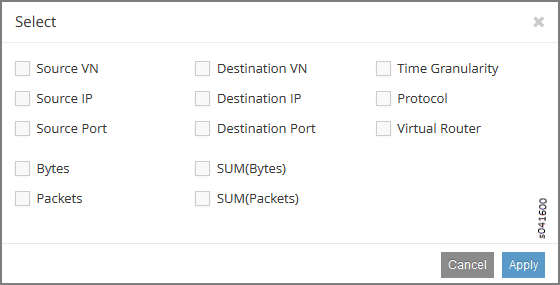
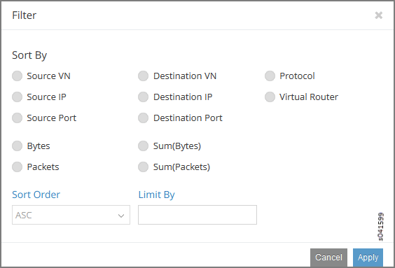
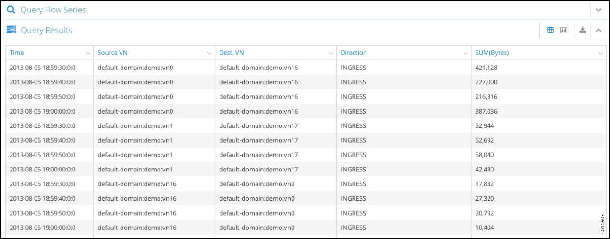
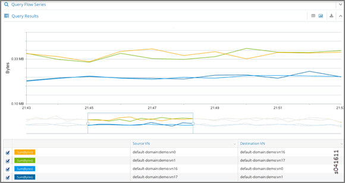
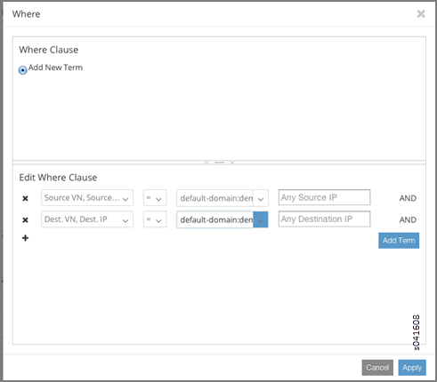

# Query &gt; Flows

 

Select **Query &gt; Flows** to perform rich and complex SQL-like queries
on flows in the Contrail Controller. You can use the query results for
such things as gaining insight into the operation of applications in a
virtual network, performing historical analysis of flow issues, and
pinpointing problem areas with flows.

## Query &gt; Flows &gt; Flow Series

Select **Query &gt; Flows &gt; Flow Series** to create queries of the
flow series table. The results are in the form of time series data for
flow series. See [Figure 1](monitoring-flow-vnc.html#flow-query).

The query fields available on the screen for the **Flow Series** tab are
described in [Table 1](monitoring-flow-vnc.html#flow-table). Enter query
data into the fields to create a SQL-like query to display and analyze
flows.

Table 1: Query Flow Series Fields

<table data-cellspacing="0" style="border-top:thin solid black;" width="99%">
<colgroup>
<col style="width: 50%" />
<col style="width: 50%" />
</colgroup>
<thead>
<tr class="header">
<th style="text-align: left;">
Field
</th>
<th style="text-align: left;">
Description
</th>
</tr>
</thead>
<tbody>
<tr class="odd">
<td style="text-align: left;">
<strong>Time Range</strong>
</td>
<td style="text-align: left;">
Select a range of time to display the flow series:

<ul>
<li>
Last 10 Mins
</li>
<li>
Last 30 Mins
</li>
<li>
Last 1 Hr
</li>
<li>
Last 6 Hrs
</li>
<li>
Last 12 Hrs
</li>
<li>
Custom
</li>
</ul>

Click <strong>Custom</strong> to enter a specific custom time range in two fields: <strong>From Time</strong> and <strong>To Time</strong>.
</td>
</tr>
<tr class="even">
<td style="text-align: left;">
<strong>Select</strong>
</td>
<td style="text-align: left;">
Click the edit button (pencil icon) to open a <strong>Select</strong> window (<a href="monitoring-flow-vnc.html#select-flow">Figure 2</a>), where you can click one or more boxes to select the fields to display from the flow series, such as <strong>Source VN, Dest VN, Bytes, Packets</strong>, and more.
</td>
</tr>
<tr class="odd">
<td style="text-align: left;">
<strong>Where</strong>
</td>
<td style="text-align: left;">
Click the edit button (pencil icon) to open a query-writing window, where you can specify query values for variables such as <strong>sourcevn, sourceip, destvn, destip, protocol, sport, dport</strong>.
</td>
</tr>
<tr class="even">
<td style="text-align: left;">
<strong>Direction</strong>
</td>
<td style="text-align: left;">
Select the desired flow direction: <strong>INGRESS</strong> or <strong>EGRESS</strong>.
</td>
</tr>
<tr class="odd">
<td style="text-align: left;">
<strong>Filter</strong>
</td>
<td style="text-align: left;">
Click the edit button (pencil icon) to open a <strong>Filter</strong> window (<a href="monitoring-flow-vnc.html#filter-flow">Figure 3</a>), where you can select filter items to sort by, the sort order, and limits to the number of results returned.
</td>
</tr>
<tr class="even">
<td style="text-align: left;">
<strong>Run Query</strong>
</td>
<td style="text-align: left;">
Click <strong>Run Query</strong> to retrieve the flows that match the query you created. The flows are listed on the lower portion of the screen in a box with columns identifying the selected fields for each flow.
</td>
</tr>
<tr class="odd">
<td style="text-align: left;">
(graph buttons)
</td>
<td style="text-align: left;">
When <strong>Time Granularity</strong> is selected, you have the option to view results in graph or flowchart form. Graph buttons appear on the screen above the <strong>Export</strong> button. Click a graph button to transform the tabular results into a graphical chart display.
</td>
</tr>
<tr class="even">
<td style="text-align: left;">
<strong>Export</strong>
</td>
<td style="text-align: left;">
The Export button is displayed after you click <strong>Run Query</strong>. This allows you to export the list of flows to a text <code class="inline" data-v-pre="">.csv</code> file.
</td>
</tr>
</tbody>
</table>

The **Select** window allows you to select one or more attributes of a
flow series by clicking the check box for each attribute desired, see
[Figure 2](monitoring-flow-vnc.html#select-flow). The upper section of
the **Select** window includes field names, and the lower portion lets
you select units. Select **Time Granularity** and then select
**SUM(Bytes)** or **SUM(Packets)** to aggregate bytes and packets in
intervals.

Use the **Filter** window to refine the display of query results for
flows, by defining an attribute by which to sort the results, the sort
order of the results, and any limit needed to restrict the number of
results. See [Figure 3](monitoring-flow-vnc.html#filter-flow).

## Example: Query Flow Series

The following is an example flow series query that returns the time
series of the summation traffic in bytes for all combinations of source
VN and destination VN for the last 10 minutes, with the bytes aggregated
in 10 second intervals. See
[Figure 4](monitoring-flow-vnc.html#flow-series-example).

The query returns tabular time series data, see
[Figure 5](monitoring-flow-vnc.html#series-tabular), for the following
combinations of Source VN and Dest VN:

1.  Flow Class 1: Source VN = default-domain:demo:front-end, Dest
    VN=\_\_UNKNOWN\_\_

2.  Flow Class 2: Source VN = default-domain:demo:front-end, Dest
    VN=default-domain:demo:back-end

Because **Time Granularity** is selected, the results can also be
displayed as graphical charts. Click the graph button on the right side
of the tabular results. The results are displayed in a graphical flow
chart. See [Figure 6](monitoring-flow-vnc.html#series-graphical).

## Query &gt; Flow Records

Select **Query &gt; Flow Records** to create queries of individual flow
records for detailed debugging of connectivity issues between
applications and virtual machines. Queries at this level return records
of the active flows within a given time period.

The query fields available on the screen for the **Flow Records** tab
are described in
[Table 2](monitoring-flow-vnc.html#flow-records-table1). Enter query
data into the fields to create an SQL-like query to display and analyze
flows.

Table 2: Query Flow Records Fields

<table data-cellspacing="0" style="border-top:thin solid black;" width="99%">
<colgroup>
<col style="width: 50%" />
<col style="width: 50%" />
</colgroup>
<thead>
<tr class="header">
<th style="text-align: left;">
Field
</th>
<th style="text-align: left;">
Description
</th>
</tr>
</thead>
<tbody>
<tr class="odd">
<td style="text-align: left;">
<strong>Time Range</strong>
</td>
<td style="text-align: left;">
Select a range of time for the flow records:

<ul>
<li>
Last 10 Mins
</li>
<li>
Last 30 Mins
</li>
<li>
Last 1 Hr
</li>
<li>
Last 6 Hrs
</li>
<li>
Last 12 Hrs
</li>
<li>
Custom
</li>
</ul>

Click <strong>Custom</strong> to enter a specified custom time range in two fields: <strong>From Time</strong> and <strong>To Time</strong>.
</td>
</tr>
<tr class="even">
<td style="text-align: left;">
<strong>Select</strong>
</td>
<td style="text-align: left;">
Click the edit button (pencil icon) to open a <strong>Select</strong> window (<a href="monitoring-flow-vnc.html#select-flow-records">Figure 8</a>), where you can click one or more boxes to select attributes to display for the flow records, including <strong>Setup Time, Teardown Time, Aggregate Bytes,</strong> and <strong>Aggregate Packets</strong>.
</td>
</tr>
<tr class="odd">
<td style="text-align: left;">
<strong>Where</strong>
</td>
<td style="text-align: left;">
Click the edit button (pencil icon) to open a query-writing window where you can specify query values for <strong>sourcevn, sourceip, destvn, destip, protocol, sport, dport</strong>. .
</td>
</tr>
<tr class="even">
<td style="text-align: left;">
<strong>Direction</strong>
</td>
<td style="text-align: left;">
Select the desired flow direction: <strong>INGRESS</strong> or <strong>EGRESS</strong>.
</td>
</tr>
<tr class="odd">
<td style="text-align: left;">
<strong>Run Query</strong>
</td>
<td style="text-align: left;">
Click <strong>Run Query</strong> to retrieve the flow records that match the query you created. The records are listed on the lower portion of the screen in a box with columns identifying the fields for each flow.
</td>
</tr>
<tr class="even">
<td style="text-align: left;">
<strong>Export</strong>
</td>
<td style="text-align: left;">
The <strong>Export</strong> button is displayed after you click <strong>Run Query</strong>, allowing you to export the list of flows to a text <code class="filepath">.csv</code> file.
</td>
</tr>
</tbody>
</table>

The **Select** window allows you to select one or more attributes to
display for the flow records selected, see
[Figure 8](monitoring-flow-vnc.html#select-flow-records).

You can restrict the query to a particular source VN and destination VN
combination using the **Where** section.

The **Where Clause** supports logical AND and logical OR operations, and
is modeled as a logical OR of multiple AND terms. For example: ( (term1
AND term2 AND term3..) OR (term4 AND term5) OR…).

Each term is a single variable expression such as **Source VN = VN1**.

## Query &gt; Flows &gt; Query Queue

Select **Query &gt; Flows &gt; Query Queue** to display queries that are
in the queue waiting to be performed on the data. See
[Figure 10](monitoring-flow-vnc.html#flows-queue).

The query fields available on the screen for the **Flow Records** tab
are described in [Table 3](monitoring-flow-vnc.html#flow-records-table).
Enter query data into the fields to create an SQL-like query to display
and analyze flows.

Table 3: Query Flow Records Fields

| Field          | Description                                                                                                                                                       |
|:---------------|:------------------------------------------------------------------------------------------------------------------------------------------------------------------|
| **Date**       | The date and time the query was started.                                                                                                                          |
| **Query**      | A display of the parameters set for the query.                                                                                                                    |
| **Progress**   | The percentage completion of the query to date.                                                                                                                   |
| **Records**    | The number of records matching the query to date.                                                                                                                 |
| **Status**     | The status of the query, such as **completed**.                                                                                                                   |
| **Time Taken** | The amount of time in seconds it has taken the query to return the matching records.                                                                              |
| (Action icon)  | Click the **Action** icon and select **View Results** to view a list of the records that match the query, or click **Delete** to remove the query from the queue. |

 
