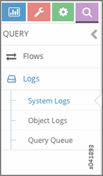
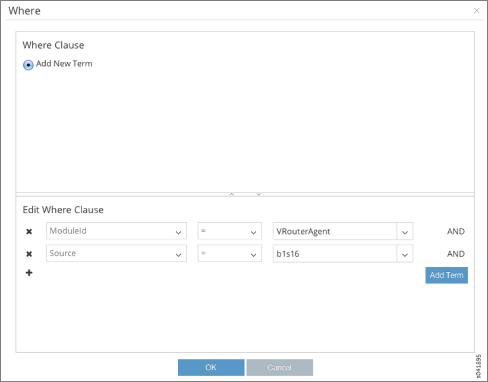

# Query &gt; Logs

 

The **Query &gt; Logs** option allows you to access the system log and
object log activity of any Contrail Controller component from one
central location.

## Query &gt; Logs Menu Options

Click **Query &gt; Logs** to access the **Query Logs** menu, where you
can select **System Logs** to view system log activity, **Object Logs**
to view object logs activity, and **Query Queue** to create custom
queries of log activity; see
[Figure 1](monitoring-syslog-vnc.html#query-syslog-menu).

## Query &gt; Logs &gt; System Logs

Click **Query &gt; Logs &gt; System Logs** to access the **Query System
Logs** menu, where you can view system logs according to criteria that
you determine. See [Figure 2](monitoring-syslog-vnc.html#query-syslog).

The query fields available on the **Query System Logs** screen are
described in [Table 1](monitoring-syslog-vnc.html#syslog-table).

Table 1: Query System Logs Fields

<table data-cellspacing="0" style="border-top:thin solid black;" width="99%">
<colgroup>
<col style="width: 50%" />
<col style="width: 50%" />
</colgroup>
<thead>
<tr class="header">
<th style="text-align: left;">
Field
</th>
<th style="text-align: left;">
Description
</th>
</tr>
</thead>
<tbody>
<tr class="odd">
<td style="text-align: left;">
<strong>Time Range</strong>
</td>
<td style="text-align: left;">
Select a range of time for which to see the system logs:

<ul>
<li>
Last 10 Mins
</li>
<li>
Last 30 Mins
</li>
<li>
Last 1 Hr
</li>
<li>
Last 6 Hrs
</li>
<li>
Last 12 Hrs
</li>
<li>
Custom
</li>
</ul>

If you click Custom, enter a desired time range in two new fields: <strong>From Time</strong> and <strong>To Time</strong>.
</td>
</tr>
<tr class="even">
<td style="text-align: left;">
<strong>Where</strong>
</td>
<td style="text-align: left;">
Click the edit button (pencil icon) to open a query-writing window, where you can specify query values for variables such as Source, Module, MessageType, and the like, in order to retrieve specific information.
</td>
</tr>
<tr class="odd">
<td style="text-align: left;">
<strong>Level</strong>
</td>
<td style="text-align: left;">
Select the message severity level to view:

<ul>
<li>
SYS_NOTICE
</li>
<li>
SYS_EMERG
</li>
<li>
SYS_ALERT
</li>
<li>
SYS_CRIT
</li>
<li>
SYS_ERR
</li>
<li>
SYS_WARN
</li>
<li>
SYS_INFO
</li>
<li>
SYS_DEBUG
</li>
</ul></td>
</tr>
<tr class="even">
<td style="text-align: left;">
<strong>Run Query</strong>
</td>
<td style="text-align: left;">
Click this button to retrieve the system logs that match the query. The logs are listed in a box with columns showing the <strong>Time</strong>, <strong>Source</strong>, <strong>Module Id</strong>, <strong>Category</strong>, <strong>Log Type</strong>, and <strong>Log</strong> message.
</td>
</tr>
<tr class="odd">
<td style="text-align: left;">
<strong>Export</strong>
</td>
<td style="text-align: left;">
This button appears after you click <strong>Run Query</strong>, allowing you to export the list of system messages to a text/csv file.
</td>
</tr>
</tbody>
</table>

## Sample Query for System Logs

This section shows a sample system logs query designed to show all
**System Logs** from `ModuleId = VRouterAgent on Source = b1s16` and
filtered by **Level** `= SYS_DEBUG`.

1.  At the **Query System Logs** screen, click in the
    **Where** field to access the **Where** query screen and enter
    information defining the location to query in the **Edit Where
    Clause** section and click **OK**; see
    [Figure 3](monitoring-syslog-vnc.html#sample-query).

    

2.  The information you defined at the Where screen
    displays on the **Query System Logs**. Enter any more defining
    information needed; see
    [Figure 4](monitoring-syslog-vnc.html#sample-query2). When finished,
    click **Run Query** to display the results.

    

## Query &gt; Logs &gt; Object Logs

Object logs allow you to search for logs associated with a particular
object, for example, all logs for a specified virtual network. Object
logs record information related to modifications made to objects,
including creation, deletion, and other modifications; see
[Figure 5](monitoring-syslog-vnc.html#object-tab).

The query fields available on the **Object Logs** screen are described
in [Table 2](monitoring-syslog-vnc.html#objects-table).

Table 2: Object Logs Query Fields

<table data-cellspacing="0" style="border-top:thin solid black;" width="99%">
<colgroup>
<col style="width: 50%" />
<col style="width: 50%" />
</colgroup>
<thead>
<tr class="header">
<th style="text-align: left;">
Field
</th>
<th style="text-align: left;">
Description
</th>
</tr>
</thead>
<tbody>
<tr class="odd">
<td style="text-align: left;">
<strong>Time Range</strong>
</td>
<td style="text-align: left;">
Select a range of time for which to see the logs:

<ul>
<li>
Last 10 Mins
</li>
<li>
Last 30 Mins
</li>
<li>
Last 1 Hr
</li>
<li>
Last 6 Hrs
</li>
<li>
Last 12 Hrs
</li>
<li>
Custom
</li>
</ul>

If you click Custom, enter a desired time range in two new fields: <strong>From Time</strong> and <strong>To Time</strong>.
</td>
</tr>
<tr class="even">
<td style="text-align: left;">
<strong>Object Type</strong>
</td>
<td style="text-align: left;">
Select the object type for which to show logs:

<ul>
<li>
Virtual Network
</li>
<li>
Virtual Machine
</li>
<li>
Virtual Router
</li>
<li>
BGP Peer
</li>
<li>
Routing Instance
</li>
<li>
XMPP Connection
</li>
</ul></td>
</tr>
<tr class="odd">
<td style="text-align: left;">
<strong>Object Id</strong>
</td>
<td style="text-align: left;">
Select from a list of available identifiers the name of the object you wish to use.
</td>
</tr>
<tr class="even">
<td style="text-align: left;">
<strong>Select</strong>
</td>
<td style="text-align: left;">
Click the edit button (pencil icon) to open a window where you can select searchable types by clicking a checkbox:

<ul>
<li>
ObjectLog
</li>
<li>
SystemLog
</li>
</ul></td>
</tr>
<tr class="odd">
<td style="text-align: left;">
<strong>Where</strong>
</td>
<td style="text-align: left;">
Click the edit button (pencil icon) to open the query-writing window, where you can specify query values for variables such as <strong>Source</strong>, <strong>ModuleId</strong>, and <strong>MessageType</strong>, in order to retrieve information as specific as you wish.
</td>
</tr>
<tr class="even">
<td style="text-align: left;">
<strong>Run Query</strong>
</td>
<td style="text-align: left;">
Click this button to retrieve the system logs that match the query. The logs are listed in a box with columns showing the <strong>Time</strong>, <strong>Source</strong>, <strong>Module Id</strong>, <strong>Category</strong>, <strong>Log Type</strong>, and <strong>Log</strong> message.
</td>
</tr>
<tr class="odd">
<td style="text-align: left;">
<strong>Export</strong>
</td>
<td style="text-align: left;">
This button appears after you click <strong>Run Query</strong>, allowing you to export the list of system messages to a text/csv file.
</td>
</tr>
</tbody>
</table>

 
