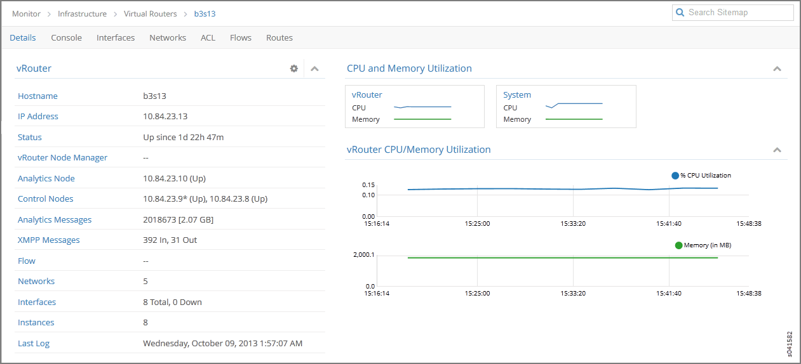
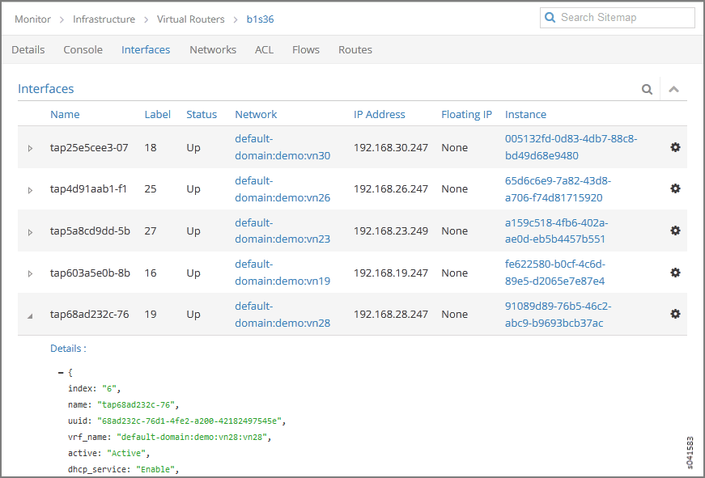
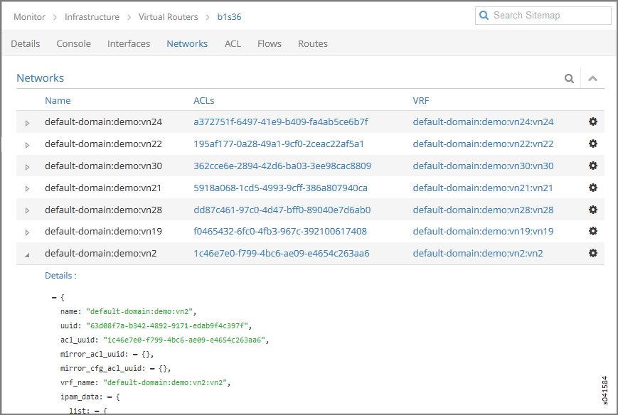
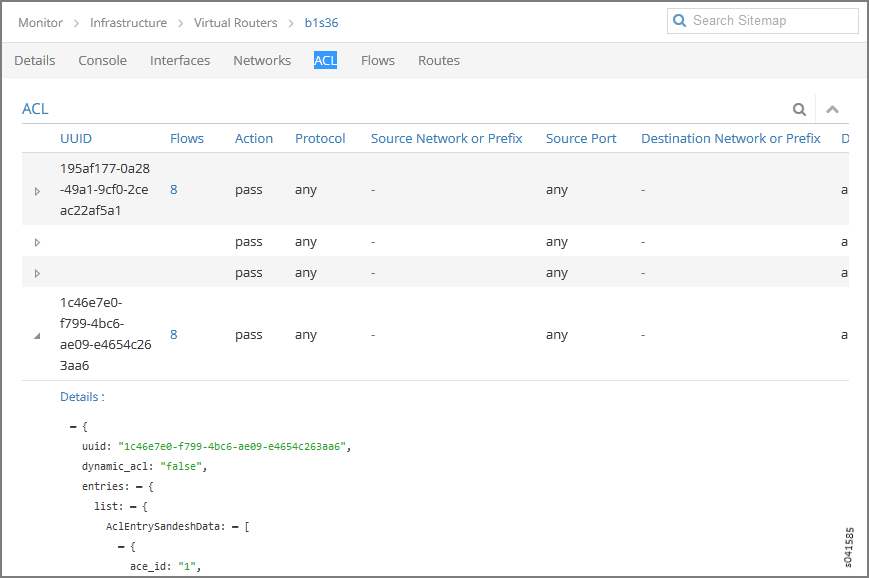
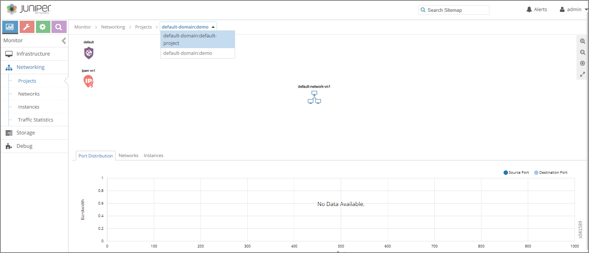
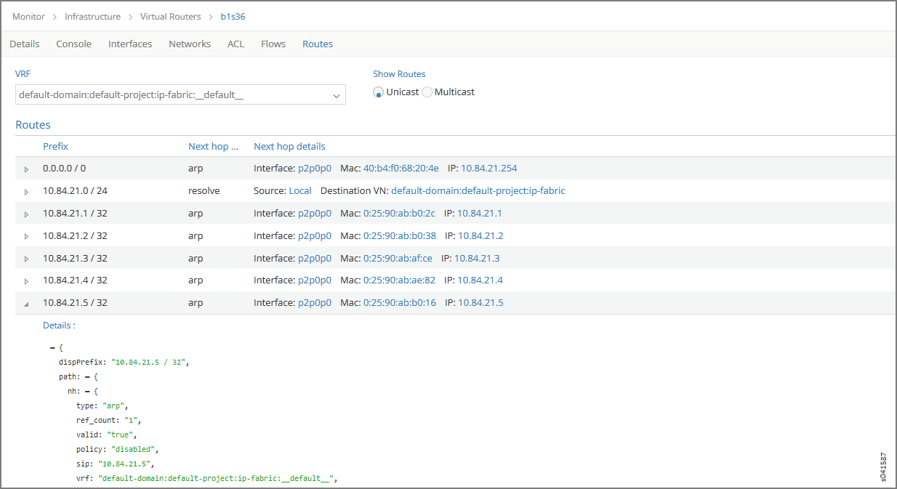
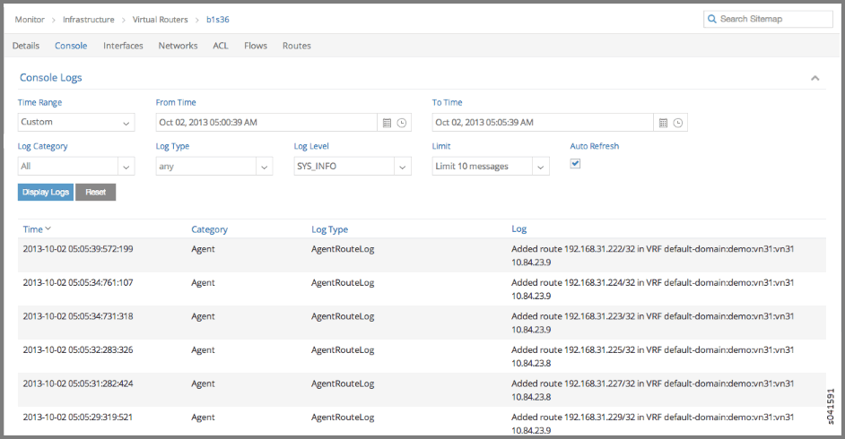

# Monitor &gt; Infrastructure &gt; Virtual Routers

 

## Monitor vRouters Summary

Click **Monitor &gt; Infrastructure &gt; Virtual Routers** to view the
**vRouters** summary screen. See
[Figure 1](monitoring-vrouters-vnc.html#vrouters-summary).

See [Table 1](monitoring-vrouters-vnc.html#vrouters-fields) for
descriptions of the fields on the **vRouters Summary** screen.

Table 1: vRouters Summary Fields

| Field           | Description                                                                    |
|:----------------|:-------------------------------------------------------------------------------|
| **Host name**   | The name of the vRouter. Click the name of any vRouter to reveal more details. |
| **IP Address**  | The IP address of the vRouter.                                                 |
| **Version**     | The version of software installed on the system.                               |
| **Status**      | The current operational status of the vRouter — Up or Down.                    |
| **CPU (%)**     | The CPU percentage currently in use by the selected vRouter.                   |
| **Memory (MB)** | The memory currently in use and the total memory available for this vRouter.   |
| **Networks**    | The total number of networks for this vRouter.                                 |
| **Instances**   | The total number of instances for this vRouter.                                |
| **Interfaces**  | The total number of interfaces for this vRouter.                               |

## Monitor Individual vRouters Tabs

Click the name of any vRouter to view details about performance and
activities for that vRouter. Each individual vRouters screen has the
following tabs.

-   **Details**—similar display of information as on individual control
    nodes **Details** tab. See
    [Figure 2](monitoring-vrouters-vnc.html#vrouters-details).

-   **Console**—similar display of information as on individual control
    nodes **Console** tab. See
    [Figure 8](monitoring-vrouters-vnc.html#vrouter-console).

-   **Interfaces**—details about associated interfaces. See
    [Figure 3](monitoring-vrouters-vnc.html#vrouters-interfaces).

-   **Networks**—details about associated networks. See
    [Figure 4](monitoring-vrouters-vnc.html#vrouters-networks).

-   **ACL**—details about access control lists. See
    [Figure 5](monitoring-vrouters-vnc.html#vrouters-acl).

-   **Flows**—details about associated traffic flows. See
    [Figure 6](monitoring-vrouters-vnc.html#vrouters-flows).

-   **Routes**—details about associated routes. See
    [Figure 7](monitoring-vrouters-vnc.html#vrouters-routes).

## Monitor Individual vRouter Details Tab

The **Details** tab provides a summary of the status and activity on the
selected node, and presents graphical displays of CPU and memory usage;
see [Figure 2](monitoring-vrouters-vnc.html#vrouters-details).
See[Table 2](monitoring-vrouters-vnc.html#vrouter-details) for
descriptions of the fields on this tab.

Table 2: vRouters Details Tab Fields

| Field                              | Description                                                                                                                            |
|:-----------------------------------|:---------------------------------------------------------------------------------------------------------------------------------------|
| **Hostname**                       | The hostname of the vRouter.                                                                                                           |
| **IP Address**                     | The IP address of the selected vRouter.                                                                                                |
| **Status**                         | The operational status of the vRouter.                                                                                                 |
| **vRouter Node Manager**           | The operational status of the vRouter node manager.                                                                                    |
| **Analytics Node**                 | The IP address of the node from which analytics (monitor) information is derived.                                                      |
| **Control Nodes**                  | The IP address of the configuration node associated with this vRouter.                                                                 |
| **Analytics Messages**             | The total number of analytics messages in and out from this node.                                                                      |
| **XMPP Messages**                  | The total number of XMPP messages that have gone in and out of this vRouter.                                                           |
| **Flow**                           | The number of active flows and the total flows for this vRouter.                                                                       |
| **Networks**                       | The number of networks associated with this vRouter.                                                                                   |
| **Interfaces**                     | The number of interfaces associated with this vRouter.                                                                                 |
| **Instances**                      | The number of instances associated with this vRouter.                                                                                  |
| **Last Log**                       | The date and time of the last log message issued about this vRouter.                                                                   |
| **vRouter CPU/Memory Utilization** | Graphs (x, y) displaying CPU and memory utilization averages over time for this vRouter, in comparison to system utilization averages. |

## Monitor Individual vRouters Interfaces Tab

The **Interfaces** tab displays details about the interfaces associated
with an individual vRouter. Click the expansion arrow next to any
interface name to reveal more details. Use horizontal and vertical
scroll bars to access all portions of the screen. See
[Figure 3](monitoring-vrouters-vnc.html#vrouters-interfaces). See
[Table 3](monitoring-vrouters-vnc.html#interfaces-tab-fields) for
descriptions of the fields on the **Interfaces** tab screen.

Table 3: vRouters: Interfaces Tab Fields

| Field           | Description                                                       |
|:----------------|:------------------------------------------------------------------|
| **Name**        | The name of the interface.                                        |
| **Label**       | The label for the interface.                                      |
| **Status**      | The current status of the interface.                              |
| **Network**     | The network associated with the interface.                        |
| **IP Address**  | The IP address of the interface.                                  |
| **Floating IP** | Displays any floating IP addresses associated with the interface. |
| **Instance**    | The name of any instance associated with the interface.           |

## Monitor Individual vRouters Networks Tab

The **Networks** tab displays details about the networks associated with
an individual vRouter. Click the expansion arrow at the name of any
network to reveal more details. See
[Figure 4](monitoring-vrouters-vnc.html#vrouters-networks). See
[Table 4](monitoring-vrouters-vnc.html#networks-tab-fields) for
descriptions of the fields on the **Networks** tab screen.

Table 4: vRouters: Networks Tab Fields

| Field      | Description                                                             |
|:-----------|:------------------------------------------------------------------------|
| **Name**   | The name of each network associated with this vRouter.                  |
| **ACLs**   | The name of the access control list associated with the listed network. |
| **VRF**    | The identifier of the VRF associated with the listed network.           |
| **Action** | Click the icon to select the action: Edit, Delete                       |

## Monitor Individual vRouters ACL Tab

The **ACL** tab displays details about the access control lists (ACLs)
associated with an individual vRouter. Click the expansion arrow next to
the UUID of any ACL to reveal more details. See
[Figure 5](monitoring-vrouters-vnc.html#vrouters-acl). See
[Table 5](monitoring-vrouters-vnc.html#acl-tab-fields) for descriptions
of the fields on the **ACL** tab screen.

Table 5: vRouters: ACL Tab Fields

| Field                             | Description                                                                   |
|:----------------------------------|:------------------------------------------------------------------------------|
| **UUID**                          | The universal unique identifier (UUID) associated with the listed ACL.        |
| **Flows**                         | The flows associated with the listed ACL.                                     |
| **Action**                        | The traffic action defined by the listed ACL.                                 |
| **Protocol**                      | The protocol associated with the listed ACL.                                  |
| **Source Network or Prefix**      | The name or prefix of the source network associated with the listed ACL.      |
| **Source Port**                   | The source port associated with the listed ACL.                               |
| **Destination Network or Prefix** | The name or prefix of the destination network associated with the listed ACL. |
| **Destination Port**              | The destination port associated with the listed ACL.                          |
| **ACE Id**                        | The ACE ID associated with the listed ACL.                                    |

## Monitor Individual vRouters Flows Tab

The **Flows** tab displays details about the flows associated with an
individual vRouter. Click the expansion arrrow next to any ACL/SG UUID
to reveal more details. Use the horizontal and vertical scroll bars to
access all portions of the screen. See
[Figure 6](monitoring-vrouters-vnc.html#vrouters-flows). See
[Table 6](monitoring-vrouters-vnc.html#flows-tab-fields) for
descriptions of the fields on the **Flows** tab screen.

Table 6: vRouters: Flows Tab Fields

| Field             | Description                                                                                                              |
|:------------------|:-------------------------------------------------------------------------------------------------------------------------|
| **ACL UUID**      | The default is to show **All** flows, however, you can select from a drop down list any single flow to view its details. |
| **ACL / SG UUID** | The universal unique identifier (UUID) associated with the listed ACL or SG.                                             |
| **Protocol**      | The protocol associated with the listed flow.                                                                            |
| **Src Network**   | The name of the source network associated with the listed flow.                                                          |
| **Src IP**        | The source IP address associated with the listed flow.                                                                   |
| **Src Port**      | The source port of the listed flow.                                                                                      |
| **Dest Network**  | The name of the destination network associated with the listed flow.                                                     |
| **Dest IP**       | The destination IP address associated with the listed flow.                                                              |
| **Dest Port**     | The destination port associated with the listed flow.                                                                    |
| **Bytes/Pkts**    | The number of bytes and packets associated with the listed flow.                                                         |
| **Setup Time**    | The setup time associated with the listed flow.                                                                          |

## Monitor Individual vRouters Routes Tab

The **Routes** tab displays details about unicast and multicast routes
in specific VRFs for an individual vRouter. Click the expansion arrow
next to the route prefix to reveal more details. See
[Figure 7](monitoring-vrouters-vnc.html#vrouters-routes). See
[Table 7](monitoring-vrouters-vnc.html#routes-fields) for descriptions
of the fields on the **Routes** tab screen.

Table 7: vRouters: Routes Tab Fields

| Field                | Description                                                                    |
|:---------------------|:-------------------------------------------------------------------------------|
| **VRF**              | Select from a drop down list the virtual routing and forwarding (VRF) to view. |
| **Show Routes**      | Select to show the route type: **Unicast** or **Multicast**.                   |
| **Prefix**           | The IP address prefix of a route.                                              |
| **Next hop**         | The next hop method for this route.                                            |
| **Next hop details** | The next hop details for this route.                                           |

## Monitor Individual vRouter Console Tab

Click the **Console** tab for an individual vRouter to display system
logging information for a defined time period, with the last 5 minutes
of information as the default display. See
[Figure 8](monitoring-vrouters-vnc.html#vrouter-console). See
[Table 8](monitoring-vrouters-vnc.html#vrouter-console-fields) for
descriptions of the fields on the **Console** tab screen.

Table 8: Control Node: Console Tab Fields

Field

Description

**Time Range**

Select a timeframe for which to review logging information as sent to
the console. There are several options, ranging from **Last 5 mins**
through to the **Last 24 hrs**, plus a **Custom** time range.

**From Time**

If you select **Custom** in **Time Range**, enter the start time.

**To Time**

If you select **Custom** in **Time Range**, enter the end time.

**Log Category**

Select a log category to display:

-   All

-   \_default\_

-   XMPP

-   TCP

**Log Type**

Select a log type to display.

**Log Level**

Select a log severity level to display:

-   SYS\_EMERG

-   SYS\_ALERT

-   SYS\_CRIT

-   SYS\_ERR

-   SYS\_WARN

-   SYS\_NOTICE

-   SYS\_INFO

-   SYS\_DEBUG

**Limit**

Select from a list an amount to limit the number of messages displayed:

-   No Limit

-   Limit 10 messages

-   Limit 50 messages

-   Limit 100 messages

-   Limit 200 messages

-   Limit 500 messages

**Auto Refresh**

Click the check box to automatically refresh the display if more
messages occur.

**Display Logs**

Click this button to refresh the display if you change the display
criteria.

**Reset**

Click this button to clear any selected display criteria and reset all
criteria to their default settings.

*Columns*

**Time**

This column lists the time received for each log message displayed.

**Category**

This column lists the log category for each log message displayed.

**Log Type**

This column lists the log type for each log message displayed.

**Log**

This column lists the log message for each log displayed.

 
