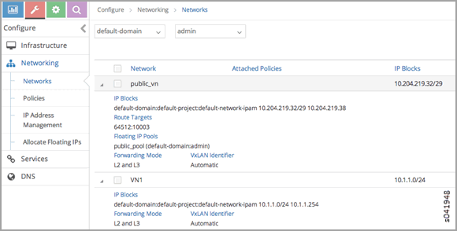
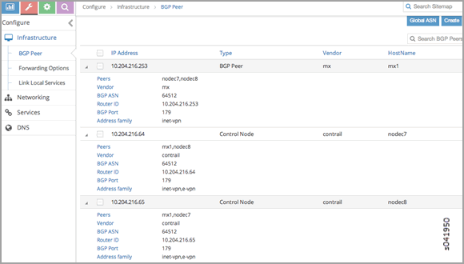
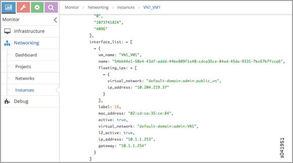
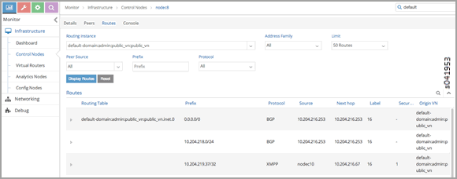
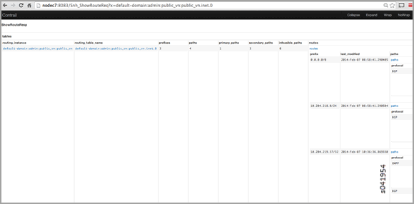
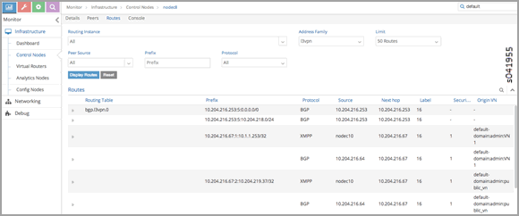
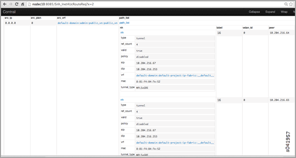
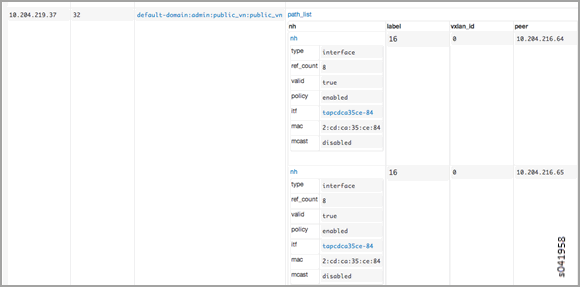

# Troubleshooting the Floating IP Address Pool in Contrail

 

This document provides troubleshooting methods to use when you have
errors with the floating IP address pool when using Contrail.

## Example Cluster

Examples in this document refer to a virtual cluster that is set up as
follows:

    Config Nodes  : ['nodec6', 'nodec7', 'nodec8']

    Control Nodes : [‘nodec7', 'nodec8']

    Compute Nodes : ['nodec9', 'nodec10']

    Collector     : ['nodec6', 'nodec8']

    WebUI         : nodec7

    Openstack     : nodec6

     

The following virtual networks are used in the examples in this
document:

Public virtual network:

-   Virtual network name: `public_vn`

-   Public addresses range: `10.204.219.32 to 10.204.219.37`

-   Route Target: `64512:10003`

-   Floating IP pool name: `public_pool`

Private virtual network:

-   Virtual network name: `vn1`

-   Subnet: `10.1.1.0/24`

## Example

A virtual machine is created in the virtual network VN1 with the name
VN1\_VM1 and with the IP address 10.1.1.253. A floating IP address of
10.204.219.37 is associated to the VN1\_VM1 instance.

An MX80 router is configured as a gateway to peer with control nodes
nodec7 and nodec8.

## Example: MX80 Configuration for the Gateway

The following is the Junos OS configuration for the MX80 gateway. The
route 10.204.218.254 is the route to the external world.

    chassis {

        fpc 1 {

            pic 0 {

                tunnel-services;

            }

        }

    }

    interfaces {

        ge-1/0/1 {                         

            unit 0 {

                family inet {

                    address 10.204.218.1/24;

                }

            }

        }

        ge-1/0/2 {

            unit 0 {

                family inet {

                    address 10.204.216.253/24;

                }

            }

        }

    }

    routing-options {                      

        static {                            

            route 0.0.0.0/0 next-hop 10.204.216.254;

        }                                  

        router-id 10.204.216.253;          

        route-distinguisher-id 10.204.216.253;

        autonomous-system 64512;           

        dynamic-tunnels {                   

            tun1 {                         

                source-address 10.204.216.253;

                gre;                       

                destination-networks {     

                    10.204.216.0/24;       

                    10.204.217.0/24;       

                }                          

            }                              

        }                                  

    }

    protocols {                            

        bgp {                              

            group control-nodes {        

                type internal;             

                local-address 10.204.216.253;

                keep all;                  

                family inet-vpn {          

                    unicast;               

                }                          

                neighbor 10.204.216.64;

                neighbor 10.204.216.65;

                }

          }

    }

    routing-instances {

        public {                           

            instance-type vrf;             

            interface ge-1/0/1.0;          

            vrf-target target:64512:10003; 

            vrf-table-label;               

            routing-options {              

                static {                   

                    route 0.0.0.0/0 next-hop 10.204.218.254;

                }                          

            }                               

        }  

    }

## Ping the Floating IP from the Public Network

From the public network, ping the floating IP 10.204.219.37.

    user1-test:~ user1$ ping 10.204.219.37

    PING 10.204.219.37 (10.204.219.37): 56 data bytes

    64 bytes from 10.204.219.37: icmp_seq=0 ttl=54 time=62.439 ms

    64 bytes from 10.204.219.37: icmp_seq=1 ttl=54 time=56.018 ms

    64 bytes from 10.204.219.37: icmp_seq=2 ttl=54 time=55.915 ms

    64 bytes from 10.204.219.37: icmp_seq=3 ttl=54 time=57.755 ms

    ^C

    --- 10.204.219.37 ping statistics ---

    5 packets transmitted, 4 packets received, 20.0% packet loss

    round-trip min/avg/max/stddev = 55.915/58.032/62.439/2.647 ms

## Troubleshooting Details

The following sections show details of ways to get related information,
view, troubleshoot, and validate floating IP addresses in Contrail
Networking.

## Get the UUID of the Virtual Network

Use the following to get the universal unique identifier (UUID) of the
virtual network.

    [root@nodec6 ~]# (source /etc/contrail/openstackrc; openstack network list) 2>/dev/null

    +--------------------------------------+-------------------------+

    | id                                   | name                    |

    +--------------------------------------+-------------------------+

    | 43707766-75f3-4d48-80d9-1b7240fb161d | public_vn               |

    | 2ab7ea04-8f5f-4b8d-acbf-a7c29c9b4112 | VN1                     |

    | 1c59ded0-38e8-4168-b91f-4c51aba10d30 | default-virtual-network |

    | 5b0a1040-91e4-47ff-bd4c-0a81e1901a1f | ip-fabric               |

    | 7efddf64-ff3c-44d2-aeb2-45d7472b7a64 | __link_local__          |

    +--------------------------------------+-------------------------+

## View the Floating IP Object in the API Server

Use the following to view the floating IP pool information in the API
server. API server requests can be made on http port 8082.

The Contrail API servers have the virtual-network public\_vn object that
contains floating IP pool information. Use the following to view the
floating-ip-pools object information.

`curl -s -X GET -H "X-Auth-Token: $(openstack token issue | grep '| id' | awk '{print $4}')" http://<API-Server_IP>:8082/virtual-network/<UUID_of_VN>`

*Example*

    root@nodec6 ~]# curl http://nodec6:8082/virtual-network/43707766-75f3-4d48-80d9-1b7240fb161d | python -m json.tool

     

    {

        "virtual-network": {

            "floating_ip_pools": [

                {

                    "href": "http://127.0.0.1:8095/floating-ip-pool/663737c1-f3ab-40ff-9442-bdb6c225e3c3",

                    "to": [

                        "default-domain",

                        "admin",

                        "public_vn",

                        "public_pool"

                    ],

                    "uuid": "663737c1-f3ab-40ff-9442-bdb6c225e3c3"

                }

            ],

            "fq_name": [

                "default-domain",

                "admin",

                "public_vn"

            ],

            "href": "http://127.0.0.1:8095/virtual-network/43707766-75f3-4d48-80d9-1b7240fb161d",

            "id_perms": {

                "created": "2014-02-07T08:58:40.892803",

                "description": null,

                "enable": true,

                "last_modified": "2014-02-07T10:06:42.234423",

                "permissions": {

                    "group": "admin",

                    "group_access": 7,

                    "other_access": 7,

                    "owner": "admin",

                    "owner_access": 7

                },

                "uuid": {

                    "uuid_lslong": 9284482284331406877,

                    "uuid_mslong": 4859515279882014024

                }

            },

            "name": "public_vn",

            "network_ipam_refs": [

                {

                    "attr": {

                        "ipam_subnets": [

                            {

                                "default_gateway": "10.204.219.38",

                                "subnet": {

                                    "ip_prefix": "10.204.219.32",

                                    "ip_prefix_len": 29

                                }

                            }

                        ]

                    },

                    "href": "http://127.0.0.1:8095/network-ipam/39b0e8da-fcd4-4b35-856c-8d18570b1483",

                    "to": [

                        "default-domain",

                        "default-project",

                        "default-network-ipam"

                    ],

                    "uuid": "39b0e8da-fcd4-4b35-856c-8d18570b1483"

                }

            ],

            "parent_href": "http://127.0.0.1:8095/project/deef6549-8e6c-4e3e-9cde-c9bc2b72ce6f",

            "parent_type": "project",

            "parent_uuid": "deef6549-8e6c-4e3e-9cde-c9bc2b72ce6f",

            "route_target_list": {

                "route_target": [

                    "target:64512:10003"

                ]

            },

            "routing_instances": [

                {

                    "href": "http://127.0.0.1:8095/routing-instance/3c6254ac-cfde-417e-916d-e7a1c0efad92",

                    "to": [

                        "default-domain",

                        "admin",

                        "public_vn",

                        "public_vn"

                    ],

                    "uuid": "3c6254ac-cfde-417e-916d-e7a1c0efad92"

                }

            ],

            "uuid": "43707766-75f3-4d48-80d9-1b7240fb161d",

            "virtual_network_properties": {

                "extend_to_external_routers": null,

                "forwarding_mode": "l2_l3",

                "network_id": 4,

                "vxlan_network_identifier": null

            }

        }

    }

     

## View floating-ips in floating-ip-pools in the API Server

Once you have located the floating-ip-pools object, use the following to
review its floating-ips object.

The floating-ips object should display the floating IP that is shown in
the Contrail UI. The floating IP should have a reference to the virtual
machine interface (VMI) object that is bound to the floating IP.

*Example*

    [root@nodec6 ~]# curlhttp://nodec6:8082/floating-ip-pool/663737c1-f3ab-40ff-9442-bdb6c225e3c3 | python -m json.tool

     

    {

        "floating-ip-pool": {

            "floating_ips": [

                {

                    "href": "http://127.0.0.1:8095/floating-ip/f3eec4d6-889e-46a3-a8f0-879dfaff6ca0",

                    "to": [

                        "default-domain",

                        "admin",

                        "public_vn",

                        "public_pool",

                        "f3eec4d6-889e-46a3-a8f0-879dfaff6ca0"

                    ],

                    "uuid": "f3eec4d6-889e-46a3-a8f0-879dfaff6ca0"

                }

            ],

            "fq_name": [

                "default-domain",

                "admin",

                "public_vn",

                "public_pool"

            ],

            "href": "http://127.0.0.1:8095/floating-ip-pool/663737c1-f3ab-40ff-9442-bdb6c225e3c3",

            "id_perms": {

                "created": "2014-02-07T08:58:41.136572",

                "description": null,

                "enable": true,

                "last_modified": "2014-02-07T08:58:41.136572",

                "permissions": {

                    "group": "admin",

                    "group_access": 7,

                    "other_access": 7,

                    "owner": "admin",

                    "owner_access": 7

                },

                "uuid": {

                    "uuid_lslong": 10683309858715198403,

                    "uuid_mslong": 7365417021744038143

                }

            },

            "name": "public_pool",

            "parent_href": "http://127.0.0.1:8095/virtual-network/43707766-75f3-4d48-80d9-1b7240fb161d",

            "parent_type": "virtual-network",

            "parent_uuid": "43707766-75f3-4d48-80d9-1b7240fb161d",

            "project_back_refs": [

                {

                    "attr": {},

                    "href": "http://127.0.0.1:8095/project/deef6549-8e6c-4e3e-9cde-c9bc2b72ce6f",

                    "to": [

                        "default-domain",

                        "admin"

                    ],

                    "uuid": "deef6549-8e6c-4e3e-9cde-c9bc2b72ce6f"

                }

            ],

            "uuid": "663737c1-f3ab-40ff-9442-bdb6c225e3c3"

        }

    }

## Check Floating IP Objects in the Virtual Machine Interface

Use the following to retrieve the virtual machine interface of the
virtual machine from either the quantum port-list command or from the
Contrail UI. Then get the virtual machine interface identifier and check
its floating IP object associations.

-   Using `openstack portlist` to get the virtual
    machine interface:
    

    ### Example

        [root@nodec6 ~]# openstack portlist

        +--------------------------------------+-----------------------------------------------------------------------------------+

        | id                                   |           fixed_ips                                                                          |

        +--------------------------------------+-----------------------------------------------------------------------------------+

        | cdca35ce-84ad-45da-9331-7bc67b7fcca6 | {"subnet_id": "e80f480b-98d4-43cc-847c-711e637295db", "ip_address": "10.1.1.253"} |

        +--------------------------------------+-----------------------------------------------------------------------------------+

         

    

-   Using Contrail UI to get the virtual machine
    interface:

    

### Checking Floating IP Objects on the Virtual Machine Interface

Once you have obtained the virtual machine interface identifier, check
the floating-ip objects that are associated with the virtual machine
interface.

    [root@nodec6 ~]# curl http://127.0.0.1:8095/floating-ip/f3eec4d6-889e-46a3-a8f0-879dfaff6ca0 | python -m json.tool

     

    {

        "floating-ip": {

            "floating_ip_address": "10.204.219.37",

            "fq_name": [

                "default-domain",

                "admin",

                "public_vn",

                "public_pool",

                "f3eec4d6-889e-46a3-a8f0-879dfaff6ca0"

            ],

            "href": "http://127.0.0.1:8095/floating-ip/f3eec4d6-889e-46a3-a8f0-879dfaff6ca0",

            "id_perms": {

                "created": "2014-02-07T10:07:05.869899",

                "description": null,

                "enable": true,

                "last_modified": "2014-02-07T10:36:36.820926",

                "permissions": {

                    "group": "admin",

                    "group_access": 7,

                    "other_access": 7,

                    "owner": "admin",

                    "owner_access": 7

                },

                "uuid": {

                    "uuid_lslong": 12173378905373109408,

                    "uuid_mslong": 17577202821367744163

                }

            },

            "name": "f3eec4d6-889e-46a3-a8f0-879dfaff6ca0",

            "parent_href": "http://127.0.0.1:8095/floating-ip-pool/663737c1-f3ab-40ff-9442-bdb6c225e3c3",

            "parent_type": "floating-ip-pool",

            "parent_uuid": "663737c1-f3ab-40ff-9442-bdb6c225e3c3",

            "project_refs": [

                {

                    "attr": null,

                    "href": "http://127.0.0.1:8095/project/deef6549-8e6c-4e3e-9cde-c9bc2b72ce6f",

                    "to": [

                        "default-domain",

                        "admin"

                    ],

                    "uuid": "deef6549-8e6c-4e3e-9cde-c9bc2b72ce6f"

                }

            ],

            "uuid": "f3eec4d6-889e-46a3-a8f0-879dfaff6ca0",

            "virtual_machine_interface_refs": [

                {

                    "attr": null,

                    "href": "http://127.0.0.1:8095/virtual-machine-interface/cdca35ce-84ad-45da-9331-7bc67b7fcca6",

                    "to": [

                        "54bb44e1-50e4-43d7-addd-44be809f1e40",

                        "cdca35ce-84ad-45da-9331-7bc67b7fcca6"

                    ],

                    "uuid": "cdca35ce-84ad-45da-9331-7bc67b7fcca6"

                }

            ]

        }

    }

## View the BGP Peer Status on the Control Node

Use the Contrail UI or the control node http introspect on port 8083 to
view the BGP peer status. In the following example, the control nodes
are **nodec7** and **nodec8**.

Ensure that the BGP peering state is displayed as **Established** for
the control nodes and the gateway MX.

*Example*

-   Using the Contrail UI:

    

-   Using the control-node Introspect:

    `http://nodec7:8083/Snh_BgpNeighborReq?ip_address=&domain=`

    `http://nodec8:8083/Snh_BgpNeighborReq?ip_address=&domain=`

## Querying Routes in the Public Virtual Network

On each control-node, a query on the routes in the **public\_vn** lists
the routes that are pushed by the MX gateway, which in the following
example are 0.0.0.0/0 and 10.204.218.0/24.

In the following results, the floating IP route of 10.204.217.32 is
installed by the compute node (nodec10) that hosts that virtual machine.

*Example*

-   Using the Contrail UI:

    

-   Using the http Introspect:

    Following is the format for using an introspect query.

    `http://<nodename/ip>:8083/Snh_ShowRouteReq?x=<RoutingInstance of public VN>.inet.0`

    *Example*

    `http://nodec8:8083/Snh_BgpNeighborReq?ip_address=&domain=`

    

### View Corresponding BGP L3VPN Routes

Use the Contrail UI or the http introspect to view the public route’s
corresponding BGP L3VPN routes, as in the following example.

*Example*

-   Using the Contrail UI:

    

-   Using the control-node Introspect:

    `http://nodec7:8083/Snh_ShowRouteReq?x=bgp.l3vpn.0`

    `http://nodec8:8083/Snh_ShowRouteReq?x=bgp.l3vpn.0`

## Verification from the MX80 Gateway

This section provides options for verifying floating IP pools from the
MX80 gateway.

### Verify BGP Sessions are Established

Use the following commands from the gateway to verify that BGP sessions
are established with the control nodes nodec7 and nodec8:

    root@mx-host> show bgp neighbor 10.204.216.64   

    Peer: 10.204.216.64+59287 AS 64512 Local: 10.204.216.253+179 AS 64512

      Type: Internal    State: Established    Flags: <Sync>

      Last State: OpenConfirm   Last Event: RecvKeepAlive

      Last Error: Hold Timer Expired Error

      Options: <Preference LocalAddress KeepAll AddressFamily Rib-group Refresh>

      Address families configured: inet-vpn-unicast

      Local Address: 10.204.216.253 Holdtime: 90 Preference: 170

      Number of flaps: 216

      Last flap event: HoldTime

      Error: 'Hold Timer Expired Error' Sent: 68 Recv: 0

      Error: 'Cease' Sent: 0 Recv: 43

      Peer ID: 10.204.216.64   Local ID: 10.204.216.253    Active Holdtime: 90

      Keepalive Interval: 30         Group index: 0    Peer index: 3  

      BFD: disabled, down

      NLRI for restart configured on peer: inet-vpn-unicast

      NLRI advertised by peer: inet-vpn-unicast

      NLRI for this session: inet-vpn-unicast

      Peer does not support Refresh capability

      Stale routes from peer are kept for: 300

      Peer does not support Restarter functionality

      Peer does not support Receiver functionality

      Peer does not support 4 byte AS extension

      Peer does not support Addpath

             

### Show Routes Learned from Control Nodes

From the MX80, use show route to display the routes for the virtual
machine 10.204.219.37 that are learned from both control-nodes.

In the following example, the routes learned are 10.204.216.64 and
10.204.216.65, pointing to a dynamic GRE tunnel next hop with a label of
16 (of the virtual machine).

    public.inet.0: 4 destinations, 5 routes (4 active, 0 holddown, 0 hidden)

    + = Active Route, - = Last Active, * = Both

     

    0.0.0.0/0          *[Static/5] 10w6d 18:47:50

                        > to 10.204.218.254 via ge-1/0/1.0

    10.204.218.0/24    *[Direct/0] 10w6d 18:47:51

                        > via ge-1/0/1.0

    10.204.218.1/32    *[Local/0] 10w6d 18:48:07

                          Local via ge-1/0/1.0

    10.204.219.37/32   *[BGP/170] 09:42:43, localpref 100, from 10.204.216.64

                          AS path: ?, validation-state: unverified

                        > via gr-1/0/0.32779, Push 16

                        [BGP/170] 09:42:43, localpref 100, from 10.204.216.65

                          AS path: ?, validation-state: unverified

                        > via gr-1/0/0.32779, Push 16

## Viewing the Compute Node Vnsw Agent

The compute node introspect can be accessed from port 8085. In the
following examples, the compute nodes are nodec9 and nodec10.

### View Routing Instance Next Hops

On the routing instance of VN1, the routes 0.0.0.0/0 and 10.204.218.0/24
should have the next hop pointing to the MX gateway (10.204.216.253).

*Example*

-   Using the Contrail UI:

    

### Using the Unicast Route Table Index to View Next Hops

Alternatively, from the agent introspect, you can view the next hops at
the unicast route table.

First, use the following to get the unicast route table index (ucindex )
for the routing instance `default-domain:admin:public_vn:public_vn.`

`http://nodec10:8085/Snh_VrfListReq?x=default-domain:admin:public_vn:public_vn`

*Example*

-   In the following example, the unicast route table index is 2.

    

Next, perform a route request query on ucindex 2, as shown in the
following. The tunnel detail indicates the source and destination
endpoints of the tunnel and the MPLS label 16 (the label of the virtual
machine).

The query should also show a route for 10.204.219.37 with an interface
next hop of tap-interface. `http://nodec10:8085/Snh_Inet4UcRouteReq?x=2`

A ping from the MX gateway to the virtual machine’s floating IP in the
public routing-instance should work.

## Advanced Troubleshooting

If you still have reachability problems after performing all of the
tests in this article, for example, a ping between the virtual machine
and the MX IP or to public addresses is failing, try the following:

-   Validate that all the required Contrail processes are running by
    using the `contrail-status` command on all of the nodes.

-   On the compute node where the virtual machine is present (nodec10 in
    this example), perform a tcpdump on the tap interface
    (`tcpdump –ni tapcdca35ce-84`). The output should show the incoming
    packets from the virtual machine.

-   Check to see if any packet drops occur in the kernel vrouter module:

    `http://nodec10:8085/Snh_KDropStatsReq? `

    In the output, scroll down to find any drops. Note: You can ignore
    any ds\_invalid\_arp increments.

-   On the physical interface where packets transmit onto the
    compute-node, perform a tcpdump matching the host IP of the MX to
    show the UDP and GRE encapsulated packets, as in the following.

    

        [root@nodec10 ~]# cat /etc/contrail/agent.conf  |grep -A 1 eth-port

            <eth-port>

              <name>p1p0p0</name>

            </eth-port>

            <metadata-proxy>

         

        [root@nodec10 ~]# tcpdump -ni p1p0p0 host 10.204.216.253 -vv

        tcpdump: WARNING: p1p0p0: no IPv4 address assigned

        tcpdump: listening on p1p0p0, link-type EN10MB (Ethernet), capture size 65535 bytes

        02:06:51.729941 IP (tos 0x0, ttl 64, id 57430, offset 0, flags [DF], proto GRE (47), length 112)

            10.204.216.253 > 10.204.216.67: GREv0, Flags [none], length 92

             MPLS (label 16, exp 0, [S], ttl 54)

             IP (tos 0x0, ttl 54, id 35986, offset 0, flags [none], proto ICMP (1), length 84)

            172.29.227.6 > 10.204.219.37: ICMP echo request, id 53240, seq 242, length 64

        02:06:51.730052 IP (tos 0x0, ttl 64, id 324, offset 0, flags [none], proto GRE (47), length 112)

            10.204.216.67 > 10.204.216.253: GREv0, Flags [none], length 92

             MPLS (label 16, exp 0, [S], ttl 64)

             IP (tos 0x0, ttl 64, id 33909, offset 0, flags [none], proto ICMP (1), length 84)

            10.204.219.37 > 172.29.227.6: ICMP echo reply, id 53240, seq 242, length 64

        02:06:52.732283 IP (tos 0x0, ttl 64, id 12675, offset 0, flags [DF], proto GRE (47), length 112)

            10.204.216.253 > 10.204.216.67: GREv0, Flags [none], length 92

             MPLS (label 16, exp 0, [S], ttl 54)

             IP (tos 0x0, ttl 54, id 54155, offset 0, flags [none], proto ICMP (1), length 84)

            172.29.227.6 > 10.204.219.37: ICMP echo request, id 53240, seq 243, length 64

        02:06:52.732355 IP (tos 0x0, ttl 64, id 325, offset 0, flags [none], proto GRE (47), length 112)

            10.204.216.67 > 10.204.216.253: GREv0, Flags [none], length 92

             MPLS (label 16, exp 0, [S], ttl 64)

             IP (tos 0x0, ttl 64, id 33910, offset 0, flags [none], proto ICMP (1), length 84)

            10.204.219.37 > 172.29.227.6: ICMP echo reply, id 53240, seq 243, length 64

        ^C

        4 packets captured

        5 packets received by filter

        0 packets dropped by kernel

        [root@nodec10 ~]#

         

    

-   On the MX gateway, use the following to inspect the GRE tunnel rx/tx
    (received/transmitted) packet count:

    

        root@mx-host> show interfaces gr-1/0/0.32779 |grep packets

            Input packets : 542

            Output packets: 559
         

        root@blr-mx1> show interfaces gr-1/0/0.32779 |grep packets   

            Input packets : 544

            Output packets: 561

    

-   Look for any packet drops in the FPC, as in the following:

    `show pfe statistics traffic fpc <id>`

-   Also inspect the dynamic tunnels, using the following:

    `show dynamic-tunnels database`

 
