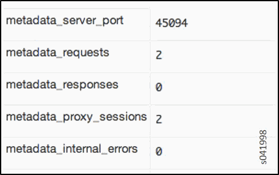

# Troubleshooting Link-Local Services in Contrail

 

Use the troubleshooting steps and guidelines in this topic when you have
errors with Contrail link-local services.

## Overview of Link-Local Services

Virtual machines might be set up to access specific services hosted on
the fabric infrastructure. For example, a virtual machine might be a
Nova client that requires access to the Nova API service running in the
fabric network. Access to services hosted on the fabric network can be
provided by configuring the services as link-local services.

A link-local address and a service port is chosen for the specific
service running on a TCP / UDP port on a server in the fabric. With the
link-local service configured, virtual machines can access the service
using the link-local address. For link-local services, Contrail uses the
address range 169.254.169.x.

Link-local service can be configured using the Contrail WebUI:
**Configure &gt; Infrastructure &gt; Link Local Services**.

## Troubleshooting Procedure for Link-Local Services

Use the following steps when you are troubleshooting link-local services
errors.

1.  Verify the reachability of the fabric server that
    is hosting the link-local service from the compute node.

2.  Check the state of the virtual machine and the
    interface:

    -   Is the **Status** of virtual machine **Up**?

    -   Is the corresponding tap interface **Active**?

    Checking the virtual machine status in the Contrail UI:

    

    Checking the tap interface status in the http agent introspect:

    `http://<compute-node-ip>:8085/Snh_ItfReq?name=`

    

3.  Check the link-local configuration in the vrouter
    agent. Make sure the configured link-local service is
    displayed.

    `http://<compute-node-ip>:8085/Snh_LinkLocalServiceInfo?`

    

4.  Validate the BGP neighbor config and the BGP
    peering config object. When the virtual machine communicates with
    the configured link-local service, a forward and reverse flow for
    the communication is set up. Check that the flow for this
    communication is created and the flow action is NAT.

    `http://<compute-node-ip>:8085/Snh_KFlowReq?flow_idx=  `

    Check that all flow entries display NAT action programmed and
    display flags for the fields (source or destination IP and ports)
    that have NAT programmed. Also shown are the number of packets and
    bytes transmitted in the respective flows.

    

    The forward flow displays the source IP of the virtual machine and
    the destination IP of the link-local service. The reverse flow
    displays the source IP of the fabric host and the destination IP of
    the compute node’s vhost interface. If the service is hosted on the
    same compute node, the destination address of the reverse flow
    displays the metadata address allocated to the virtual machine.

    Note that the **index** and **rflow** index for the two flows are
    reversed.

    You can also view similar information in the vrouter agent
    introspect page, where you can see the policy and security group for
    the flow. Check that the flow actions display as **pass**.

    `http://<compute-node-ip>:8085/Snh_FetchAllFlowRecords?  `

## Metadata Service

OpenStack allows virtual instances to access metadata by sending an HTTP
request to the link-local address 169.254.169.254. The metadata request
from the instance is proxied to Nova, with additional HTTP header fields
added, which Nova uses to identify the source instance. Then Nova
responds with appropriate metadata.

The Contrail vrouter acts as the proxy, trapping the metadata requests,
adding the necessary header fields, and sending the requests to the Nova
API server.

## Troubleshooting Procedure for Link-Local Metadata Service

Metadata service is also a link-local service, with a fixed service name
(metadata), a fixed service address (169.254.169.254:80), and a fabric
address pointing to the server where the OpenStack Nova API server is
running. All of the configuration and troubleshooting procedures for
Contrail link-local services also apply to the metadata service.

However, for metadata service, the flow is always set up to the compute
node, so the vrouter agent will update and proxy the HTTP request. The
vrouter agent listens on a local port to receive the metadata requests.
Consequently, the reverse flow has the compute node as the source IP,
the local port on which the agent is listening is the source port, and
the instance’s metadata IP is the destination IP address.

After performing all of the troubleshooting procedures for link-local
services, the following additional steps can be used to further
troubleshoot metadata service.

1.  Check the metadata statistics for: the number of
    metadata requests received by the vrouter agent, the number of proxy
    sessions set up with the Nova API server, and number of internal
    errors encountered.

    ` http://<compute-node-ip>:8085/Snh_MetadataInfo? `

    The port on which the vrouter agent listens for metadata requests is
    also displayed.

    

2.  Check the metadata trace messages, which show the
    trail of metadata requests and responses.

    `http://<compute-node-ip>:8085/Snh_SandeshTraceRequest?x=Metadata`

3.  Check the Nova configuration. On the server
    running the OpenStack service, inspect the `nova.conf` file.
    -   Ensure that the metadata proxy is enabled, as follows:

        `service_neutron_metadata_proxy = True `

        `service_quantum_metadata_proxy = True` (on older installations)

    -   Check to see if the metadata proxy shared secret is set:

        `neutron_metadata_proxy_shared_secret  `

        `quantum_metadata_proxy_shared_secret ` (on older
        installations)​

        If the shared secret is set in `nova.conf`, the same secret must
        be configured on each compute node in the file
        `/etc/contrail/contrail-vrouter-agent.conf`, and the same shared
        secret must be updated in the `METADATA` section as
        `metadata_proxy_secret=<secret>`.

4.  Restart the vrouter agent after modifying the
    shared secret:

    `service contrail-vrouter restart`

 
