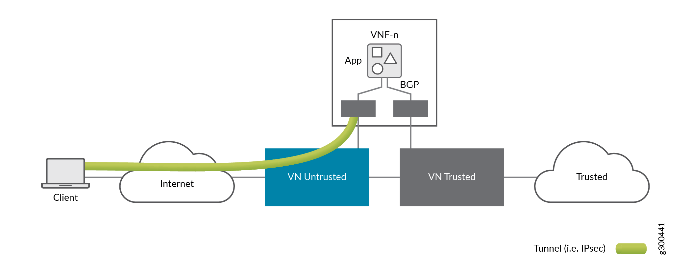
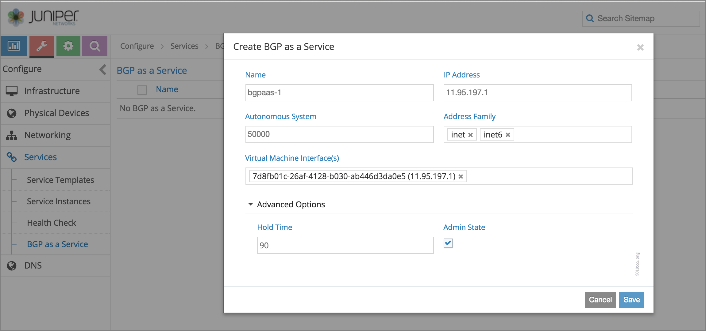
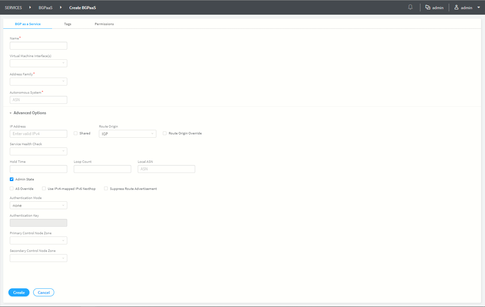

# BGP as a Service

 

## Understanding BGP as a Service

The BGP as a Service (BGPaaS) feature allows a guest virtual machine
(VM) to place routes in its own virtual routing and forwarding (VRF)
instance using BGP.

-   [Contrail BGPaaS Features](bgpaas-contrail.html#jd0e24)

-   [BGPaaS Use Cases](bgpaas-contrail.html#jd0e109)

### Contrail BGPaaS Features

Using BGPaaS with Contrail Networking requires the guest VM to have
connectivity to the control node and to be able to advertise routes into
the VRF instance.

With the BGPaaS feature:

-   The vRouter agent is able to accept BGP connections from the VMs and
    proxy them to the control node.

-   The vRouter agent always selects one of the control nodes that it is
    using as an XMPP server.

Contrail Networking provides route export functionality for BGPaaS
sessions. The next hop for all routes advertised to the tenant VM is set
to the default gateway address of the subnet of the tenant VM. This
allows the tenant BGP implementation to be relatively simple, by not
requiring support for recursive resolution of BGP next hops.

The BGPaaS object is associated with a virtual machine interface, not
just a virtual machine (VM), which enables a tenant VM to have BGP
sessions in multiple virtual networks, if required.

BGPaaS in Contrail Networking has the following features:

-   By default, all BGPaaS sessions are configured to have bidirectional
    exchange of routes. The Boolean property bgpaas-suppress-route-advertisement ensures no
    advertisement of routes to the tenant VM.

-   If inet6 routes are being advertised to the tenant VM, they are
    advertised with the IPv6 subnet's default gateway address as the BGP
    next hop. A Boolean property, bgpaas-ipv4-mapped-ipv6-nexthop, causes the IPv4
    subnet's default gateway, in IPv4-mapped IPv6 format, to be used
    instead as the next hop.

-   If multiple tenant VMs in the same virtual network have BGPaaS
    sessions and they use eBGP, the standard BGP AS path loop prevention
    rules prevent routes advertised by one tenant VM from being
    advertised to the other tenant VMs. The as-override field, added to the existing
    `BgpSessionAttributes` in the BGPaaS object, causes the control node
    to replace the AS number of the tenant VM with it's own AS number,
    when advertising routes learned from a tenant VM to another tenant
    VM in the same virtual network. The tenant VM does not need to
    implement any new functionality.

Contrail Networking provides support for high availability (HA)
architectures, BGPaaS supports control node zone selection, with options
available to configure BGPaaS control node zone peers.

This capability enables you to set up primary and secondary control node
zones, which can have one or more control nodes. The reason for this is
because BGPaaS is often being relied upon to provide routing to and from
VNFs, which are comprised of several nodes across different computes,
and the VNFs usually rely upon two BGP peers for HA. These control node
zone features increase the robustness and failover capabilities for
BGPaaS in Contrail.

The following are caveats:

-   BGP sessions must use IPv4 transport.

-   The VNF must support RFC 2545, Use of BGP-4 Multiprotocol Extensions
    for IPv6 Inter-Domain Routing, to carry IPv6 routes over the IPv4
    peer.

-   Only IPv4 (inet) and IPv6 (inet6) address families are supported.

The following features are supported in Contrail Networking for BGPaaS
configuration:

-   Global-System-Config has an option to add, modify, or delete control
    node zones

-   Control-Node-Zone has an option to add, modify, or delete control
    nodes

-   Control node has an option to add, modify or delete a control node
    zone and it can have only one control node zone

-   BGPaaS has an option to add, modify, or delete a primary or
    secondary control node zone

-   If control node zone has more than one control-node, selection of
    control-node for BGP Peering is random in a control node zone

-   Using just one control node in each zone, VNF can predictably
    establish bgp-peering to that particular control node.

### BGPaaS Use Cases

This section provides example scenarios for implementing BGPaaS with
Contrail.

-   [Dynamic Tunnel Insertion Within a Tenant
    Overlay](bgpaas-contrail.html#jd0e117)

-   [Dynamic Network Reachability of
    Applications](bgpaas-contrail.html#jd0e131)

-   [Liveness Detection for High
    Availability](bgpaas-contrail.html#jd0e138)

#### Dynamic Tunnel Insertion Within a Tenant Overlay

Various applications need to insert dynamic tunnels into virtual
networks. Virtual network functions (VNFs) provide the function of
tunnel termination. Tunnel termination types vary across application
types, such as business VPN, mobility small site backhaul, VPC, and the
like. The key requirement is that tunnels need to insert dynamically new
network reachability information into the virtual network. The
predominant methods of tunnel network reachability insertion use BGP.

BGPaaS allows the migration of brownfield VNFs into Contrail, preserving
the application behavior and requirement for BGP, without rewriting the
application.

[Figure 1](bgpaas-contrail.html#dyntunnel1) shows the need to insert a
dynamic tunnel into a virtual network.

#### Dynamic Network Reachability of Applications

The Domain Name System (DNS) is a widespread application that uses BGP
as a mechanism to tune reachability of its services, based on metrics
such as load, maintenance, availability, and the like. As DNS services
are migrated to environments using overlays, a mechanism to preserve the
existing application behavior and requirements is needed, including the
ability to announce and withdraw reachability to the available
application.

This requirement is not limited to DNS. Other applications, such as
virtualized evolved packet core (vEPC) and others, use BGP as a
mechanism for network reachability based on availability and load.

#### Liveness Detection for High Availability

Various keepalive mechanisms for tenant reachability have been provided
by network components such as BGP, OSPF, PING, VRRP, BFD, or
application-specific mechanisms. With BGP on the vRouter agent, BGP can
be used to provide a liveness detection mechanism between the tenant on
the local compute node and the services that the specific tenant VM is
providing.

## Configuring BGPaaS using VNC API

To configure BGPaaS using VNC APIs:

1.  Access the default project.

    `default_project = self._vnc_lib.project_read(fq_name=[u'default-domain', ‘bgpaas-tenant’])`

2.  Create a BGPaaS object.

    `bgpaas_obj = BgpAsAService(name=‘bgpaas_1’, parent_obj=default_project)`

3.  Attach the BGP object to a precreated virtual
    machine interface.

    `bgpaas_obj.add_virtual_machine_interface(vmi)`

4.  Set the ASN. It must be an eBGP session.

    `bgpaas_obj.set_autonomous_system('65000') `

    If the ASN is not set, the primary instance IP will be chosen.

    `bgpaas_obj.set_bgpaas_ip_address(u’10.1.1.5’)`

5.  Set session attributes.

    `bgp_addr_fams = AddressFamilies(['inet’, ‘inet6’]) bgp_sess_attrs = BgpSessionAttributes(address_families=bgp_addr_fams,hold_time=60) bgpaas_obj.set_bgpaas_session_attributes(bgp_sess_attrs)  self._vnc_lib.bgp_as_a_service_create(bgpaas_obj)`

To delete a BGPaaS object, follow the given code:

`fq_name=[u'default-domain', ‘bgpaas-tenant’, ‘bgpaas_1’] bgpaas_obj = self._vnc_lib.bgp_as_a_service_read(fq_name=fq_name) bgpaas_obj.del_virtual_machine_interface(vmi) self._vnc_lib.bgp_as_a_service_update(bgpaas_obj) self._vnc_lib.bgp_as_a_service_delete(id=bgpaas_obj.get_uuid())`

## Configuring BGPaaS from Contrail Web UI

To configure BGPaaS within a tenant:

1.  Select **Configure &gt; Services &gt; BGP as a
    Service** from the Contrail Web User Interface (UI). The BGP as a
    Service page is displayed.

2.  Click the **+** button on the **BGPaaS** page.
    The **Create BGP as a Service** page is displayed. See
    [Figure 2](bgpaas-contrail.html#bgpaas-webui).

    

3.  In the **Create BGPaaS** page, populate the
    fields with the following values to create your service.
    | Fields                                                         | Description                                                                                                                                           |
    |:---------------------------------------------------------------|:------------------------------------------------------------------------------------------------------------------------------------------------------|
    | **Name**                                                       | Enter a name for the BGP service The name can be a unique string of not more than 15 characters that contains alphanumeric characters and hyphen (-). |
    | **IP Address**                                                 | Enter the IPv4 or IPv6 source-address on the BGPaaS VM.                                                                                               |
    | **Virtual Machine Interface**                                  | Enter IP address of a virtual machine interface.                                                                                                      |
    | **Address Family**                                             | Choose inet or inet6 from the Address Family list according to your requirement.                                                                      |
    | **Autonomous System**                                          | Enter AS number in the range 1- 65,534.                                                                                                               |
    | Advanced Options |                                                                                                                                                       |
    | **Hold Time**                                                  | Enter the maximum time a BGP session remains active if no Keepalives are received.                                                                    |
    | **Admin State**                                                | Select the **Admin state** box to enable the state as UP and deselect the box to disable the state to DOWN.                                           |

4.  Click **Save** to create the BGP object.

## Configuring BGPaaS from Contrail Command

To configure BGPaaS within a tenant:

1.  Select **Services &gt; BGPaaS.** from the
    Contrail Command user interface (UI). The BGPaaS page is
    displayed.

2.  Click the **Create** button on the **BGPaaS**
    page. The **Create BGPaaS** page is displayed. See
    [Figure 3](bgpaas-contrail.html#bgpass-create).

    

3.  In the **Create BGPaaS** page, populate the
    fields with the following values to create your BGP object.
    <table data-cellspacing="0" style="border-top:thin solid black;" width="99%">
    <colgroup>
    <col style="width: 50%" />
    <col style="width: 50%" />
    </colgroup>
    <thead>
    <tr class="header">
    <th style="text-align: left;">
Fields
</th>
    <th style="text-align: left;">
Description
</th>
    </tr>
    </thead>
    <tbody>
    <tr class="odd">
    <td style="text-align: left;">
<strong>Name</strong>
</td>
    <td style="text-align: left;">
Enter a name for the BGP service. The name can be a unique string of not more than 15 characters that contains alphanumeric characters and hyphen (-).
</td>
    </tr>
    <tr class="even">
    <td style="text-align: left;">
<strong>Virtual Machine Interface</strong>
</td>
    <td style="text-align: left;">
Enter IP address of a virtual machine interface.
</td>
    </tr>
    <tr class="odd">
    <td style="text-align: left;">
<strong>Address Family</strong>
</td>
    <td style="text-align: left;">
Choose inet or inet6 from the Address Family list according to your requirement.
</td>
    </tr>
    <tr class="even">
    <td style="text-align: left;">
<strong>Autonomous System</strong>
</td>
    <td style="text-align: left;">
Enter autonomous system (AS) number in the range of 1-65,535.

    
If you enable <strong>4 Byte ASN</strong> in <strong>Global Config</strong>, you can enter 4-byte AS number in the range of 1-4,294,967,295.
</td>
    </tr>
    <tr class="odd">
    <td style="text-align: left;">
<kbd class="user-typing" data-v-pre="">Advanced Options</kbd>
</td>
    <td style="text-align: left;"> </td>
    </tr>
    <tr class="even">
    <td style="text-align: left;">
<strong>IP Address</strong>
</td>
    <td style="text-align: left;">
Enter the IPv4 or IPv6 source-address on the BGPaaS VM.
</td>
    </tr>
    <tr class="odd">
    <td style="text-align: left;">
<strong>Shared</strong>
</td>
    <td style="text-align: left;">
Select this check box to link all VMIs with the common bgp-router object. If this box is not selected, each virtual machine interface individually links to its own bgp-router object.
</td>
    </tr>
    <tr class="even">
    <td style="text-align: left;">
<strong>Route Origin</strong>
</td>
    <td style="text-align: left;"><ul>
    <li>
Choose BGP from the list if the route originated on a BGP router.
</li>
    <li>
Choose EGP from the list if the route originated from an External Gateway Protocols (EGP) session.
</li>
    <li>
Choose Incomplete from the list if the Network Layer Reachability Information (NLRI) is learned through methods such as redistribution of the routes into BGP, and not through BGP.
</li>
    </ul></td>
    </tr>
    <tr class="odd">
    <td style="text-align: left;">
<strong>Route Origin Override</strong>
</td>
    <td style="text-align: left;">
Select this check box to override the origin attribute of the advertised route origin into Incomplete.
</td>
    </tr>
    <tr class="even">
    <td style="text-align: left;">
<strong>Service Health Check</strong>
</td>
    <td style="text-align: left;">
Select any Service Health Check object from the list according to your requirement.
</td>
    </tr>
    <tr class="odd">
    <td style="text-align: left;">
<strong>Hold Time</strong>
</td>
    <td style="text-align: left;">
Enter the maximum time a BGP session remains active if no Keepalives are received.
</td>
    </tr>
    <tr class="even">
    <td style="text-align: left;">
<strong>Loop Count</strong>
</td>
    <td style="text-align: left;">
Enter the number of times the same ASN can be seen in a route-update. The route is discarded when the loop count is exceeded.
</td>
    </tr>
    <tr class="odd">
    <td style="text-align: left;">
<strong>Local ASN</strong>
</td>
    <td style="text-align: left;">
Enter autonomous system (AS) number in the range of 1-65,535.

    
If you enable <strong>4 Byte ASN</strong> in <strong>Global Config</strong>, you can enter 4-byte AS number in the range of 1-4,294,967,295.
</td>
    </tr>
    <tr class="even">
    <td style="text-align: left;">
<strong>AS Override</strong>
</td>
    <td style="text-align: left;">
Select this check box to replace the AS number of the control node with the AS number of the tenant VM.
</td>
    </tr>
    <tr class="odd">
    <td style="text-align: left;">
<strong>Use IPv4-mapped IPv6 Nexthop</strong>
</td>
    <td style="text-align: left;">
Select this check box to use IPv4-mapped IPv6 format as the next hop instead of the IPv4 subnet's default gateway.
</td>
    </tr>
    <tr class="even">
    <td style="text-align: left;">
<strong>Suppress Route Advertisement</strong>
</td>
    <td style="text-align: left;">
Select this check box to prevent advertisement of routes to tenant VM.
</td>
    </tr>
    <tr class="odd">
    <td style="text-align: left;">
<strong>Primary Control Node Zone</strong>
</td>
    <td style="text-align: left;">
You can choose the control-node with which the BGPaaS VM can perform a BGP session.
</td>
    </tr>
    <tr class="even">
    <td style="text-align: left;">
<strong>Secondary Control Node Zone</strong>
</td>
    <td style="text-align: left;">
You can choose the control-node with which the BGPaaS VM can perform a BGP session.
</td>
    </tr>
    </tbody>
    </table>

4.  Click the **Create** button to create the BGP
    object.

 
