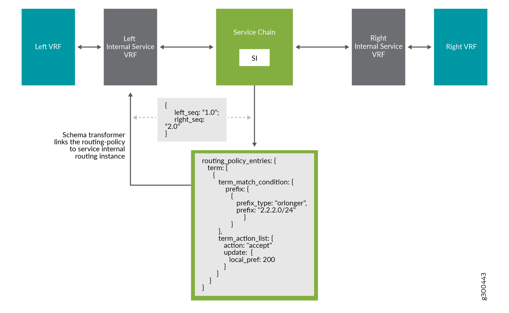
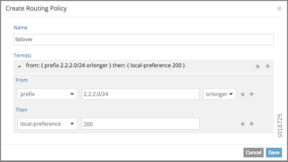
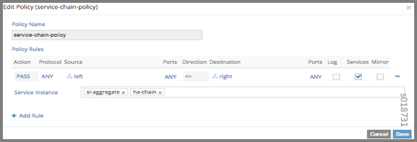
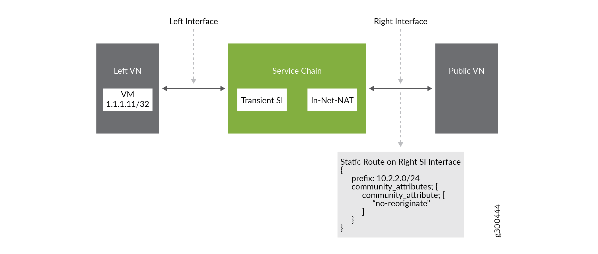

# Routing Policy

 

Starting with Contrail Networking Release 1910,
virtual network routing policies are automatically applied to secondary
routes. See [Applying Routing Policies to Secondary
Routes](contrail-routing-policy-sp-features.html#secondary-routing-policies-cn-spguide).

Contrail Networking uses routing policy infrastructure to manipulate the
route and path attribute dynamically and supports attaching the import
routing policy on the service instances.

The routing policy contains list terms. A term can be a terminal rule,
meaning that upon a match on the specified term, no further terms are
evaluated and the route is dropped or accepted, based on the action in
that term.

If the term is not a terminal rule, subsequent terms are evaluated for
the given route.

The list terms are structured as in the following example.

    Policy {
         Term-1
         Term-2
    }

The matches and actions of the policy term lists operate similarly to
the Junos language match and actions operations. A visual representation
is the following.

Each term is represented as in the following:

    from {
        match-condition-1
        match-condition-2
        ..
        ..
    }
    then {
        action
        update-action-1
        update-action-2
        ..
        ..
    }

The term should not contain an `any` match condition, for example, an
empty `from` should not be present.

If an `any` match condition is present, all routes are considered as
matching the term.

However, the `then` condition can be empty or the action can be
unspecified.

## Applying Routing Policy

The routing policy evaluation has the following key points:

-   If the term of a routing policy consists of multiple match
    conditions, a route must satisfy all match conditions to apply the
    action specified in the term.

-   If a term in the policy does not specify a match condition, all
    routes are evaluated against the match.

-   If a match occurs but the policy does not specify an accept, reject,
    or next term action, one of the following occurs:

    -   The next term, if present, is evaluated.

    -   If no other terms are present, the next policy is evaluated.

    -   If no other policies are present, the route is accepted. The
        default routing policy action is “accept”.

-   If a match does not occur with a term in a policy, and subsequent
    terms in the same policy exist, the next term is evaluated.

-   If a match does not occur with any terms in a policy, and subsequent
    policies exist, the next policy is evaluated.

-   If a match does not occur by the end of a policy or all policies,
    the route is accepted.

A routing policy can consist of multiple terms. Each term consists of
match conditions and actions to apply to matching routes.

Each route is evaluated against the policy as follows:

1.  The route is evaluated against the first term. If it matches, the
    specified action is taken. If the action is to accept or reject the
    route, that action is taken and the evaluation of the route ends. If
    the next term action is specified or if no action is specified, or
    if the route does not match, the evaluation continues as described
    above to subsequent terms.

2.  Upon hitting the last non-terminal term of the given routing policy,
    the route is evaluated against the next policy, if present, in the
    same manner as described in step 1.

### Match Condition: From

The match condition `from` contains a list of match conditions to be
satisfied for applying the action specified in the term. It is possible
that the term doesn’t have any match condition. This indicates that all
routes match this term and action is applied according to the action
specified in the term.

The following table describes the match conditions supported by Contrail
Networking.

<table data-cellspacing="0" style="border-top:thin solid black;" width="99%">
<colgroup>
<col style="width: 33%" />
<col style="width: 33%" />
<col style="width: 33%" />
</colgroup>
<thead>
<tr class="header">
<th style="text-align: left;">
Match Condition
</th>
<th style="text-align: left;">
User Input
</th>
<th style="text-align: left;">
Description
</th>
</tr>
</thead>
<tbody>
<tr class="odd">
<td style="text-align: left;">
Prefix
</td>
<td style="text-align: left;">
List of prefixes to match
</td>
<td style="text-align: left;">
Each prefix in the list is represented as prefix and match type, where the prefix match type can be:

<ul>
<li>
<code class="inline" data-v-pre="">exact</code>
</li>
<li>
<code class="inline" data-v-pre="">orlonger</code>
</li>
<li>
<code class="inline" data-v-pre="">longer</code>
</li>
</ul>

Example: 1.1.0.0/16 <code class="inline" data-v-pre="">orlonger</code>

A route matches this condition if its prefix matches any of the prefixes in the list.
</td>
</tr>
<tr class="even">
<td style="text-align: left;">
Community
</td>
<td style="text-align: left;">
Community string to match
</td>
<td style="text-align: left;">
Represented as either a well-known community string with <code class="inline" data-v-pre="">no export</code> or <code class="inline" data-v-pre="">no reoriginate</code>, or a string representation of a community (64512:11).
</td>
</tr>
<tr class="odd">
<td style="text-align: left;">
Protocol
</td>
<td style="text-align: left;">
Array of path source or path protocol to match
</td>
<td style="text-align: left;">
BGP | XMPP | StaticRoute | ServiceChain | Aggregate. A path is considered as matching this condition if the path protocol is one of protocols in the list.
</td>
</tr>
</tbody>
</table>

### Routing Policy Action and Update Action

The policy action contains two parts, action and update action.

The following table describes `action` as supported by Contrail
Networking.

| Action    | Terminal? | Description                                                                                                                                                                                                                                                                                                   |
|:----------|:----------|:--------------------------------------------------------------------------------------------------------------------------------------------------------------------------------------------------------------------------------------------------------------------------------------------------------------|
| Reject    | Yes       | Reject the route that matches this term. No more terms are evaluated after hitting this term.                                                                                                                                                                                                                 |
| Accept    | Yes       | Accept the route that matches this term. No more terms are evaluated after hitting this term. The route is updated using the update specified in the policy action.                                                                                                                                           |
| Next Term | No        | This is the default action taken upon matching the policy term. The route is updated according to the update specified in the policy action. Next terms present in the routing policy are processed on the route. If there are no more terms in the policy, the next routing policy is processed, if present. |

The update action section specifies the route modification to be
performed on the matching route.

The following table describes `update action` as supported by Contrail
Networking.

<table data-cellspacing="0" style="border-top:thin solid black;" width="99%">
<colgroup>
<col style="width: 33%" />
<col style="width: 33%" />
<col style="width: 33%" />
</colgroup>
<thead>
<tr class="header">
<th style="text-align: left;">
Update Action
</th>
<th style="text-align: left;">
User Input
</th>
<th style="text-align: left;">
Description
</th>
</tr>
</thead>
<tbody>
<tr class="odd">
<td style="text-align: left;">
Community
</td>
<td style="text-align: left;">
List of community
</td>
<td style="text-align: left;">
As part of the policy update, the following actions can be taken for community:

<ul>
<li>
Add a list of community to the existing community.
</li>
<li>
Set a list of community.
</li>
<li>
Remove a list of community (if present) from the existing community.
</li>
</ul></td>
</tr>
<tr class="even">
<td style="text-align: left;">
MED
</td>
<td style="text-align: left;">
Update the MED of the BgpPath
</td>
<td style="text-align: left;">
Unsigned integer representing the MED
</td>
</tr>
<tr class="odd">
<td style="text-align: left;">
local-pref
</td>
<td style="text-align: left;">
Update the local-pref of the BgpPath
</td>
<td style="text-align: left;">
Unsigned integer representing local-pref
</td>
</tr>
</tbody>
</table>

### Applying Routing Policies to Secondary Routes

A virtual network routing policy is automatically applied to secondary
routes. The ability to apply routing policies to secondary routes is
especially useful as a mechanism to modify routes imported from MP-BGP,
including routes that are imported from the MPLS network.

**Note**

Routing policies that are attached to service instances are applied to
primary routes only. These routing policies are not applied to secondary
routes.

## Routing Policy Configuration

Routing policy is configured on the service instance. Multiple routing
policies can be attached to a single service instance interface.

When the policy is applied on the left interface, the policy is
evaluated for all the routes that are reoriginated in the left VN for
routes belonging to the right VN. Similarly, the routing policy attached
to the right interface influences the route reorigination in the right
VN, for routes belonging to the left VN.

The following figure illustrates a routing policy configuration.

The policy sequence number specified in the routing policy link data
determines the order in which the routing policy is evaluated. The
routing policy link data on the service instance also specifies whether
the policy needs to be applied to the left service interface, to the
right service interface, or to both interfaces.

It is possible to attach the same routing policy to both the left and
right interfaces for a service instance, in a different order of policy
evaluation. Consequently, the routing policy link data contains the
sequence number for policy evaluation separately for the left and right
interfaces.

The schema transformer links the routing policy object to the internal
routing instance created for the service instance. The transformer also
copies the routing policy link data to ensure the same policy order.

## Configuring and Troubleshooting Routing Policy

This section shows how to create a routing policy for service chains and
how to validate the policy.

### Create Routing Policy

First, create the routing policy, **Configure &gt; Networking &gt;
Routing &gt; Create &gt;Routing Policy**. See the following example.

**Note**

The Contrail Web UI and REST APIs enable you to configure a BGP routing
policy and then assign it to a virtual network, but the routing policy
will not be applied if the virtual network is attached to an L3VPN.

### Configure Service Instance

Create a service instance and attach the routing policy to both the left
and right interfaces. The order of the policy is calculated by the UI,
based on the order of the policy specified in the list.

### Configure the Network Policy for the Service Chain

At **Edit Policy**, create a policy for the service chain, see the
following example.

## Using a VNC Script to Create Routing Policy

The following example shows use of a VNC API script to create a routing
policy.

    from vnc_api.vnc_api import *
    vnc_lib = VncApi("admin", "<password>", "admin")
    project=vnc_lib.project_read(fq_name=["default-domain", "admin"])
    routing_policy=RoutingPolicy(name="vnc_3", parent_obj=project)
    policy_term=PolicyTermType()
    policy_statement=PolicyStatementType()

    match_condition=TermMatchConditionType(protocol=["bgp"], community="22:33")
    prefix_match=PrefixMatchType(prefix="1.1.1.0/24", prefix_type="orlonger")
    match_condition.set_prefix([prefix_match])

    term_action=TermActionListType(action="accept")
    action_update=ActionUpdateType(local_pref=101, med=10)
    add_community=ActionCommunityType()
    comm_list=CommunityListType(["11:22"])
    add_community.set_add(comm_list)
    action_update.set_community(add_community)
    term_action.set_update(action_update)

    policy_term.set_term_action_list(term_action)
    policy_term.set_term_match_condition(match_condition)

    policy_statement.add_term(policy_term)
    routing_policy.set_routing_policy_entries(policy_statement)
    vnc_lib.routing_policy_create(routing_policy)

## Verify Routing Policy in API Server

You can verify the service instance references and the routing instance
references for the routing policy by looking in the API server
configuration database. See the following example.

## Verify Routing Policy in the Control Node

You can verify the routing policy in the control node.

Point your browser to:

`http://<control-node>:8083/Snh_ShowRoutingPolicyReq?search_string=failover  `

See the following example.

## Verify Routing Policy Configuration in the Control Node

You can verify the routing policy configuration in the control node.

Point your browser to:

`http://<control-node>:8083/Snh_ShowBgpRoutingPolicyConfigReq?search_string=failover  `

See the following example.

## Verify Routing Policy Configuration on the Routing Instance

You can verify the routing policy configuration on the internal routing
instance.

Point your browser to:

`http://<control-node>:8083/Snh_ShowBgpInstanceConfigReq?search_string=<name-of-internal-vrf> `

See the following example.

You can also verify the routing policy on the routing instance
operational object.

Point your browser to:

`http://<control-node>:8083/Snh_ShowRoutingInstanceReq?x=<name-of-internal-vrf> `

See the following example.

## Control for Route Reorigination

The ability to prevent reorigination of interface static routes is
typically required when routes are configured on an interface that
belongs to a service VM.

As an example, the following image shows a service chain that has
multiple service instances, with an `in-net-nat` service instance as the
last service VM, also with the right VN as the public VN.

The last service instance performs NAT by using a NAT pool. The right
interface of the service VM must be configured with an interface static
route for the NAT pool so that the destination in the right VN knows how
to reach addresses in the NAT pool. However, the NAT pool prefix should
not be reoriginated into the left VN.

To prevent route reorigination, the interface static route is tagged
with a well-known BGP community called `no-reoriginate`.

When the control node is reoriginating the route, it skips the routes
that are tagged with the BGP community.

## Configuring and Troubleshooting Reorigination Control

The community attribute on the static routes for the interface static
route of the service instance is specified during creation of the
service instance. See the following example.

Use the following example to verify that the service instance
configuration object in the API server has the correct community set for
the static route. See the following example.

Release History Table

Release

Description

[1910](#jd0e11)

Starting with Contrail Networking Release 1910, virtual network routing
policies are automatically applied to secondary routes. See [Applying
Routing Policies to Secondary
Routes](contrail-routing-policy-sp-features.html#secondary-routing-policies-cn-spguide).

 
