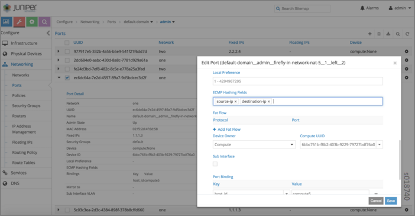

# Customized Hash Field Selection for ECMP Load Balancing

 

## Overview: Custom Hash Feature

Contrail Networking enables you to configure the set of fields used to
hash upon during equal-cost multipath (ECMP) load balancing.

With the custom hash feature, users can configure an exact subset of
fields to hash upon when choosing the forwarding path among a set of
eligible ECMP candidates.

The custom hash configuration can be applied in the following ways:

-   globally

-   per virtual network (VN)

-   per virtual network interface (VMI)

VMI configurations take precedence over VN configurations, and VN
configurations take precedence over global level configuration (if
present).

Custom hash is useful whenever packets originating from a particular
source and addressed to a particular destination must go through the
same set of service instances during transit. This might be required if
source, destination, or transit nodes maintain a certain state based on
the flow, and the state behavior could also be used for subsequent new
flowsl, between the same pair of source and destination addresses. In
such cases, subsequent flows must follow the same set of service nodes
followed by the initial flow.

You can use the Contrail Web UI to identify specific fields in the
network upon which to hash at the **Configure &gt; Networking &gt;
Network, Create Network** window, in the **ECMP Hashing Fields** section
as shown in the following figure.

If the hashing fields are configured for a virtual network, all traffic
destined to that VN will be subject to the customized hash field
selection during forwarding over ECMP paths by vRouters. This may not be
desirable in all cases, as it could potentially skew all traffic to the
destination network over a smaller set of paths across the IP fabric.

A more practical scenario is one in which flows between a source and
destination must go through the same service instance in between, where
one could configure customized ECMP fields for the virtual machine
interface of the service instance. Then, each service chain route
originating from that virtual machine interface would get the desired
ECMP field selection applied as its path attribute, and eventually get
propagated to the ingress vRouter node. See the following example.

## Using ECMP Hash Fields Selection

Custom hash fields selection is most useful in scenarios where multiple
ECMP paths exist for a destination. Typically, the multiple ECMP paths
point to ingress service instance nodes, which could be running anywhere
in the Contrail cloud.

### Configuring ECMP Hash Fields Over Service Chains

Use the following steps to create customized hash fields with ECMP over
service chains.

1.  Create the virtual networks needed to interconnect
    using service chaining, with ECMP load-balancing.

2.  Create a service template and enable
    scaling.

3.  Create a service instance, and using the service
    template, configure by selecting:

    -   the desired number of instances for scale-out

    -   the left and right virtual network to connect

    -   the shared address space, to make sure that instantiated
        services come up with the same IP address for left and right,
        respectively

    This configuration enables ECMP among all those service instances
    during forwarding.

4.  Create a policy, then select the service instance
    previously created and apply the policy to to the desired VMIs or
    VNs.

5.  After the service VMs are instantiated, the ports
    of the left and right interfaces are available for further
    configuration. At the Contrail Web UI Ports section under
    Networking, select the ports on the left interface (virtual machine
    interface) of the service instance and apply the desired ECMP hash
    field configuration.**Note**

    Currently the ECMP field selection configuration for the service
    instance left or right interface must be applied by using the Ports
    (VMIs) section under Networking and explicitly configuring the ECMP
    fields selection for each of the instantiated service instances'
    VMIs. This must be done for all service interfaces of the group, to
    ensure the end result is as expected, because the load balance
    attribute of only the best path is carried over to the ingress
    vRouter. If the load balance attribute is not configured, it is not
    propagated to the ingress vRouter, even if other paths have that
    configuration.

When the configuration is finished, the vRouters get programmed with
routing tables with the ECMP paths to the various service instances. The
vRouters are also programmed with the desired ECMP hash fields to be
used during load balancing of the traffic.

 
