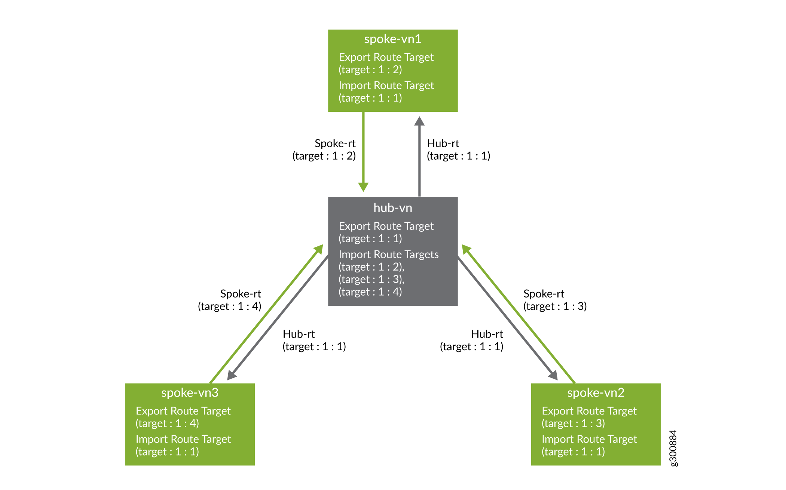
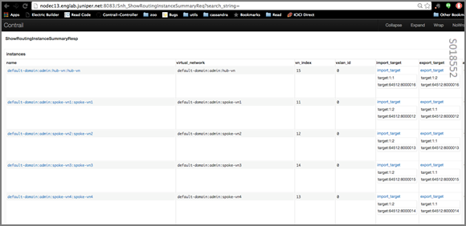

# Configuring Virtual Networks for Hub-and-Spoke Topology

 

Contrail Networking supports hub-and-spoke topology, which can be used
to ensure that virtual machines (VMs) don’t communicate with each other
directly; their communication is only allowed indirectly by means of a
designated hub virtual network.

## Route Targets for Virtual Networks in Hub-and-Spoke Topology

Hub-and-spoke topology can be used to ensure that virtual machines (VMs)
don’t communicate with each other directly; their communication is only
allowed indirectly by means of a designated hub virtual network (VN).
The VMs are configured in spoke VNs.

This is useful for enabling VMs in a spoke VN to communicate by means of
a policy or firewall, where the firewall exists in a hub site.

hub-and-spoke topology is implemented using two route targets (`hub-rt`
and `spoke-rt`), as follows:

-   Hub route target (`hub-rt`):

    -   The hub VN *exports* all routes tagged with `hub-rt`.

    -   The spoke VN *imports* routes tagged with `hub-rt`, ensuring
        that the spoke VN has only routes exported by the hub VN.

    -   To attract spoke traffic, the hub VN readvertises the spoke
        routes or advertises the default route.

-   Spoke route target (`spoke-rt`):

    -   All spoke VNs export routes with route target `spoke-rt`.

    -   The hub VN imports all spoke routes, ensuring that hub VN has
        all spoke routes.

**Note**

The hub VN or VRF can reside in an external gateway, such as an MX
Series router, while the spoke VN resides in the Contrail controller.

## Example: Hub-and-Spoke Topology

In the example shown in
[Figure 1](hub-spoke-vnc.html#hub-and-spoke-topology), the `hub-vn` is
configured as a hub virtual network, and the three `spoke-vn`s are
configured as spoke virtual networks. The hub and spokes each use a
unique export route target. The `hub-vn` exports its `hub-rt`
`(target:1:1)` routes to the spokes, and each `spoke-vn` imports them.
Each `spoke-vn` exports its `spoke-rt`
`(target:1:2, target:1:3, target:1:4)` routes to the hub, and the
`hub-vn` imports them.

## Troubleshooting Hub-and-Spoke Topology

The following examples provide methods to help you troubleshoot
hub-and-spoke configurations.

**Example: Validating the Configuration on the Virtual Network**

The following example uses the api-server HTTP get request to validate
the configuration on the virtual network.

Hub VN configuration:

`curl -u admin:<password> http://<host ip>/virtual-network/<hub-vn-uuid>| python -m json.tool`

    {
        "virtual-network": {
            "display_name": "hub-vn",
            "fq_name": [
                "default-domain",
                "admin",
                "hub-vn"
            ],
            "export_route_target_list": {
                "route_target": [
                    "target:1:2"
                ]
            },
            "import_route_target_list": {
                "route_target": [
                    "target:1:1"
                ]
            },
        }
    }

Spoke VN configuration:

`curl -u admin:<password> http://<host ip>:8095/virtual-network/<spoke-vn-uuid> | python -m json.tool`

    {
    {
        "virtual-network": {
            "display_name": "spoke-vn1",
            "fq_name": [
                "default-domain",
                "admin",
                "spoke-vn1"
            ],
            "export_route_target_list": {
                "route_target": [
                    "target:1:1"
                ]
            },
            "import_route_target_list": {
                "route_target": [
                    "target:1:2"
                ]
            },
        }
    }

**Example: Validate the Configuration on the Routing Instance**

The following example uses `api-server HTTP get `request to validate the
configuration on the routing instance.

Spoke VRF configuration (with a system-created VRF by schema
transformer):

`user@node:/opt/contrail/utils# curl -u admin:<password> http://<host ip>:8095/routing-instance/<spoke-vrf-uuid>| python -m json.tool`

    {
        "routing-instance": {
            "display_name": "spoke-vn1",
            "fq_name": [
                "default-domain",
                "admin",
                "spoke-vn1",
                "spoke-vn1"
            ],
            "route_target_refs": [
                {
                    "attr": {
                        "import_export": "export"
                    },
                    "href": "http://<host ip>:8095/route-target/446a3bbe-f263-4b58-a537-8333878dd7c3",
                    "to": [
                        "target:1:1"
                    ],
                    "uuid": "446a3bbe-f263-4b58-a537-8333878dd7c3"
                },
                {
                    "attr": {
                        "import_export": null
                    },
                    "href": "http://<host ip>:8095/route-target/7668088d-e403-414f-8f5d-649ed80e0689",
                    "to": [
                        "target:64512:8000012"
                    ],
                    "uuid": "7668088d-e403-414f-8f5d-649ed80e0689"
                },
                {
                    "attr": {
                        "import_export": "import"
                    },
                    "href": "http://<host ip>:8095/route-target/8f216064-8488-4486-8fce-b4afb87266bb",
                    "to": [
                        "target:1:2"
                    ],
                    "uuid": "8f216064-8488-4486-8fce-b4afb87266bb"
                }
            ],
            "routing_instance_is_default": true,
        }
    }

Hub VRF configuration:

`curl -u admin:<password> http://<host ip>:8095/routing-instance/<hub-vrf-uuid> | python -m json.tool`

    {
        "routing-instance": {
            "display_name": "hub-vn",
            "fq_name": [
                "default-domain",
                "admin",
                "hub-vn",
                "hub-vn"
            ],
            "route_target_refs": [
                {
                    "attr": {
                        "import_export": "import"
                    },
                    "href": "http://<host ip>:8095/route-target/446a3bbe-f263-4b58-a537-8333878dd7c3",
                    "to": [
                        "target:1:1"
                    ],
                    "uuid": "446a3bbe-f263-4b58-a537-8333878dd7c3"
                },
                {
                    "attr": {
                        "import_export": "export"
                    },
                    "href": "http://<host ip>:8095/route-target/8f216064-8488-4486-8fce-b4afb87266bb",
                    "to": [
                        "target:1:2"
                    ],
                    "uuid": "8f216064-8488-4486-8fce-b4afb87266bb"
                },
                {
                    "attr": {
                        "import_export": null
                    },
                    "href": "http://<host ip>:8095/route-target/a85fec19-eed2-430c-af23-9919aca1dd12",
                    "to": [
                        "target:64512:8000016"
                    ],
                    "uuid": "a85fec19-eed2-430c-af23-9919aca1dd12"
                }
            ],
            "routing_instance_is_default": true,
        }
    }

**Example: Using Contrail Control Introspect**

[Figure 2](hub-spoke-vnc.html#introspect) shows the import and export
targets for `hub-vn` and `spoke-vns`, by invoking
`contrail-control-introspect`.

 
