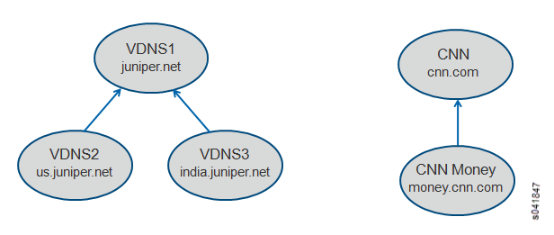
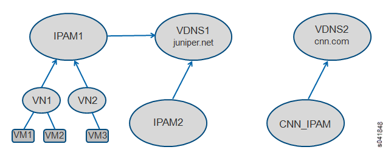
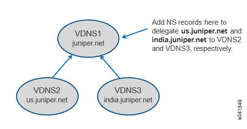
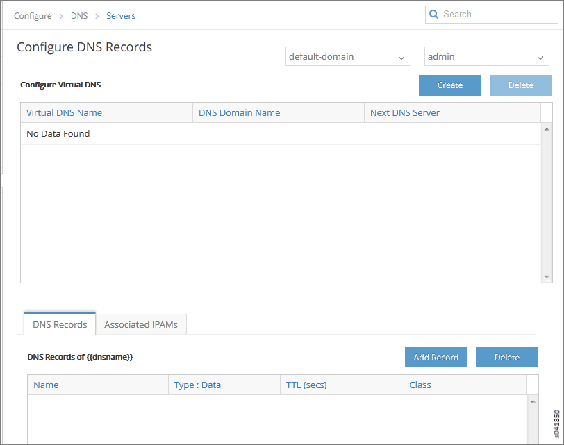
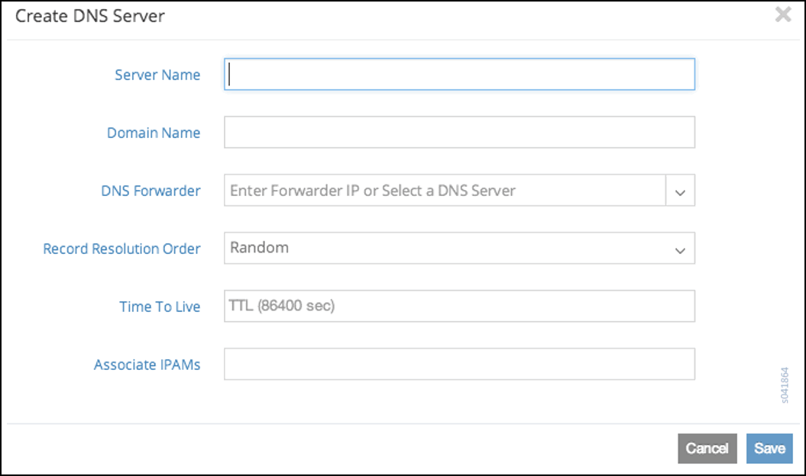
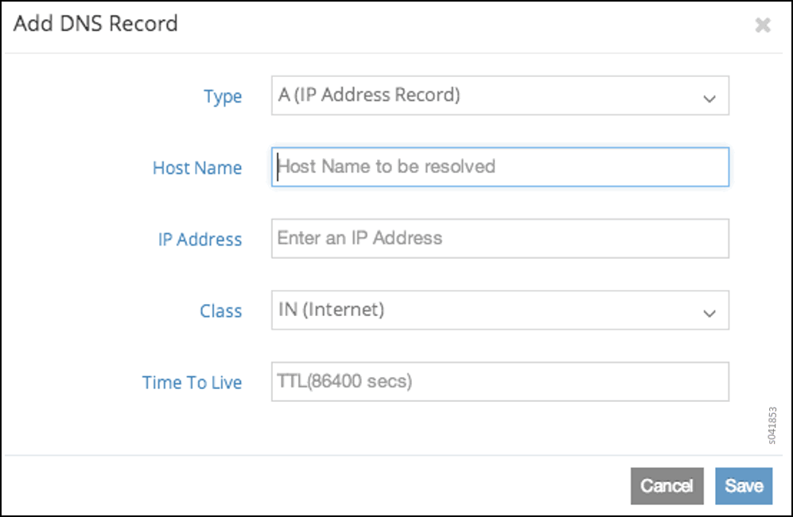
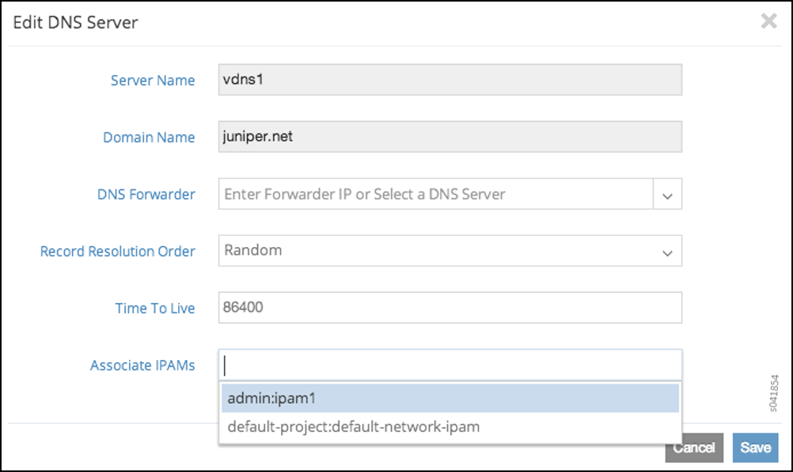
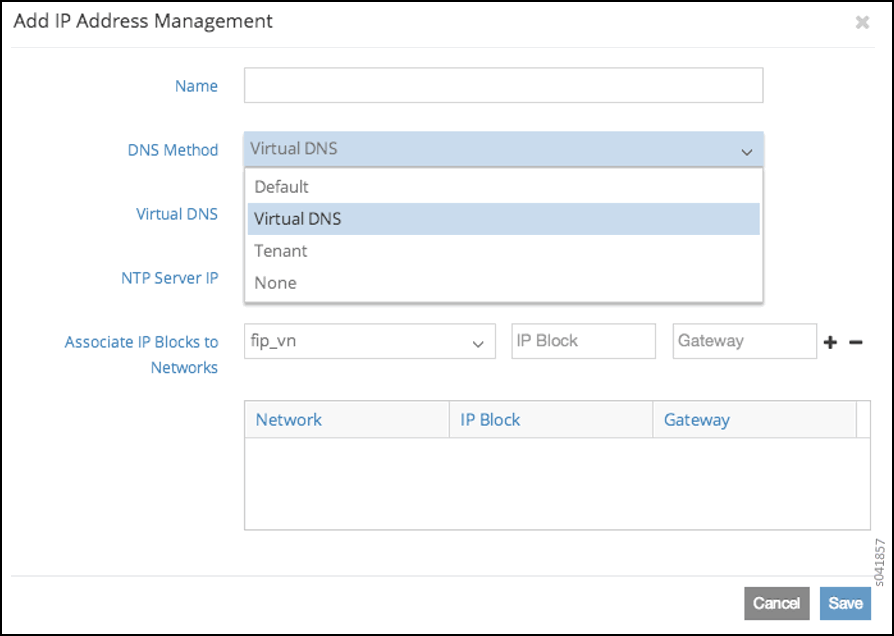

# Configuring DNS Servers

 

## DNS Overview

Domain Name System (DNS) is the standard protocol for resolving domain
names into IP addresses so that traffic can be routed to its
destination. DNS provides the translation between human-readable domain
names and their IP addresses. The domain names are defined in a
hierarchical tree, with a root followed by top-level and next-level
domain labels.

A DNS server stores the records for a domain name and responds to
queries from clients based on these records. The server is authoritative
for the domains for which it is configured to be the name server. For
other domains, the server can act as a caching server, fetching the
records by querying other domain name servers.

The following are the key attributes of domain name service in a virtual
world:

-   It should be possible to configure multiple domain name servers to
    provide name resolution service for the virtual machines spawned in
    the system.

-   It should be possible to configure the domain name servers to form
    DNS server hierarchies required by each tenant.

    -   The hierarchies can be independent and completely isolated from
        other similar hierarchies present in the system, or they can
        provide naming service to other hierarchies present in the
        system.

-   DNS records for the virtual machines spawned in the system should be
    updated dynamically when a virtual machine is created or destroyed.

-   The service should be scalable to handle an increase in servers and
    the resulting increased numbers of virtual machines and DNS queries
    handled in the system.

## Defining Multiple Virtual Domain Name Servers in Contrail

Contrail provides the flexibility to define multiple virtual domain name
servers under each domain in the system. Each virtual domain name server
is an authoritative server for the DNS domain configured.
[Figure 1](configure-dns-vnc.html#dns-example) shows examples of virtual
DNS servers defined in **default-domain**, providing the name service
for the DNS domains indicated.

## IPAM and Virtual DNS

Each IP address management (IPAM) service in the system can refer to one
of the virtual DNS servers configured. The virtual networks and virtual
machines spawned are associated with the DNS domain specified in the
corresponding IPAM. When the VMs are configured with DHCP, they receive
the domain assignment in the DHCP **domain-name** option. Examples are
shown in [Figure 2](configure-dns-vnc.html#ipam-example)

## DNS Record Types

DNS records can be added statically. DNS record types **A, CNAME, PTR**,
and **NS** are currently supported in the system. Each record includes
the type, class (IN), name, data, and TTL values. See
[Table 1](configure-dns-vnc.html#dns-record-types) for descriptions of
the record types.

Table 1: DNS Record Types Supported

| DNS Record Type | Description                                                                                                                                                                                                                                                                                                                                  |
|:----------------|:---------------------------------------------------------------------------------------------------------------------------------------------------------------------------------------------------------------------------------------------------------------------------------------------------------------------------------------------|
| **A**           | Used for mapping hostnames to IPv4 addresses. Name refers to the name of the virtual machine, and data is the IPv4 address of the virtual machine.                                                                                                                                                                                           |
| **CNAME**       | Provides an alias to a name. Name refers to the name of the virtual machine, and data is the new name (alias) for the virtual machine.                                                                                                                                                                                                       |
| **PTR**         | A pointer to a record, it provides reverse mapping from an IP address to a name. Name refers to the IP address, and data is the name for the virtual machine. The address in the PTR record should be part of a subnet configured for a VN within one of the IPAMs referring to this virtual DNS server.                                     |
| **NS**          | Used to delegate a subdomain to another DNS server. The DNS server could be another virtual DNS server defined in the system or the IP address of an external DNS server reachable via the infrastructure. Name refers to the subdomain being delegated, and data is the name of the virtual DNS server or IP address of an external server. |

[Figure 3](configure-dns-vnc.html#ns-example) shows an example usage for
the DNS record type of **NS**.

## Configuring DNS on the User Interface

DNS can be configured by using the user interface or by using scripts.
The following procedure shows how to configure DNS through the Juniper
Networks Contrail interface.

1.  Access **Configure &gt; DNS &gt; Servers** to
    create or delete virtual DNS servers and records.

    The **Configure DNS Records** page appears; see
    [Figure 4](configure-dns-vnc.html#config-dns-record).

    

2.  To add a new DNS server, click the **Create**
    button.

    Enter DNS server information in the **Add DNS** window; see
    [Figure 5](configure-dns-vnc.html#add-dns-svr)

    

    Complete the fields for the new server; see
    [Table 2](configure-dns-vnc.html#add-dns-fields).

    Table 2: Add DNS Fields

    | Field                    | Description                                                                                                                                                                                                                                                                                                                                                                                                                               |
    |:-------------------------|:------------------------------------------------------------------------------------------------------------------------------------------------------------------------------------------------------------------------------------------------------------------------------------------------------------------------------------------------------------------------------------------------------------------------------------------|
    | **Server Name**          | Enter a name for this server.                                                                                                                                                                                                                                                                                                                                                                                                             |
    | **Domain Name**          | Enter the name of the domain for this server.                                                                                                                                                                                                                                                                                                                                                                                             |
    | **Time To Live**         | Enter the **TTL** in seconds.                                                                                                                                                                                                                                                                                                                                                                                                             |
    | **Next DNS Server**      | Select from a list the name of the next DNS server to process DNS requests if they cannot be processed at this server, or **None**.                                                                                                                                                                                                                                                                                                       |
    | **Load Balancing Order** | Select the load-balancing order from a list—**Random, Fixed, Round Robin**. When a name has multiple records matching, the configured record order determines the order in which the records are sent in the response. Select **Random** to have the records sent in random order. Select **Fixed** to have records sent in the order of creation. Select **Round Robin** to have the record order cycled for each request to the record. |
    | **OK**                   | Click **OK** to create the record.                                                                                                                                                                                                                                                                                                                                                                                                        |
    | **Cancel**               | Click **Cancel** to clear the fields and start over.                                                                                                                                                                                                                                                                                                                                                                                      |

3.  To add a new DNS record, from the **Configure DNS
    Records** page, click the **Add Record** button in the lower right
    portion of the screen.

    The **Add DNS Record** window appears; see
    [Figure 6](configure-dns-vnc.html#add-dns-record).

    

4.  Complete the fields for the new record; see
    [Table 3](configure-dns-vnc.html#add-dns-record-fields).

    Table 3: Add DNS Record Fields

    | Field            | Description                                                |
    |:-----------------|:-----------------------------------------------------------|
    | **Record Name**  | Enter a name for this record.                              |
    | **Type**         | Select the record type from a list—**A, CNAME, PTR, NS.**  |
    | **IP Address**   | Enter the IP address for the location for this record.     |
    | **Class**        | Select the record class from a list—**IN** is the default. |
    | **Time To Live** | Enter the **TTL** in seconds.                              |
    | **OK**           | Click **OK** to create the record.                         |
    | **Cancel**       | Click **Cancel** to clear the fields and start over.       |

5.  To associate an IPAM to a virtual DNS server,
    from the **Configure DNS Records** page, select the **Associated
    IPAMs** tab in the lower right portion of the screen and click the
    **Edit** button.

    The **Associate IPAMs to DNS** window appears; see
    [Figure 7](configure-dns-vnc.html#associate-IPAM).

    

    Complete the IPAM associations, using the field descriptions in
    [Table 4](configure-dns-vnc.html#ipams-fields).

    Table 4: Associate IPAMs to DNS Fields

    | Field                      | Description                                                                                                                                                                                                                                                              |
    |:---------------------------|:-------------------------------------------------------------------------------------------------------------------------------------------------------------------------------------------------------------------------------------------------------------------------|
    | **Associate to All IPAMs** | Select this box to associate the selected DNS server to all available IPAMs.                                                                                                                                                                                             |
    | **Available IPAMs**        | This column displays the currently available IPAMs.                                                                                                                                                                                                                      |
    | **Associated IPAMs**       | This column displays the IPAMs currently associated with the selected DNS server.                                                                                                                                                                                        |
    | **&gt;&gt;**               | Use this button to associate an available IPAM to the selected DNS server, by selecting an available IPAM in the left column and clicking this button to move it to the Associated IPAMs column. The selected IPAM is now associated with the selected DNS server.       |
    | **&lt;&lt;**               | Use this button to disassociate an IPAM from the selected DNS server, by selecting an associated IPAM in the right column and clicking this button to move it to the left column (Available IPAMs). The selected IPAM is now disassociated from the selected DNS server. |
    | **OK**                     | Click **OK** to commit the changes indicated in the window.                                                                                                                                                                                                              |
    | **Cancel**                 | Click **Cancel** to clear all entries and start over.                                                                                                                                                                                                                    |

6.  Use the **IP Address Management** page
    (**Configure &gt; Networking &gt; IP Address Management**); see
    [Figure 8](configure-dns-vnc.html#config-IPAM)) to configure the DNS
    mode for any DNS server and to associate an IPAM to DNS servers of
    any mode or to tenants’ IP addresses.

    

7.  To associate an IPAM to a virtual DNS server or
    to tenant’s IP addresses, at the **IP Address Management** page,
    select the network associated with this IPAM, then click the
    **Action** button in the last column, and click **Edit**.

    The **Edit IP Address Management** window appears; see
    [Figure 9](configure-dns-vnc.html#dns-window).

    

8.  In the first field, select the **DNS Method**
    from a list (**None, Default DNS, Tenant DNS, Virtual DNS**; see
    [Table 5](configure-dns-vnc.html#dns-modes).

    Table 5: DNS Modes

    | DNS Mode        | Description                                                                                                                                                                                                                                                                                                                                                                                                                   |
    |:----------------|:------------------------------------------------------------------------------------------------------------------------------------------------------------------------------------------------------------------------------------------------------------------------------------------------------------------------------------------------------------------------------------------------------------------------------|
    | **None**        | Select **None** when no DNS support is required for the VMs.                                                                                                                                                                                                                                                                                                                                                                  |
    | **Default**     | In default mode, DNS resolution for VMs is performed based on the name server configuration in the server infrastructure. The subnet default gateway is configured as the DNS server for the VM, and the DHCP response to the VM has this DNS server option. DNS requests sent by a VM to the default gateway are sent to the name servers configured on the respective compute nodes. The responses are sent back to the VM. |
    | **Tenant**      | Configure this mode when a tenant wants to use its own DNS servers. Configure the list of servers in the IPAM. The server list is sent in the DHCP response to the VM as DNS servers. DNS requests sent by the VMs are routed the same as any other data packet based on the available routing information.                                                                                                                   |
    | **Virtual DNS** | Configure this mode to support virtual DNS servers (VDNS) to resolve the DNS requests from the VMs. Each IPAM can have a virtual DNS server configured in this mode.                                                                                                                                                                                                                                                          |

9.  Complete the remaining fields on this page, and
    click **OK** to commit the changes, or click **Cancel** to clear the
    fields and start over.

## Configuring DNS Using Scripts

You can configure DNS by using scripts that are available in the
contrail-utils RPM/DEB package in the `/opt/contrail/utils` directory.
The scripts are copied to the config\_api\_container or config node when
you install the contrail-utils RPM/DEB package. You can execute the
scripts from either the config\_api container or the config node. The
scripts are described in [Table 6](configure-dns-vnc.html#dns-scripts).

**Caution**

Be aware of the following cautions when using scripts to configure DNS:

-   DNS doesn’t allow special characters in the names, other than -
    (dash) and . (period). Any records that include special characters
    in the name will be discarded by the system.

-   The IPAM DNS mode and association should only be edited when there
    are *no* virtual machine instances in the virtual networks
    associated with the IPAM.

Table 6: DNS Scripts

<table data-cellspacing="0" style="border-top:thin solid black;" width="99%">
<colgroup>
<col style="width: 50%" />
<col style="width: 50%" />
</colgroup>
<thead>
<tr class="header">
<th style="text-align: left;">
Action
</th>
<th style="text-align: left;">
Script
</th>
</tr>
</thead>
<tbody>
<tr class="odd">
<td style="text-align: left;">
Add a virtual DNS server
</td>
<td style="text-align: left;">
Script: <code class="inline" data-v-pre="">add_virtual_dns.py</code>

Sample usage: <code class="inline" data-v-pre="">python add_virtual_dns.py --api_server_ip 10.204.216.21 --api_server_port 8082 --name vdns1 --domain_name default-domain --dns_domain juniper.net --dyn_updates --record_order random --ttl 1200 --next_vdns default-domain:vdns2 </code>
</td>
</tr>
<tr class="even">
<td style="text-align: left;">
Delete a virtual DNS server
</td>
<td style="text-align: left;">
Script: <code class="inline" data-v-pre="">del_virtual_dns_record.py</code>

Sample usage: <code class="inline" data-v-pre="">python del_virtual_dns.py --api_server_ip 10.204.216.21 --api_server_port 8082 --fq_name default-domain:vdns1</code>
</td>
</tr>
<tr class="odd">
<td style="text-align: left;">
Add a DNS record
</td>
<td style="text-align: left;">
Script: <code class="inline" data-v-pre="">add_virtual_dns_record.py </code>

Sample usage: <code class="inline" data-v-pre="">python add_virtual_dns_record.py --api_server_ip 10.204.216.21 --api_server_port 8082 --name rec1 --vdns_fqname default-domain:vdns1 --rec_name one --rec_type A --rec_class IN --rec_data 1.2.3.4 --rec_ttl 2400</code>
</td>
</tr>
<tr class="even">
<td style="text-align: left;">
Delete a DNS record
</td>
<td style="text-align: left;">
Script: <code class="inline" data-v-pre="">del_virtual_dns_record.py </code>

Sample usage: <code class="inline" data-v-pre="">python del_virtual_dns_record.py --api_server_ip 10.204.216.21 --api_server_port 8082 --fq_name default-domain:vdns1:rec1</code>
</td>
</tr>
<tr class="odd">
<td style="text-align: left;">
Associate a virtual DNS server with an IPAM
</td>
<td style="text-align: left;">
Script: <code class="inline" data-v-pre="">associate_virtual_dns.py </code>

Sample usage: <code class="inline" data-v-pre="">python associate_virtual_dns.py --api_server_ip 10.204.216.21 --api_server_port 8082 --ipam_fqname default-domain:demo:ipam1 --vdns_fqname default-domain:vdns1</code>
</td>
</tr>
<tr class="even">
<td style="text-align: left;">
Disassociate a virtual DNS server with an IPAM
</td>
<td style="text-align: left;">
Script: <code class="inline" data-v-pre="">disassociate_virtual_dns.py </code>

Sample usage: <code class="inline" data-v-pre="">python disassociate_virtual_dns.py --api_server_ip 10.204.216.21 --api_server_port 8082 --ipam_fqname default-domain:demo:ipam1 --vdns_fqname default-domain:vdns1</code>
</td>
</tr>
</tbody>
</table>

 
