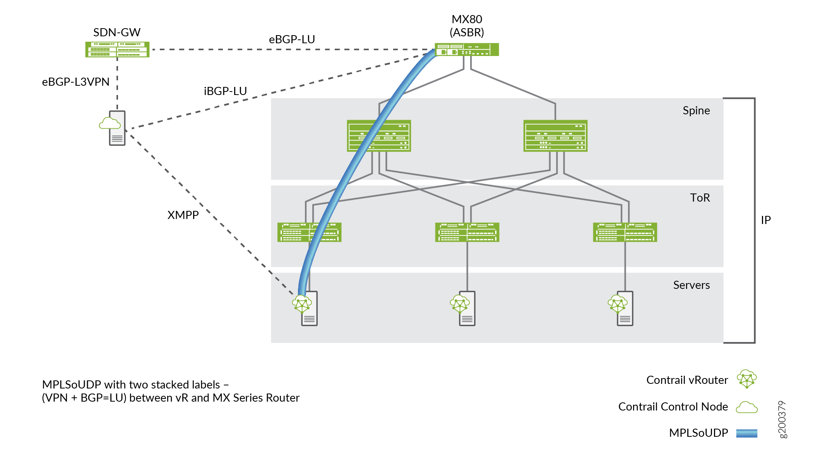
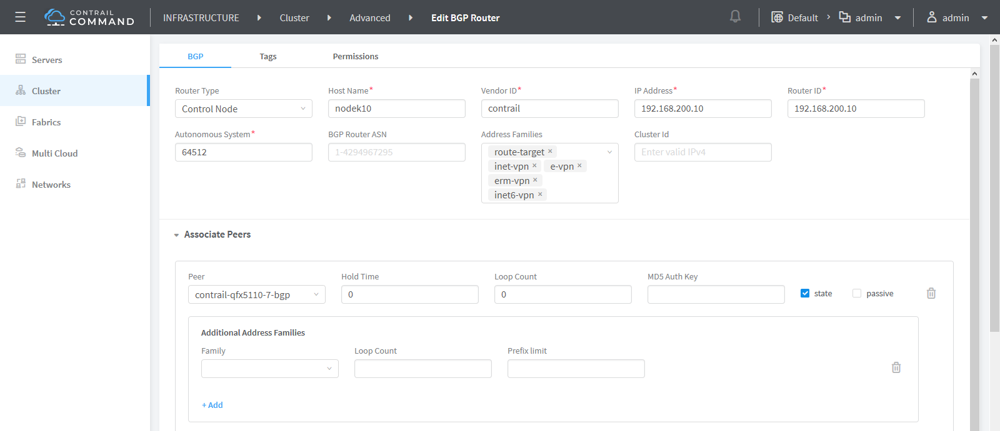
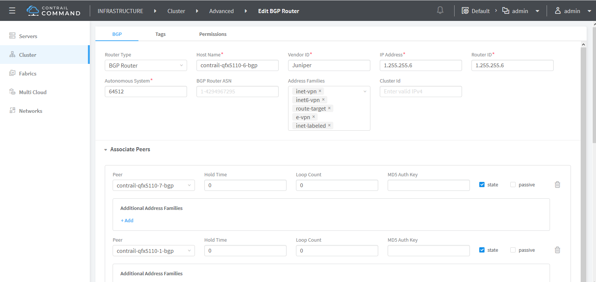

# Support for L3VPN Inter AS Option C

 

Contrail Release 5.1 and later supports L3VPN inter AS Option C, which
is used to interconnect multi-AS backbones as described in RFC 4364.
Inter-AS option C uses BGP as the label distribution protocol. Labeled
IPv4 routes are redistributed by eBGP between the neighboring autonomous
systems. A new address family inet-labeled is added to maintain labeled
unicast routes. This table is used for resolving L3VPN routes which are
encapsulated using MPLS.
[Figure 1](contrail-inter-as-option-c.html#l3vpn-interas-option-c) shows
the connectivity and the roles of different components in this
architecture.

The controller maintains an eBGP session with the SDN-GW router and an
iBGP session with the ASBR router. The controller exchanges labeled
routes with the vRouters over XMPP. The vRouter uses MPLSoUDP or
MPLSoGRE to reach the ASBR and encapsulates two labels within it - the
inner VPN label and outer BGP-LU label. For the opposite direction, the
vRouter advertises a labeled unicast route for its vhost address with a
label 3 (implicit null), so the traffic from the ASBR delivered through
the fabric to the vRouter over a UDP/GRE tunnel contains only the VPN
label.

## Configuring Inter AS Option C

This section describes how to configure L3VPN Inter AS Option C from
Contrail Command UI.

1.  Navigate to Infrastructure &gt; Cluster &gt;
    Advanced.

2.  Click **BGP Routers** tab and click the **Edit**
    icon against the node that you want to configure.

    The Edit BGP Router page is displayed.

3.  Configure eBGP session for the SDN gateway. Make
    sure you include inet-labeled to
    the **Address Family** field.

    

4.  Configure the iBGP session with the ASBR router.
    Address family must be set to inet-labeled.

    

5.  Navigate to **Infrastructure &gt; Cluster &gt;
    Advanced**.

6.  Click the **Virtual Routers** tab and on the
    Forwarding Options pane, click Edit to modify the encapsulation
    settings.

    Contrail supports three encapsulation types. They are VXLAN, MPLS
    Over UDP, and MPLS Over GRE.

7.  Set the Encapsulation priority order.

    

8.  Click **Save**.

    Changes made to Forwarding Options settings are saved.

 
