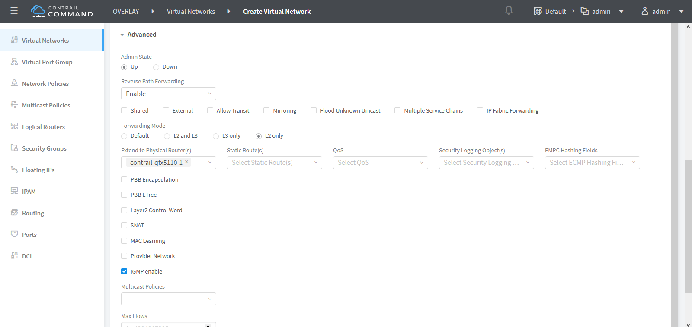

# Support for EVPN Type 6 Selective Multicast Ethernet Tag Route

 

Contrail Release 5.1 supports EVPN Type 6 selective multicast Ethernet
tag (SMET) route to selectively send or receive traffic based on the
presence or absence of active receivers on a compute node. The EVPN
Type-6 SMET route helps build and use multicast trees selectively on a
per &lt;\*, G&gt; basis.

Currently, all broadcast, unknown unicast, multicast (BUM) traffic is
carried over the inclusive multicast ethernet tag (IMET) routes. This
results in flooding of all compute nodes irrespective of whether an
active receiver is present or not on each of those compute-nodes.

## Configuring EVPN Type-6 SMET Routes

EVPN Type-6 SMET routes capability attaches a specific BGP community
attribute Ethernet Multicast flags
Community (MF) to the IMET
routes. This community is advertised by default in Contrail release 5.1
and later. You must enable IGMP on the network as shown in
[Figure 1](evpn-type-6-selective-multicast-ethernet-tag-route.html#configure-igmp)
as well as on the QFX device to which the multicast source is connected.
You can configure IGMP at the global system configuration-level, at
virtual network-level, or at VMI-level. Configuring ERB-UCAST-Gateway role enables IGMP snooping on the QFX
device.

You can allow or deny multicast traffic by attaching a policy at the
virtual network-level as shown in
[Figure 2](evpn-type-6-selective-multicast-ethernet-tag-route.html#define-multicast-policy).

In Contrail Release 5.1, the receivers are always inside the contrail
cluster and sender is always outside the cluster. This feature is
supported only with &lt;\*, G&gt; /igmpv2. The SMET feature is supported
only on QFX10000 and QFX5110 devices running Junos OS Release 18.4R1 and
later.

 
