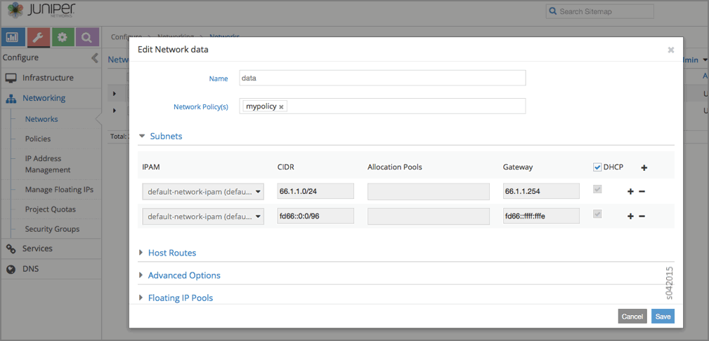
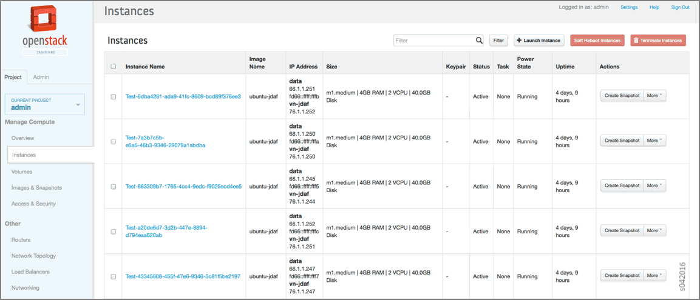
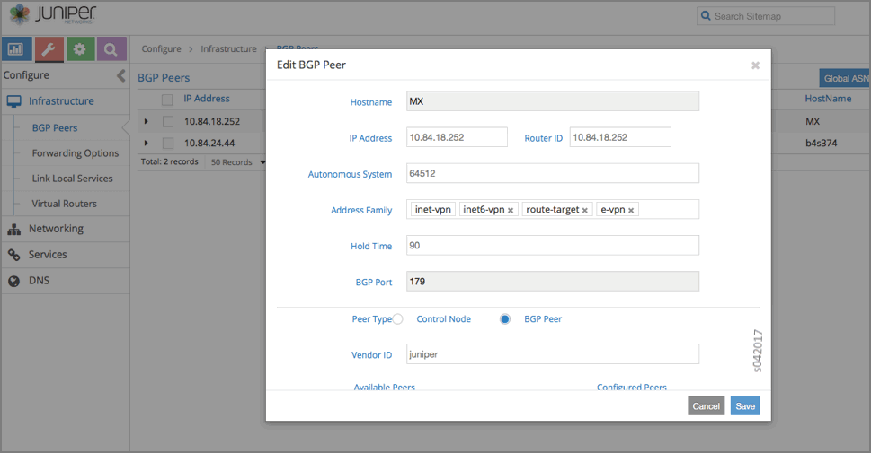

# Support for IPv6 Networks in Contrail

 

Starting with Contrail Release 2.0, support for IPv6 overlay networks is
provided.

## Overview: IPv6 Networks in Contrail

The following features are supported for IPv6 networks and overlay. The
underlay network must be IPv4.

-   Virtual machines with IPv6 and IPv4 interfaces

-   Virtual machines with IPv6-only interfaces

-   DHCPv6 and neighbor discovery

-   Policy and Security groups

-   IPv6 flow set up, tear down, and aging

-   Flow set up and tear down based on TCP state machine

-   Protocol-based flow aging

-   Fat flow

-   Allowed address pair configuration with IPv6 addresses

-   IPv6 service chaining

-   Equal Cost Multi-Path (ECMP)

-   Connectivity with gateway (MX Series device)

-   Virtual Domain Name Services (vDNS), name-to-IPv6 address resolution

-   User-Visible Entities (UVEs)

*NOT* present is support for the following:

-   Source Network Address Translation (SNAT)

-   Load Balancing as a Service (LBaaS)

-   IPv6 fragmentation

-   Floating IP

-   Link-local and metadata services

-   Diagnostics for IPv6

-   Contrail Device Manager

-   Virtual customer premises equipment (vCPE)

## Creating IPv6 Virtual Networks in Contrail

You can create an IPv6 virtual network from the Contrail user interface
in the same way you create an IPv4 virtual network. When you create a
new virtual network by selecting **Configure &gt; Networking &gt;
Networks**, the Edit fields accept IPv6 addresses, as shown in the
following image.

### Address Assignments

When virtual machines are launched with an IPv6 virtual network created
in the Contrail user interface, the virtual machine interfaces get
assigned addresses from all the families configured in the virtual
network.

The following is a sample of IPv6 instances with address assignments, as
listed in the OpenStack Horizon user interface.

#### Enabling DHCPv6 In Virtual Machines

To allow IPv6 address assignment using DHCPv6, the virtual machine
network interface configuration must be updated appropriately.

For example, to enable DHCPv6 for Ubuntu-based virtual machines, add the
following line in the `/etc/network/interfaces` file:

`iface eht0 inet6 dhcp`

Also, `dhclient -6` can be run from within the virtual machine to get
IPv6 addresses using DHCPv6.

## Adding IPv6 Peers

The procedure to add an IPv6 BGP peer in Contrail is similar to adding
an IPv4 peer. Select **Configure &gt; Infrastructure &gt; BGP Peers**,
include `inet6-vpn` in the Address Family list to allow advertisement of
IPv6 addresses.

A sample is shown in the following.

**Note**

Additional configuration is required on the peer router to allow
inet6-vpn peering.

 
