# Service Chain Route Reorigination

 

## Overview: Service Chaining in Contrail

In Contrail, the service chaining feature allows the operator to insert
dynamic services to control the traffic between two virtual networks.
The service chaining works on a basic rule of next-hop stitching.

In [Figure 1](service-chain-route-reorig-vnc.html#rr1), the service
chain is inserted between the Left VN and the Right VN. The service
chain contains one or more service instances to achieve a required
network policy.

In the example, the route for the VM in the Right VN is added to the
routing table for the Left VN, with the next hop modified to ensure that
the traffic is sent by means of the left interface of the service chain.
This is an example of route reorigination.

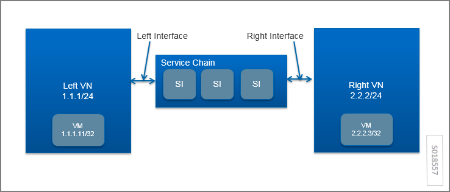

Using reorigination of routes for service chaining (for example, putting
the route for the right network in the left routing table) requires the
following features:

-   **Route aggregation**

    For scaling purposes, it is useful to publish an aggregated route as
    the service chain route, rather than publishing every route of each
    VM (/32). This reduces the memory footprint for the route table in
    the gateway router and also reduces route exchanges between control
    nodes and the gateway router. The route can be aggregated to the
    default route (0/0), to the VN subnet prefix, or to any arbitrary
    route prefix.

-   **Path attribute modification for reoriginated routes**

    There are cases where the `BgpPath` attribute for the service chain
    route needs to be modified. An example is the case of service chain
    failover, in which there are two service chains with identical
    services that are connected between the same two VNs. The operator
    needs to control which service chain is used for traffic between two
    networks, in addition to ensuring redundancy and high availability
    by providing failover support. Path attribute modification for
    reoriginated routes is implemented by means of routing policy, by
    providing an option to alter the MED (multi-exit discriminator) or
    `local-pref` of the reoriginated service chain route.

-   **Control to enable and disable reorigination of the route**

    In some scenarios, the operator needs a control to stop
    reorigination of the route as the service chain route, for example,
    when static routes are configured on service VM interfaces. Control
    to enable or disable reorigination of the route is implemented by
    tagging the routes with the `no-reoriginate` community. Routes with
    the `no-reoriginate` community tag are skipped for route
    reorigination.

Starting in Contrail Release 5.0, when one or more than one service
instance in a service chain fails, reorigination of routes on both sides
of the service chain is stopped and routes automatically converge to a
backup service chain that is part of another Contrail cluster. For more
information, see [Service Instance Health
Checks](../../topic-map/service-instance-health-check.html).

## Route Aggregation

The route aggregation configuration object contains a list of prefixes
to aggregate. The next-hop field in the route aggregate object contains
the address of the route whose next hop is stitched as a next hop of the
aggregate route.

Route aggregation is configured on the service instance. The operator
can attach multiple route aggregation objects to a service instance. For
example, if routes from the Right VN need to be aggregated and
reoriginated in the route table of the Left VN, the route aggregate
object is created with a prefix of the Right VN’s subnet prefix and
attached to the left interface of the service instance.

If the service chain has multiple service instances, the route aggregate
object is attached to the left interface of the left-most service
instance and to the right interface of the right-most service instance.

The relationships are shown in
[Figure 2](service-chain-route-reorig-vnc.html#rr2).

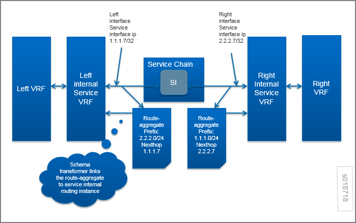

The schema transformer sets the next-hop field of the route aggregate
object to the service chain interface address. The schema transformer
also links the route aggregate object to the internal routing instance
created for the service instance.

Using the configuration as described, the Contrail control service reads
the route aggregation object on the routing instance. When the first,
more specific route or contributing route is launched (when the first VM
is launched on the right VN), the aggregate route is published.
Similarly, the aggregated route is deleted when the last, more specific
route or contributing route is deleted (when the last VM is deleted in
the right VN). The aggregated route is published when the next hop for
the aggregated route gets resolved.

By default, in BGP or XMPP route exchanges, the control node will not
publish contributing routes of an aggregate route.

### Schema for Route Aggregation

-   [Route Aggregate Object](service-chain-route-reorig-vnc.html#jd0e90)

-   [Service Instance Link to Route Aggregate
    Object](service-chain-route-reorig-vnc.html#jd0e98)

-   [Routing Instance Link to Route Aggregate
    Object](service-chain-route-reorig-vnc.html#jd0e106)

#### Route Aggregate Object

The following is the schema for route aggregate objects. Multiple
prefixes can be specified in a single route aggregate object.

    <xsd:element name="route-aggregate" type="ifmap:IdentityType"/>
    <xsd:complexType name="RouteListType">
        <xsd:element name="route" type="xsd:string" maxOccurs="unbounded"/>
    </xsd:complexType>

    <xsd:element name='aggregate-route-entries' type='RouteListType'/>
    <!--#IFMAP-SEMANTICS-IDL
        Property('aggregate-route-entries', 'route-aggregate') -->

    <xsd:element name='aggregate-route-nexthop' type='xsd:string'/>
    <!--#IFMAP-SEMANTICS-IDL
            Property('aggregate-route-nexthop', 'route-aggregate') -->

#### Service Instance Link to Route Aggregate Object

The following is the schema for the service instance link to route
aggregation objects. The operator can link multiple route aggregate
objects to a single service interface.

    <xsd:element name="route-aggregate" type="ifmap:IdentityType"/>
    <xsd:complexType name="RouteListType">
        <xsd:element name="route" type="xsd:string" maxOccurs="unbounded"/>
    </xsd:complexType>

    <xsd:element name='aggregate-route-entries' type='RouteListType'/>
    <!--#IFMAP-SEMANTICS-IDL
        Property('aggregate-route-entries', 'route-aggregate') -->

    <xsd:element name='aggregate-route-nexthop' type='xsd:string'/>
    <!--#IFMAP-SEMANTICS-IDL
            Property('aggregate-route-nexthop', 'route-aggregate') -->

    <xsd:simpleType name="ServiceInterfaceType">
            <xsd:restriction base="xsd:string">
            <xsd:pattern value="management|left|right|other[0-9]*"/>
            </xsd:restriction>
    </xsd:simpleType>
    <xsd:complexType name='ServiceInterfaceTag'>
            <xsd:element name="interface-type" type="ServiceInterfaceType"/>
    </xsd:complexType>

    <xsd:element name="route-aggregate-service-instance" type="ServiceInterfaceTag"/>
    <!--#IFMAP-SEMANTICS-IDL
            Link('route-aggregate-service-instance',
                       'bgp:route-aggregate', 'service-instance', ['ref']) -->

#### Routing Instance Link to Route Aggregate Object

The following is the schema for the routing instance link to the route
aggregation object. A routing instance can be linked to multiple route
aggregate objects to perform route aggregation for multiple route
prefixes.

    <xsd:element name="route-aggregate-routing-instance"/>
    <!--#IFMAP-SEMANTICS-IDL
            Link('route-aggregate-routing-instance',
                      'route-aggregate', 'routing-instance', ['ref']) -->

### Configuring and Troubleshooting Route Aggregation

-   [Configure Route Aggregate
    Object](service-chain-route-reorig-vnc.html#jd0e119)

-   [Configuring a Service
    Instance](service-chain-route-reorig-vnc.html#jd0e141)

-   [Create a Virtual Network and Network
    Policy](service-chain-route-reorig-vnc.html#jd0e152)

-   [Validate the Route Aggregate Object in the API
    Server](service-chain-route-reorig-vnc.html#jd0e163)

-   [Validate the Route Aggregate Object in the Control
    Node](service-chain-route-reorig-vnc.html#jd0e173)

#### Configure Route Aggregate Object

You can use the Contrail UI, **Configure &gt; Networking &gt; Routing
&gt; Create &gt;Route Aggregate** screen to name the route aggregate
object and identify the routes to aggregate. See
[Figure 3](service-chain-route-reorig-vnc.html#rr3).

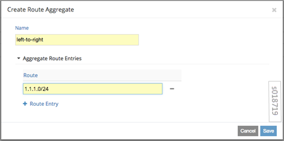

##### Example VNC Script to Create a Route Aggregate Object

You can use a VNC script to create a route aggregate object, as in the
following example:

    from vnc_api.vnc_api import *
    vnc_lib = VncApi("admin", "<password>.", "admin")
    project=vnc_lib.project_read(fq_name=["default-domain", "admin"])
    route_aggregate=RouteAggregate(name="left_to_right", parent_obj=project)
    route_list=RouteListType(["<ip address>"])
    route_aggregate.set_aggregate_route_entries(route_list)
    vnc_lib.route_aggregate_create(route_aggregate)

#### Configuring a Service Instance

Create a service instance with the route aggregate object linked to the
aggregate left network subnet prefix in the right virtual network. See
the example in [Figure 4](service-chain-route-reorig-vnc.html#si1).

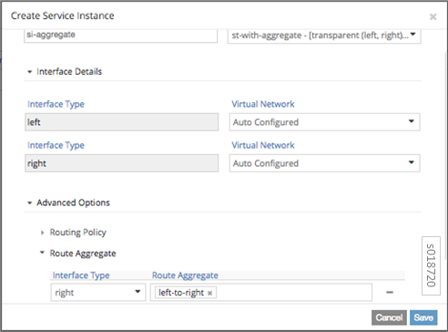

#### Create a Virtual Network and Network Policy

Create a left and right virtual network with the subnets 1.1.1/24 and
2.2.2/24, respectively. Create a network policy to apply a service chain
between the left VN and the right VN. See the following example.

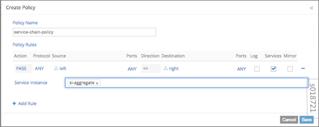

Attach the network policy to create the service chain between the left
and right VNs. See the following example.

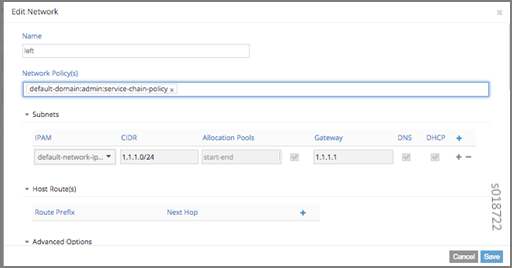

#### Validate the Route Aggregate Object in the API Server

Validate the route aggregate object in the API server configuration
database. Verify the routing instance reference and the service instance
reference for the aggregate object. The `aggregate_route_nexthop` field
in the route aggregate object is initialized by the schema transformer
to the service chain address. See the following example.

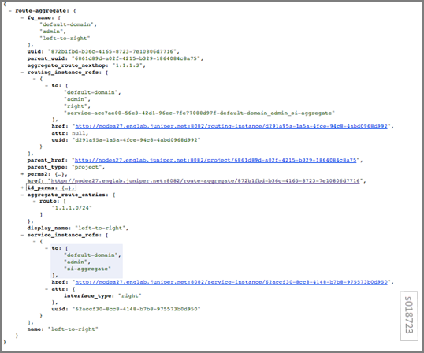

#### Validate the Route Aggregate Object in the Control Node

Validate the instance configurations of the route aggregate by checking
the control node introspect for the service instance internal routing
instance. For example:

`http://<control-node>:8083/Snh_ShowBgpInstanceConfigReq?search_string=default-domain:admin:right:service-ace7ae00-56e3-42d1-96ec-7fe77088d97f-default-domain_admin_si-aggregate`

See the following example.

To check the state of the route aggregate object on the control node,
point your browser to:

`http://<control-node>:8083/Snh_ShowRouteAggregateReq`

See the following example.

You can also check the route table for the aggregate route in the right
VN BGP table. For example:

`http://<control-node>:8083/Snh_ShowRouteReq?x=default-domain:admin:right:right.inet.0`

See the following example.

## Routing Policy

Contrail uses routing policy infrastructure to manipulate the route and
path attribute dynamically. Contrail also supports attaching the import
routing policy on the service instances.

The routing policy contains list terms. A term can be a terminal rule,
meaning that upon a match on the specified term, no further terms are
evaluated and the route is dropped or accepted, based on the action in
that term.

If the term is not a terminal rule, subsequent terms are evaluated for
the given route.

The list terms are structured as in the following example.

    Policy {
         Term-1
         Term-2
    }

The matches and actions of the policy term lists operate similarly to
the Junos language match and actions operations.

Each term is represented as in the following:

    from {
        match-condition-1
        match-condition-2
        ..
        ..
    }
    then {
        action
        update-action-1
        update-action-2
        ..
        ..
    }

The term should not contain an `any` match condition, for example, an
empty `from` should not be present.

If an `any` match condition is present, all routes are considered as
matching the term.

However, the `then` condition can be empty or the action can be
unspecified.

### Applying Routing Policy

The routing policy evaluation has the following key points:

-   If the term of a routing policy consists of multiple match
    conditions, a route must satisfy all match conditions to apply the
    action specified in the term.

-   If a term in the policy does not specify a match condition, all
    routes are evaluated against the match.

-   If a match occurs but the policy does not specify an accept, reject,
    or next term action, one of the following occurs:

    -   The next term, if present, is evaluated.

    -   If no other terms are present, the next policy is evaluated.

    -   If no other policies are present, the route is accepted. The
        default routing policy action is “accept”.

-   If a match does not occur with a term in a policy, and subsequent
    terms in the same policy exist, the next term is evaluated.

-   If a match does not occur with any terms in a policy, and subsequent
    policies exist, the next policy is evaluated.

-   If a match does not occur by the end of a policy or all policies,
    the route is accepted.

A routing policy can consist of multiple terms. Each term consists of
match conditions and actions to apply to matching routes.

Each route is evaluated against the policy as follows:

1.  The route is evaluated against the first term. If it matches, the
    specified action is taken. If the action is to accept or reject the
    route, that action is taken and the evaluation of the route ends. If
    the next term action is specified or if no action is specified, or
    if the route does not match, the evaluation continues as described
    above to subsequent terms.

2.  Upon hitting the last non-terminal term of the given routing policy,
    the route is evaluated against the next policy, if present, in the
    same manner as described in step 1.

#### Match Condition: From

The match condition `from` contains a list of match conditions to be
satisfied for applying the action specified in the term. It is possible
that the term doesn’t have any match condition. This indicates that all
routes match this term and action is applied according to the action
specified in the term.

The following table describes the match conditions supported by
Contrail.

<table data-cellspacing="0" style="border-top:thin solid black;" width="99%">
<colgroup>
<col style="width: 33%" />
<col style="width: 33%" />
<col style="width: 33%" />
</colgroup>
<thead>
<tr class="header">
<th style="text-align: left;">
Match Condition
</th>
<th style="text-align: left;">
User Input
</th>
<th style="text-align: left;">
Description
</th>
</tr>
</thead>
<tbody>
<tr class="odd">
<td style="text-align: left;">
Prefix
</td>
<td style="text-align: left;">
List of prefixes to match
</td>
<td style="text-align: left;">
Each prefix in the list is represented as prefix and match type, where the prefix match type can be:

<ul>
<li>
<code class="inline" data-v-pre="">exact</code>
</li>
<li>
<code class="inline" data-v-pre="">orlonger</code>
</li>
<li>
<code class="inline" data-v-pre="">longer</code>
</li>
</ul>

Example: 1.1.0.0/16 <code class="inline" data-v-pre="">orlonger</code>

A route matches this condition if its prefix matches any of the prefixes in the list.
</td>
</tr>
<tr class="even">
<td style="text-align: left;">
Community
</td>
<td style="text-align: left;">
Community string to match
</td>
<td style="text-align: left;">
Represented as either a well-known community string with <code class="inline" data-v-pre="">no export</code> or <code class="inline" data-v-pre="">no reoriginate</code>, or a string representation of a community (64512:11).
</td>
</tr>
<tr class="odd">
<td style="text-align: left;">
Protocol
</td>
<td style="text-align: left;">
Array of path source or path protocol to match
</td>
<td style="text-align: left;">
BGP | XMPP | StaticRoute | ServiceChain | Aggregate. A path is considered as matching this condition if the path protocol is one of protocols in the list.
</td>
</tr>
</tbody>
</table>

#### Routing Policy Action and Update Action

The policy action contains two parts, action and update action.

The following table describes `action` as supported by Contrail.

| Action    | Terminal? | Description                                                                                                                                                                                                                                                                                                   |
|:----------|:----------|:--------------------------------------------------------------------------------------------------------------------------------------------------------------------------------------------------------------------------------------------------------------------------------------------------------------|
| Reject    | Yes       | Reject the route that matches this term. No more terms are evaluated after hitting this term.                                                                                                                                                                                                                 |
| Accept    | Yes       | Accept the route that matches this term. No more terms are evaluated after hitting this term. The route is updated using the update specified in the policy action.                                                                                                                                           |
| Next Term | No        | This is the default action taken upon matching the policy term. The route is updated according to the update specified in the policy action. Next terms present in the routing policy are processed on the route. If there are no more terms in the policy, the next routing policy is processed, if present. |

The update action section specifies the route modification to be
performed on the matching route.

The following table describes `update action` as supported by Contrail.

<table data-cellspacing="0" style="border-top:thin solid black;" width="99%">
<colgroup>
<col style="width: 33%" />
<col style="width: 33%" />
<col style="width: 33%" />
</colgroup>
<thead>
<tr class="header">
<th style="text-align: left;">
Update Action
</th>
<th style="text-align: left;">
User Input
</th>
<th style="text-align: left;">
Description
</th>
</tr>
</thead>
<tbody>
<tr class="odd">
<td style="text-align: left;">
Community
</td>
<td style="text-align: left;">
List of community
</td>
<td style="text-align: left;">
As part of the policy update, the following actions can be taken for community:

<ul>
<li>
Add a list of community to the existing community.
</li>
<li>
Set a list of community.
</li>
<li>
Remove a list of community (if present) from the existing community.
</li>
</ul></td>
</tr>
<tr class="even">
<td style="text-align: left;">
MED
</td>
<td style="text-align: left;">
Update the MED of the BgpPath
</td>
<td style="text-align: left;">
Unsigned integer representing the MED
</td>
</tr>
<tr class="odd">
<td style="text-align: left;">
local-pref
</td>
<td style="text-align: left;">
Update the local-pref of the BgpPath
</td>
<td style="text-align: left;">
Unsigned integer representing local-pref
</td>
</tr>
</tbody>
</table>

### Routing Policy Configuration

Routing policy is configured on the service instance. Multiple routing
policies can be attached to a single service instance interface.

When the policy is applied on the left interface, the policy is
evaluated for all the routes that are reoriginated in the left VN for
routes belonging to the right VN. Similarly, the routing policy attached
to the right interface influences the route reorigination in the right
VN, for routes belonging to the left VN.

The following figure illustrates a routing policy configuration.

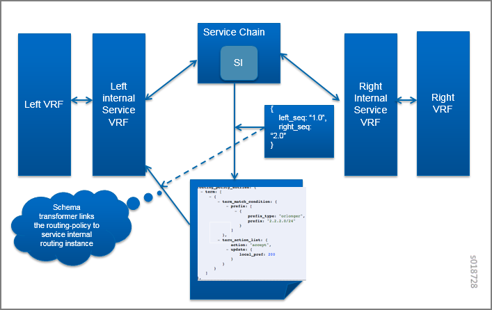

The policy sequence number specified in the routing policy link data
determines the order in which the routing policy is evaluated. The
routing policy link data on the service instance also specifies whether
the policy needs to be applied to the left service interface, to the
right service interface, or to both interfaces.

It is possible to attach the same routing policy to both the left and
right interfaces for a service instance, in a different order of policy
evaluation. Consequently, the routing policy link data contains the
sequence number for policy evaluation separately for the left and right
interfaces.

The schema transformer links the routing policy object to the internal
routing instance created for the service instance. The transformer also
copies the routing policy link data to ensure the same policy order.

### Configuring and Troubleshooting Routing Policy

This section shows how to create a routing policy for service chains and
how to validate the policy.

-   [Create Routing Policy](service-chain-route-reorig-vnc.html#jd0e532)

-   [Configure Service
    Instance](service-chain-route-reorig-vnc.html#jd0e545)

-   [Configure the Network Policy for the Service
    Chain](service-chain-route-reorig-vnc.html#jd0e552)

#### Create Routing Policy

First, create the routing policy, **Configure &gt; Networking &gt;
Routing &gt; Create &gt;Routing Policy**. See the following example.

**Note**

The Contrail UI and REST APIs enable you to configure a BGP routing
policy and then assign it to a virtual network, but the routing policy
will not be applied if the virtual network is attached to an L3VPN.

#### Configure Service Instance

Create a service instance and attach the routing policy to both the left
and right interfaces. The order of the policy is calculated by the UI,
based on the order of the policy specified in the list.

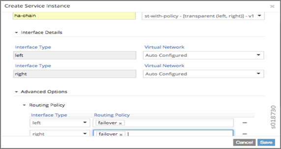

#### Configure the Network Policy for the Service Chain

At **Edit Policy**, create a policy for the service chain, see the
following example.

### Using a VNC Script to Create Routing Policy

The following example shows use of a VNC API script to create a routing
policy.

    from vnc_api.vnc_api import *
    vnc_lib = VncApi("admin", "<password>", "admin")
    project=vnc_lib.project_read(fq_name=["default-domain", "admin"])
    routing_policy=RoutingPolicy(name="vnc_3", parent_obj=project)
    policy_term=PolicyTermType()
    policy_statement=PolicyStatementType()

    match_condition=TermMatchConditionType(protocol=["bgp"], community="22:33")
    prefix_match=PrefixMatchType(prefix="1.1.1.0/24", prefix_type="orlonger")
    match_condition.set_prefix([prefix_match])

    term_action=TermActionListType(action="accept")
    action_update=ActionUpdateType(local_pref=101, med=10)
    add_community=ActionCommunityType()
    comm_list=CommunityListType(["11:22"])
    add_community.set_add(comm_list)
    action_update.set_community(add_community)
    term_action.set_update(action_update)

    policy_term.set_term_action_list(term_action)
    policy_term.set_term_match_condition(match_condition)

    policy_statement.add_term(policy_term)
    routing_policy.set_routing_policy_entries(policy_statement)
    vnc_lib.routing_policy_create(routing_policy)

### Verify Routing Policy in API Server

You can verify the service instance references and the routing instance
references for the routing policy by looking in the API server
configuration database. See the following example.

### Verify Routing Policy in the Control Node

You can verify the routing policy in the control node.

Point your browser to:

`http://<control-node>:8083/Snh_ShowRoutingPolicyReq?search_string=failover  `

See the following example.

### Verify Routing Policy Configuration in the Control Node

You can verify the routing policy configuration in the control node.

Point your browser to:

`http://<control-node>:8083/Snh_ShowBgpRoutingPolicyConfigReq?search_string=failover  `

See the following example.

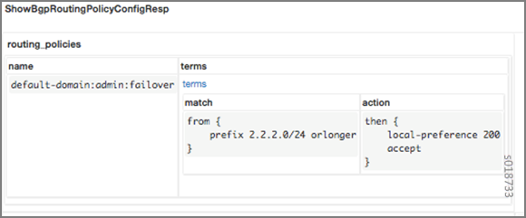

### Verify Routing Policy Configuration on the Routing Instance

You can verify the routing policy configuration on the internal routing
instance.

Point your browser to:

`http://<control-node>:8083/Snh_ShowBgpInstanceConfigReq?search_string=<name-of-internal-vrf> `

See the following example.

You can also verify the routing policy on the routing instance
operational object.

Point your browser to:

`http://<control-node>:8083/Snh_ShowRoutingInstanceReq?x=<name-of-internal-vrf> `

See the following example.

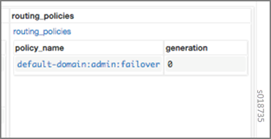

## Control for Route Reorigination

The ability to prevent reorigination of interface static routes is
typically required when routes are configured on an interface that
belongs to a service VM.

As an example, the following image shows a service chain that has
multiple service instances, with an `in-net-nat` service instance as the
last service VM, also with the right VN as the public VN.

The last service instance performs NAT by using a NAT pool. The right
interface of the service VM must be configured with an interface static
route for the NAT pool so that the destination in the right VN knows how
to reach addresses in the NAT pool. However, the NAT pool prefix should
not be reoriginated into the left VN.

To prevent route reorigination, the interface static route is tagged
with a well-known BGP community called `no-reoriginate`.

When the control node is reoriginating the route, it skips the routes
that are tagged with the BGP community.

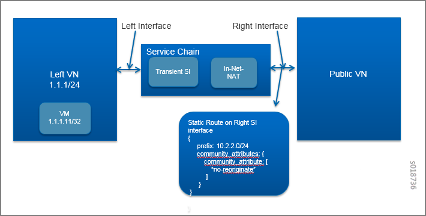

### Configuring and Troubleshooting Reorigination Control

The community attribute on the static routes for the interface static
route of the service instance is specified during creation of the
service instance. See the following example.

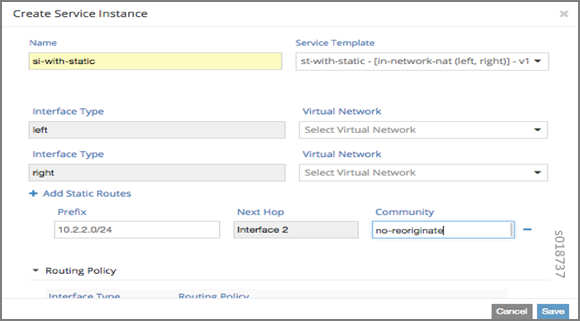

Use the following example to verify that the service instance
configuration object in the API server has the correct community set for
the static route. See the following example.

 
