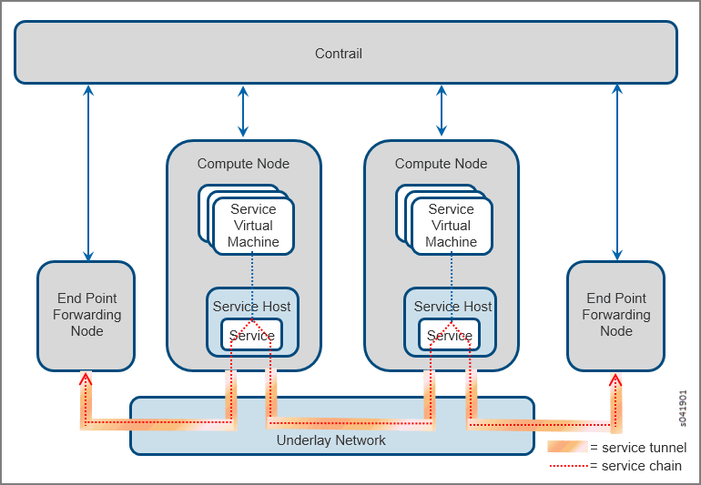

# Service Chaining

 

Contrail Controller supports chaining of various Layer 2 through Layer 7
services such as firewall, NAT, IDP, and so on.

## Service Chaining Basics

Services are offered by instantiating service virtual machines to
dynamically apply single or multiple services to virtual machine (VM)
traffic. It is also possible to chain physical appliance-based services.

[Figure 1](service-chaining-vnc.html#service-chain-vm1) shows the basic
service chain schema, with a single service. The service VM spawns the
service, using the convention of left interface (left IF) and right
interface (right IF). Multiple services can also be chained together.

When you create a service chain, the Contrail software creates tunnels
across the underlay network that span through all services in the chain.
[Figure 2](service-chaining-vnc.html#svc-chain) shows two end points and
two compute nodes, each with one service instance and traffic going to
and from one end point to the other.

The following are the modes of services that can be configured.

-   *Transparent or bridge mode*

    -   Used for services that do not modify the packet. Also known as
        bump-in-the-wire or Layer 2 mode. Examples include Layer 2
        firewall, IDP, and so on.

-   *In-network or routed mode*

    -   Provides a gateway service where packets are routed between the
        service instance interfaces. Examples include NAT, Layer 3
        firewall, load balancer, HTTP proxy, and so on.

-   *In-network-nat mode*

    -   Similar to in-network mode, however, return traffic does not
        need to be routed to the source network. In-network-nat mode is
        particularly useful for NAT service.

## Service Chaining Configuration Elements

Service chaining requires the following configuration elements in the
solution:

-   Service template

-   Service instance

-   Service policy

*Service Template*

Service templates are always configured in the scope of a domain, and
the templates can be used on all projects within a domain. A template
can be used to launch multiple service instances in different projects
within a domain.

The following are the parameters to be configured for a service
template:

-   Service template name

-   Domain name

-   Service mode

    -   Transparent

    -   In-Network

    -   In-Network NAT

-   Image name (for virtual service)

    -   If the service is a virtual service, then the name of the image
        to be used must be included in the service template. In an
        OpenStack setup, the image must be added to the setup by using
        Glance.

-   Interface list

    -   Ordered list of interfaces---this determines the order in which
        Interfaces will be created on the service instance.

    -   Most service templates will have management, left, and right
        interfaces. For service instances requiring more interfaces,
        “other” interfaces can be added to the interface list.

    -   Shared IP attribute, per interface

    -   Static routes enabled attribute, per interface

-   Advanced options

    -   Service scaling— use this attribute to enable a service instance
        to have more than one instance of the service instance virtual
        machine.

    -   Flavor—assign an OpenStack flavor to be used while launching the
        service instance. Flavors are defined in OpenStack Nova with
        attributes such as assignments of CPU cores, memory, and disk
        space.

*Service Instance*

A service instance is always maintained within the scope of a project. A
service instance is launched using a specified service template from the
domain to which the project belongs.

The following are the parameters to be configured for a service
instance:

-   Service instance name

-   Project name

-   Service template name

-   Number of virtual machines that will be spawned

    -   Enable service scaling in the service template for multiple
        virtual machines

-   Ordered virtual network list

    -   Interfaces listed in the order specified in the service template

    -   Identify virtual network for each interface

    -   Assign static routes for virtual networks that have static route
        enabled in the service template for their interface

        -   Traffic that matches an assigned static route is directed to
            the service instance on the interface created for the
            corresponding virtual network

*Service Policy*

The following are the parameters to be configured for a service policy:

-   Policy name

-   Source network name

-   Destination network name

-   Other policy match conditions, for example direction and source and
    destination ports

-   Policy configured in “routed/in-network” or “bridged/” mode

-   An action type called **apply\_service** is used:

    -   Example: **'apply\_service’:
        \[DomainName:ProjectName:ServiceInstanceName\]**

 
