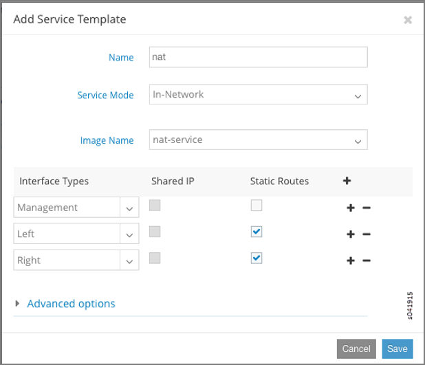
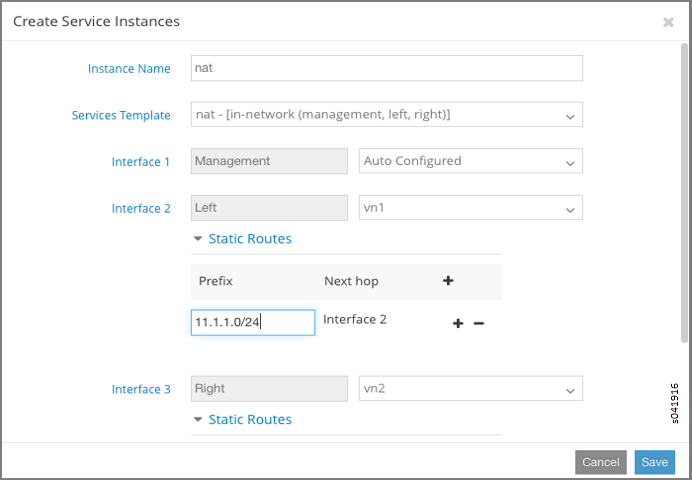
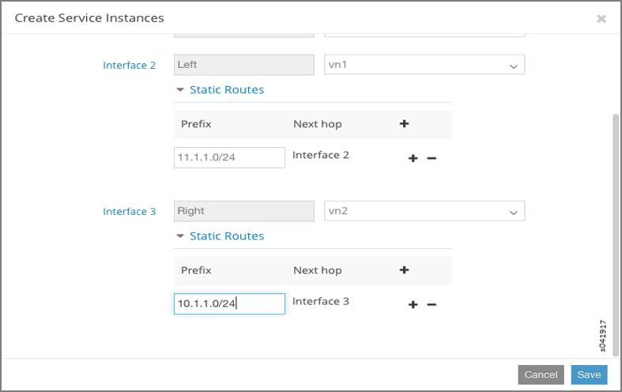
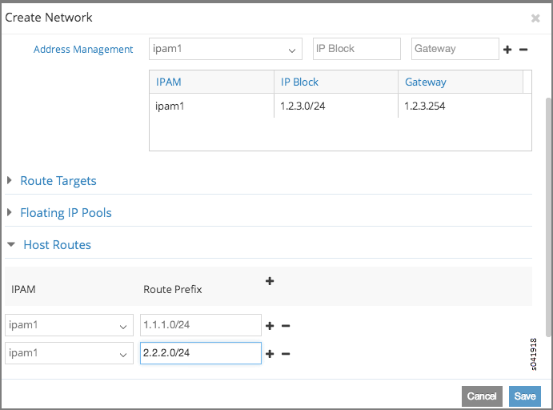

# Using Static Routes with Services

 

## Static Routes for Service Instances

Static routes can be configured in a virtual network to direct traffic
to a service virtual machine.

The following figure shows a virtual network with subnet 10.1.1.0/24.
All of the traffic from a virtual machine that is directed to subnet
11.1.1.0/24 can be configured to be routed by means of a service
machine, by using the static route 11.1.1.252 configured on the service
virtual machine interface.

## Configuring Static Routes on a Service Instance

To configure static routes on a service instance, first enable the
static route option in the service template to be used for the service
instance.

To enable the static route option in a service template:

1.  Go to **Configure &gt; Services &gt; Service
    Templates** and click **Create**.

2.  At **Add Service Template**, complete the fields
    for **Name**, **Service Mode**, and **Image Name**.

3.  Select the **Interface Types** to use for the
    template, then for each interface type that might have a static
    route configured, click the check box under the **Static Routes**
    column to enable the static route option for that interface.

    The following figure shows a service template in which the left and
    right interfaces of service instances have the static routes option
    enabled. Now a user can configure a static route on a corresponding
    interface on a service instance that is based on the service
    template shown.

## Configuring Static Routes on Service Instance Interfaces

To configure static routes on a service instance interface:

1.  Go to **Configure &gt; Services &gt; Service
    Instances** and click **Create**.

2.  At **Create Service Instances**, complete the
    fields for **Instance Name** and **Services Template**.

3.  Select the virtual network for each of the
    interfaces

4.  Click the **Static Routes** dropdown menu under
    each interface field for which the static routes option is enabled
    to open the **Static Routes** menu and configure the static routes
    in the fields provided.**Note**

    If the **Auto Configured** option is selected, traffic destined to
    the static route subnet is load balanced across service instances.

The following figure shows a configuration to apply a service instance
between VN1 (10.1.1.0/24) and VN2 (11.1.1.0/24). The left interface of
the service instance is configured with VN1 and the right interface is
configured to be VN2 (11.1.1.0/24). The static route 11.1.1.0/24 is
configured on the left interface, so that all traffic from VN1 that is
destined to VN2 reaches the left interface of the service instance.

The following figure shows static route 10.1.1.0/24 configured on the
right interface, so that all traffic from VN2 that is destined to VN1
reaches the right interface of the service virtual machine.

When the static routes are configured for both the left and the right
interfaces, all inter-virtual network traffic is forwarded through the
service instance.

## Configuring Static Routes as Host Routes

You can also use static routes for host routes for a virtual machine, by
using the classless static routes option in the DHCP server response
that is sent to the virtual machine.

The routes to be sent in the DHCP response to the virtual machine can be
configured for each virtual network as it is created.

To configure static routes as host routes:

1.  Go to **Configure** **&gt; Network &gt;
    Networks** and click **Create**.

2.  At **Create Network**, click the **Host Routes**
    option and add the host routes to be sent to the virtual
    machines.

    An example is shown in the following figure.

 
